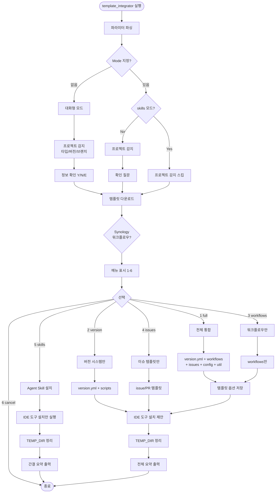
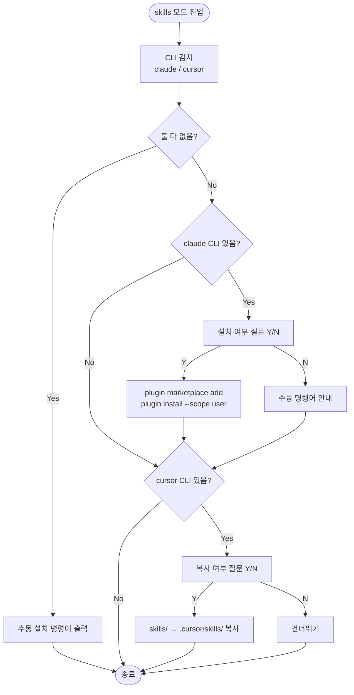

# template_integrator 대화형 메뉴에 Agent Skill 설치 항목 추가

## 개요

`template_integrator.sh` / `template_integrator.ps1` 실행 시 대화형 메뉴에서 Claude Code 플러그인 및 Cursor Skills 설치를 **단독으로** 수행할 수 있는 항목이 없었다. 기존에는 전체 통합(1번) 이후에만 `Offer-IdeToolsInstall`이 자동 호출되어, Skill만 업데이트하고 싶은 사용자는 불필요한 템플릿 통합까지 감수해야 했다. 본 작업에서는 메뉴 5번에 `Agent Skill 설치 (Claude, Cursor)` 항목을 추가하고, 기존 취소를 6번으로 이동시켰다. skills 모드는 템플릿 파일을 전혀 건드리지 않고 Claude 플러그인 설치와 Cursor skills 복사만 수행한 뒤 종료한다.

## 변경 사항

### 대화형 메뉴
- `template_integrator.ps1`: 메뉴 항목 5번 `Agent Skill 설치 (Claude, Cursor)` 추가, 취소를 6번으로 이동, 입력 검증 범위 `1-5` → `1-6`
- `template_integrator.sh`: 동일한 변경사항 대칭 적용

### 모드 분기
- `template_integrator.ps1` `Start-Integration`: skills 모드일 때 CLI 모드의 프로젝트 타입/버전/브랜치 자동 감지 및 확인 질문 단계 스킵 (`$Mode -ne "skills"` 조건 추가)
- `template_integrator.ps1` switch 블록: skills 케이스에서 `Offer-IdeToolsInstall` 호출 → `$TEMP_DIR` 정리 → `Show-Summary` → `return`으로 공통 후속 로직(템플릿 옵션 저장 등) 완전 차단
- `template_integrator.sh` `execute_integration`: 동일한 skills 케이스 분기 및 early return 처리

### 파라미터/도움말
- `template_integrator.ps1`: `$validModes` 배열에 `skills` 추가, 상단 주석 및 도움말 출력에 `skills` 모드 설명 추가
- `template_integrator.sh`: 상단 주석 및 `--help` 출력에 `skills` 모드 설명 추가

### 완료 요약
- `Show-Summary` / `print_summary`: skills 모드일 때 "추가된 파일" / "추가된 워크플로우" 섹션 대신 템플릿 레포 링크만 출력하는 early return 분기 추가

## 주요 구현 내용

### skills 모드 실행 흐름 (핵심)

skills 모드는 템플릿 통합 로직을 우회하고 IDE 도구 설치만 수행한다. `execute_integration` / `Start-Integration`의 switch/case에서 skills 케이스에 도달하면 즉시 `offer_ide_tools_install`을 호출하고, 임시 파일을 정리한 뒤 간결한 완료 요약을 출력하고 함수를 `return`한다. 이로써 switch 이후의 공통 후속 로직(`save_template_options`, version.yml 쓰기 등)은 전혀 실행되지 않는다.

### CLI 모드 지원

```bash
bash template_integrator.sh --mode skills
# or
pwsh template_integrator.ps1 -Mode skills
```

CLI 모드에서도 `$Mode -ne "skills"` 조건으로 프로젝트 감지/확인 단계를 건너뛴다. 이는 "Skill만 설치하려는 사용자는 프로젝트 타입/버전과 무관하다"는 전제를 반영한다.

### 전체 워크플로우 (Mermaid)



### skills 모드 세부 흐름



## 주의사항

- **Interactive 모드에서 5번 선택 시 사전 감지 단계가 먼저 실행된다.** 현재 대화형 모드는 메뉴 표시 이전에 프로젝트 타입/버전 감지와 "이 정보가 맞습니까?" 확인 질문을 거치는 구조이므로, Skill만 설치하려는 사용자도 이 단계를 통과해야 한다. 구조적 리팩터가 필요하며 후속 이슈로 분리 권장.
- **CLI 모드(`--mode skills`)에서는 템플릿 다운로드가 여전히 수행된다.** `$TEMP_DIR/skills` 경로가 Cursor skills 복사에 필요하기 때문이다. Claude 플러그인만 설치하는 경우에도 다운로드가 발생하는 것은 현재 구조상 불가피하다.
- **`save_template_options`는 `full`/`workflows` 모드에서만 호출되므로 skills 모드에서는 안전하게 우회된다.** 그러나 안전성을 명시적으로 보장하기 위해 skills 케이스 내부에서 early return 패턴을 적용했다.
- sh와 ps1 두 파일의 변경사항은 대칭적으로 유지되어야 한다. 향후 한쪽만 수정하지 않도록 주의.
