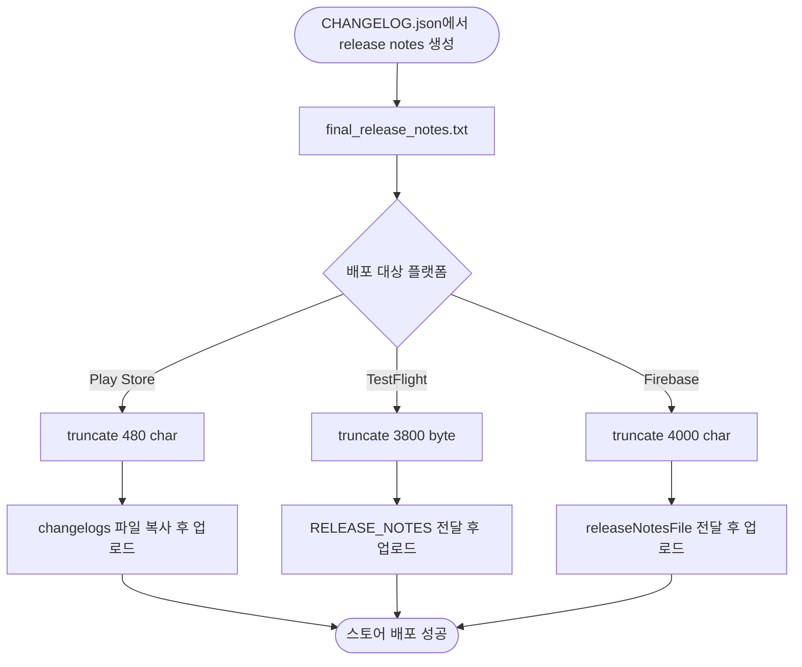
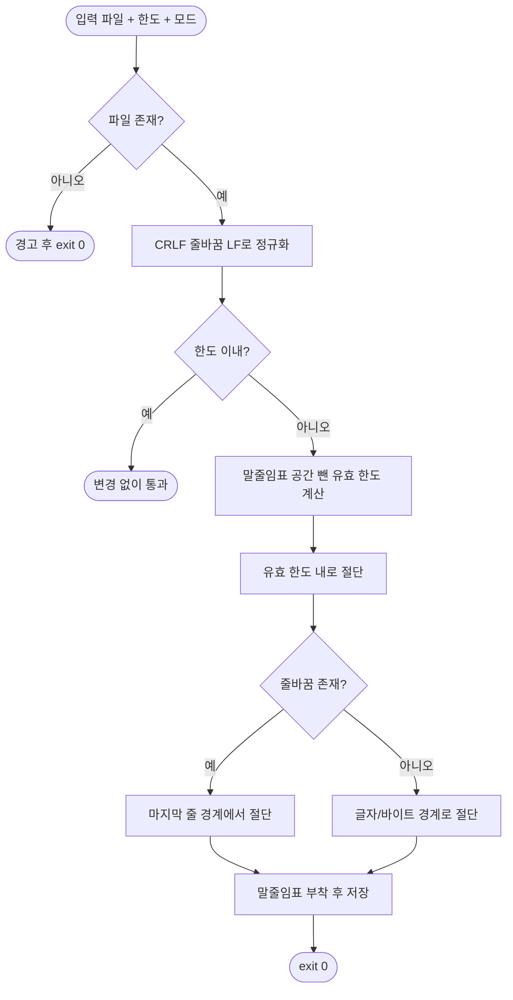

# Flutter 배포 워크플로우 release notes 길이 제한 미적용으로 배포 실패

## 개요

Flutter 배포 워크플로우 3종(Play Store / TestFlight / Firebase)이 AI로 생성한 release notes를 길이 검증 없이 그대로 각 스토어에 업로드해, changelog가 길어지면 배포가 실패하던 버그를 수정했다. 실제로 `cops-and-robbers-FE`에서 changelog 612자가 Google Play 500자 한도를 초과해 배포가 실패했다. 세 워크플로우가 동일한 `final_release_notes.txt`를 공유하지만 어디에도 길이 절단 로직이 없던 구조적 문제였다. 공통 절단 스크립트를 추가하고 각 워크플로우의 배포 직전 단계에 플랫폼별 한도로 적용했다.

## 기능 흐름

절단 스크립트 내부 처리:

## 변경 사항

### 신규 공통 스크립트
- `.github/scripts/truncate_release_notes.sh`: release notes 길이 절단 스크립트. `<입력파일> <최대길이> <char|byte> [출력파일]` 인터페이스. char(유니코드 글자 수) / byte(UTF-8 바이트 수) 모드 지원, 줄 경계 우선 절단, CRLF→LF 정규화, 한도 초과 시 말줄임표(`…`) 부착, 어떤 경우에도 exit 0.
- `.github/scripts/test/test_truncate_release_notes.sh`: 절단 스크립트 테스트 스위트(10케이스).

### 워크플로우 적용
- `PROJECT-FLUTTER-ANDROID-PLAYSTORE-CICD.yaml`: changelog 복사 직전 `480 char` 절단 적용.
- `PROJECT-FLUTTER-IOS-TESTFLIGHT.yaml`: RELEASE_NOTES 읽기 직전 `3800 byte` 절단 적용.
- `PROJECT-FLUTTER-ANDROID-FIREBASE-CICD.yaml`: 업로드 직전 별도 step에서 `4000 char` 안전망 적용.

## 주요 구현 내용

### 플랫폼별 한도와 계측 단위 차이
웹 검색으로 검증한 결과, 플랫폼마다 한도뿐 아니라 계측 단위가 다르다.

| 플랫폼 | 한도 | 단위 | 적용값 |
|---|---|---|---|
| Google Play | 500 | 글자(유니코드 문자) | 480 char |
| TestFlight | 4000 | 바이트 | 3800 byte |
| Firebase | 제한 존재(미공개) | 불명확 | 4000 char (안전망) |

생성 단계에서 일괄 절단하지 않고, 각 플랫폼 배포 직전에 그 플랫폼 기준으로 절단한다. 가장 빡빡한 기준으로 깎으면 넉넉한 플랫폼이 손해를 보기 때문이다.

### 안전 설계
- 한도 초과 시 말줄임표 공간(1글자/3byte)을 뺀 유효 한도로 자른 뒤, 줄 경계를 우선 존중해 자연스럽게 마무리한다.
- byte 모드는 멀티바이트 문자(한글 등) 중간을 깨지 않도록 문자 경계를 보장한다.
- CRLF 입력의 `\r`가 길이 계산에서 누락돼 절단 후에도 한도를 넘는 문제를 LF 정규화로 방어한다.
- 입력 없음·빈 파일·잘못된 모드 등 모든 예외에서 비정상 종료하지 않아 배포 파이프라인을 막지 않는다.
- Python 표준 라이브러리만 사용해 내부망(폐쇄망)과 크로스 플랫폼에서 추가 설치 없이 동작한다.

### 검증
- WSL Linux 환경(실제 GitHub Actions Ubuntu와 동일 조건)에서 테스트 스위트 13/13 통과: char 통과·절단, byte 한글 무손상, CRLF 줄경계, 없는/빈 파일 exit 0, 잘못된 모드 fallback, 출력파일 분리.
- 수정한 워크플로우 3종 YAML 문법 검증 통과.

## 주의사항

- 이 수정은 템플릿 원천(SUH-DEVOPS-TEMPLATE)에 반영됐다. 이미 배포된 프로젝트(cops-and-robbers-FE 등)는 `template_integrator`로 템플릿 업데이트를 받아야 수정이 적용된다.
- 절단은 release notes 한도 초과 시에만 발생하며, 그 외에는 원문을 그대로 유지한다. GitHub Release 등 다른 용도로 쓰이는 전체 changelog 생성 로직은 변경하지 않았다.
