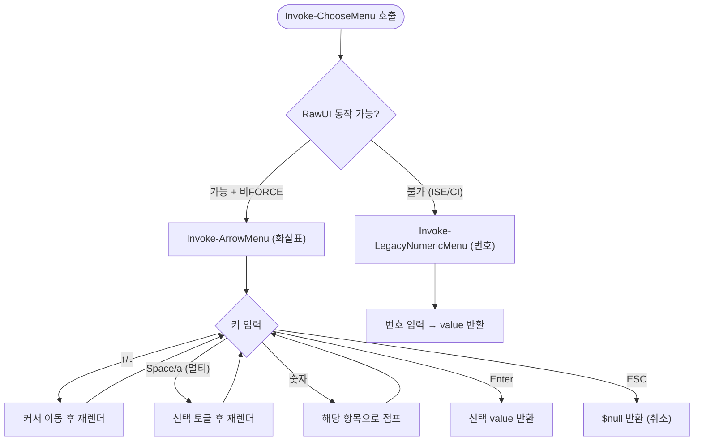
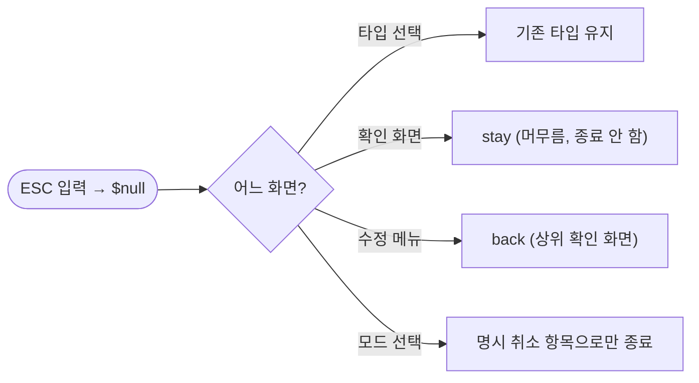

# template_integrator ps1 화살표 메뉴 이식 및 sh 대칭화 (#363)

## 개요

Windows용 `template_integrator.ps1`의 대화형 마법사 선택 UI를 macOS/Linux용 `template_integrator.sh`와 **화살표 메뉴·문구·ESC 동작까지 완전히 동일**하게 통일했다. 기존 ps1은 화살표 메뉴가 제거되어 항상 번호 입력 방식으로 동작했고, ESC 키가 없다는 전제로 '뒤로'를 메뉴 항목으로만 우회 제공했다. Windows 실기 검증으로 redirect(원격 iex) 환경에서도 `RawUI.ReadKey`가 동작함을 확인하고, sh의 `interactive_menu`와 1:1 대칭인 화살표 메뉴를 이식했다. 핵심은 **키 입력 방식만 바꾸고 모든 래퍼의 반환 계약을 보존**해 호출처를 수정하지 않은 것이다.

## 기능 흐름

### 메뉴 디스패치 (Invoke-ChooseMenu)

### ESC 동작 분기 (호출처별)

## 변경 사항

### Windows (`template_integrator.ps1`, +231/-40)

- **`Test-ArrowMenuSupported` (신규)**: RawUI 커서 제어 가능 여부로 화살표 지원을 판정. `IsInputRedirected`가 아니라 실제 RawUI 동작 여부 기준이라 redirect(원격 iex) 환경에서도 화살표를 쓴다. PowerShell ISE만 제외.
- **`Invoke-ArrowMenu` (신규)**: sh `interactive_menu`와 1:1 대칭. 단일(↑↓·숫자 점프·Enter·ESC)과 멀티(Space 토글·a 전체토글·preselect)를 한 함수로 통합. 키 입력은 `$Host.UI.RawUI.ReadKey("NoEcho,IncludeKeyDown")`, 화면 갱신은 ANSI 상대 이동(`ESC[nA` + `ESC[2K`)으로 줄 쌓임 없이 제자리 렌더.
- **`Invoke-ChooseMenu` (수정)**: `-CancelLabel` 파라미터 추가. RawUI 가능하면 `Invoke-ArrowMenu`, 불가하면 기존 `Invoke-LegacyNumericMenu`로 폴백 (sh `choose_menu` 디스패처와 대칭).
- **`Ask-YesNo` (수정)**: 화살표 2지선(예/아니오)으로 전환. default가 첫 항목 = 커서 초기 위치. 반환 `$true`/`$false` 유지, ESC = `$false`. FORCE/ISE는 Y/N 키 입력 폴백.
- **`Ask-YesNoEdit` (수정)**: 화살표 3지선(예/수정/취소). 반환 `"yes"`/`"no"`/`"edit"` 유지, ESC = `"stay"` 신규.
- **확인 화면(`Detect-AndConfirmProject`)**: 기존 `Y/y - 예 / E/e - 수정 / N/n - 취소` 안내 블록 제거. 화살표 3지선이 자체 안내를 출력. `"stay"` 분기 추가로 ESC 시 종료하지 않고 머무름.
- **수정 메뉴(`Edit-ProjectInfo`)**: `-CancelLabel "뒤로"` 추가. ESC(`$null`)와 '뒤로' 항목 모두 상위 확인 화면으로 복귀.
- **cancel-label 정합**: 타입 선택 `뒤로`, AI 스킬 메뉴 `건너뛰기`, IDE 설치/제거 `뒤로`를 sh와 동일하게 지정.

### macOS/Linux (`template_integrator.sh`, +8/-2)

- **수정 메뉴(`handle_project_edit_menu`)**: '뒤로 (변경 없이 확인 화면으로)' 명시 항목 추가 + 라벨 매핑. ps1과 동일하게 "ESC + 뒤로 항목" 둘 다 제공.
- **확인 화면**: `--cancel-label="머무르기"` 추가. ESC가 실제로는 stay(머무름)인데 기존엔 "취소"로 안내되던 불일치를 해소 (ps1과 문구·동작 통일).

### 문서

- `docs/superpowers/specs/2026-06-12-ps1-arrow-menu-parity-design.md`: 설계 문서.
- `docs/superpowers/plans/2026-06-12-ps1-arrow-menu-parity.md`: 구현 계획.
- `docs/suh-template/issue/...UIUX_가이드.md`: 사용 가이드 이슈(#370) 산출물.

## 주요 구현 내용

### 1. 폴백 판정 기준 교정

기존 ps1은 `[Console]::IsInputRedirected == True`면 무조건 번호 입력으로 폴백했다. 그러나 실측 결과 원격 다운로드로 stdin이 redirect된 상태에서도 `RawUI.ReadKey`는 화살표 키(VirtualKeyCode 38/40)를 정상 인식한다. 판정 기준을 redirect 여부가 아니라 **RawUI 커서 제어 동작 여부**(`Test-ArrowMenuSupported`)로 바꿔, 파일 실행·원격 iex 모두에서 화살표가 동작하게 했다. 이는 sh가 `curl | bash` 파이프에서도 `/dev/tty`로 키를 받는 것과 같은 전략이다.

### 2. 렌더링 — ANSI 상대 이동

`RawUI.CursorPosition` 절대 좌표 설정은 Windows Terminal/VSCode 같은 VT 호스트에서 무시되어 메뉴가 아래로 계속 쌓였다(과거 ps1이 화살표를 포기한 실제 원인). ANSI 상대 이동 `ESC[nA`(n줄 위로) + `ESC[2K`(줄 지우기)로 매 redraw마다 항목 수만큼만 되돌려 제자리 갱신한다. sh가 쓰는 `\033[1A\033[2K`와 동일한 방식이다.

### 3. 반환 계약 보존 (불변 조건)

키 입력 → 화살표로 내부 구현만 교체하고, 래퍼의 반환값(`$true`/`$false`, `"yes"`/`"no"`/`"edit"`)을 그대로 유지했다. 덕분에 33곳(sh 16 + ps1 17)의 호출처를 한 줄도 수정하지 않았다. ESC를 위한 `"stay"`(확인 화면)·`$null`(메뉴 취소) 신호만 신규 추가했다.

## 검증

- sh 회귀 테스트 `test_integrator_suggest.sh`: 22/22 통과.
- sh 문법: `bash -n` 통과.
- ps1 문법: PowerShell `Parser::ParseFile` 통과.
- `Invoke-ArrowMenu` 런타임: 키 시퀀스 주입으로 8케이스(단일·멀티·ESC·a토글·숫자점프·preselect·빈선택·wrap) + redirect 환경 디스패치·렌더(줄 안 쌓임)·ESC 분기·반환계약 전부 통과.
- 문구 대조: cancel-label(`건너뛰기`/`뒤로`×4/`머무르기`)·안내 꼬리표 양쪽 완전 일치.
- Windows 실기: 파일 실행에서 단일·멀티·예아니오·ESC(stay/back) 정상 동작 확인.

## 주의사항

- **물리 키보드 실기**는 인터랙티브 특성상 자동화가 불가해 사용자 확인으로 최종 검증했다.
- PowerShell ISE·일부 비대화형 CI에서는 RawUI 미지원으로 번호 입력 폴백된다 (의도된 동작, 결과 동일).
- 한글·이모지 출력은 실제 원격 방식(`$wc.Encoding = UTF8` + `DownloadString`)에서 정상이며, 파이프(`| powershell -Command -`) 실행 시에만 인코딩이 깨질 수 있으나 이는 실제 사용 시나리오가 아니다.
