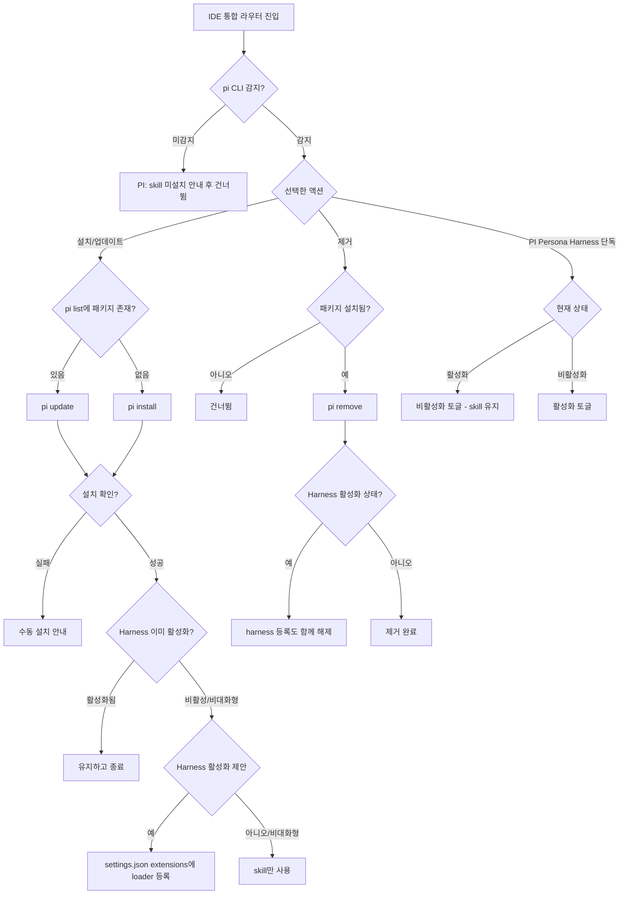

# PI(pi-coding-agent) Agent 지원 및 Persona Harness 통합

## 개요
기존에 Claude Code·Cursor·Gemini·Codex만 지원하던 통합 마법사(`template_integrator.sh` / `.ps1`)에 PI(pi-coding-agent) Agent를 다섯 번째 대상으로 추가했다. PI는 raw 파일 복사가 아니라 native `pi install <git-url>` 방식으로 레포를 통째 클론해 skill을 인식하므로, 설치/업데이트/제거 흐름과 설치 검증 로직을 PI 전용 헬퍼로 별도 구현했다. 더불어 PI가 대화 시작 시 전문가 페르소나와 SDLC 워크플로우를 시스템 프롬프트에 자동 주입하는 Persona Harness(`harness/`)를 신규 패키지 인프라(`package.json`, `harness-loader.ts`)와 함께 추가하고, skill과 독립적으로 켜고/끌 수 있는 opt-in 토글로 노출했다. 이 패키지 전용 파일들은 일반 프로젝트로 흘러가지 않도록 initializer 정리·integrator 복사 제외·플러그인 버전 동기화 워크플로우에 각각 반영했다.

## 변경 사항

### 패키지 인프라 (신규)
- `package.json`: PI 패키지 매니페스트. `name: cassiiopeia`, `version`, `pi.skills: ["./skills"]`로 PI가 스킬 디렉터리를 인식하도록 선언. `private: true`, `keywords: ["pi-package"]`.
- `harness/harness-loader.ts`: PI 확장(extension) 로더. `before_agent_start` 이벤트에서 자기 자신이 위치한 `harness/` 폴더 기준으로 옆의 `.md` 파일을 모두 읽어 시스템 프롬프트 끝에 주입한다. `import.meta.url` 기반으로 디렉터리를 잡아 패키지가 어디에 clone되든 경로를 자동 추적한다.
- `harness/PERSONA.md`: 5개 전문가 페르소나(System Architect·Software Developer·Reviewer·Test Engineer(SDET)·Frontend Engineer & UX/UI Designer)와 성과 지향 마인드셋(자율 경로 선택·확증 편향 경계·간결한 기술 커뮤니케이션 등)을 정의.
- `harness/WORKFLOW.md`: 요구분석→설계→명세→개발→심층 감사→테스트의 6단계 SDLC 프로세스와 14개 전역 실행 규칙(Devil's Advocate 강제, Stop-and-Think 게이트, Zero-Contamination, 단순 작업 Fast-Track 등)을 정의.

### 통합 마법사 (sh / ps1 공통)
- `template_integrator.sh` (+305) / `template_integrator.ps1` (+288): PI skill 설치·업데이트·제거 + Persona Harness 토글 전체 로직 추가. 두 스크립트가 동일한 구조·동작을 갖도록 1:1 대응으로 구현.
- 통합 모드 안내·메뉴 라벨·완료 요약의 대상 목록을 `Claude, Cursor, Gemini, Codex` → `Claude, Cursor, Gemini, Codex, PI`로 갱신.
- IDE 통합 라우터(설치/업데이트·제거)에 PI 항목과 별도의 `PI Persona Harness` 항목을 추가. skill 일괄 처리 시 PI를 기본 선택(preselect)에 포함.
- 패키지 복사 제외 배열(sh `plugin_items_to_remove` / ps1 `Download-Template` 제외 목록)에 `package.json`·`harness` 추가 — 통합 대상 프로젝트로 마켓플레이스 전용 파일이 복사되지 않도록 방어.

### 템플릿 초기화 (initializer)
- `.github/scripts/template_initializer.sh` (+12): `cleanup_template_files()`에 `package.json`(파일)·`harness`(폴더) 삭제 블록 추가. "Use this template"로 생성된 신규 레포에서 PI 패키지 전용 파일을 제거.

### 워크플로우 (버전 동기화)
- `.github/workflows/PROJECT-TEMPLATE-PLUGIN-VERSION-SYNC.yaml` (+21): `package.json`을 버전 동기화 대상에 추가. `deploy` 브랜치 push 시 `jq`(없으면 `sed` fallback)로 `package.json`의 `version`을 `version.yml` 버전에 맞춰 갱신하고 커밋 대상(`git add`)에 포함.

## 주요 구현 내용

### PI 설치 검증 — 폴더가 아니라 `pi list` 출력으로 판정
PI는 패키지의 skill을 로컬에 복사하지 않고, settings에 등록된 패키지 경로를 startup마다 직접 스캔한다. 따라서 설치 여부를 폴더 존재로 판단할 수 없어, `pi list` 출력에 레포명(`SUH-DEVOPS-TEMPLATE`/`cassiiopeia`)이 잡히는지로 판정한다. 설치/업데이트는 native `pi install`·`pi update`, 제거는 `pi remove`를 git URL 대상으로 호출한다.

### Persona Harness — skill과 독립적인 opt-in 토글
Harness 활성화는 PI `settings.json`의 `extensions` 배열에 harness loader 절대경로를 등록하는 방식이다. skill 설치와 완전히 분리되어, skill은 그대로 두고 harness만 켜거나 끌 수 있다. 활성화는 보수적 기본값(opt-in, 기본 N)으로 설치 직후 1회 제안하며, 비대화형/FORCE 모드에서는 묻지 않고 자동 스킵한다. PI 패키지를 제거하면 클론이 사라져 loader 경로가 무효화되므로, 제거 흐름에서 harness 등록도 함께 해제한다.

### mac / Windows 호환 처리
- sh: Windows의 `python3`가 Microsoft Store stub일 수 있어(`command -v`는 성공하나 실행 시 Exit 49) 실제 실행으로 동작하는 python 경로를 골라낸다. settings.json 읽기/쓰기는 환경변수로 경로를 전달하는 heredoc Python 스크립트로 처리.
- ps1: `pi.ps1`이 버전을 stderr로 출력해 PS 5.1 + `$ErrorActionPreference='Stop'`에서 `& pi --version 2>$null`이 NativeCommandError로 격상돼 실패하는 문제를, `cmd /c "... 2>&1"`로 stderr를 stdout에 합쳐 받아 회피한다. settings.json 저장 시 node가 BOM을 파싱 실패할 수 있어 `[System.IO.File]::WriteAllText`로 BOM 없는 UTF-8로 기록한다.

### 동작 흐름

## 주의사항
- Harness 등록은 loader의 **절대경로**를 settings.json에 기록한다. PI 표준 클론 위치(`~/.pi/agent/git/github.com/Cassiiopeia/SUH-DEVOPS-TEMPLATE`)가 바뀌거나 패키지를 재설치해 경로가 달라지면 기존 등록이 무효화될 수 있으므로, 그런 경우 harness를 다시 토글해 경로를 갱신해야 한다.
- harness 토글에는 `settings.json`이 존재해야 하므로, PI를 한 번도 실행하지 않아 settings 파일이 없으면 활성화가 건너뛰어진다(안내 후 재시도 유도).
- Harness 변경은 PI 재시작 후에 적용된다.
- `package.json`·`harness/`는 마켓플레이스 전용 자산이다. 추후 유사한 루트 레벨 패키지 파일을 추가할 때는 initializer 정리·integrator(sh/ps1) 복사 제외·플러그인 버전 동기화 워크플로우 4곳을 함께 갱신해야 신규/통합 프로젝트 오염을 막을 수 있다.
- `package.json`의 `version`은 `PROJECT-TEMPLATE-PLUGIN-VERSION-SYNC` 워크플로우가 `version.yml` 기준으로 동기화하므로 수동 편집은 불필요하다.
