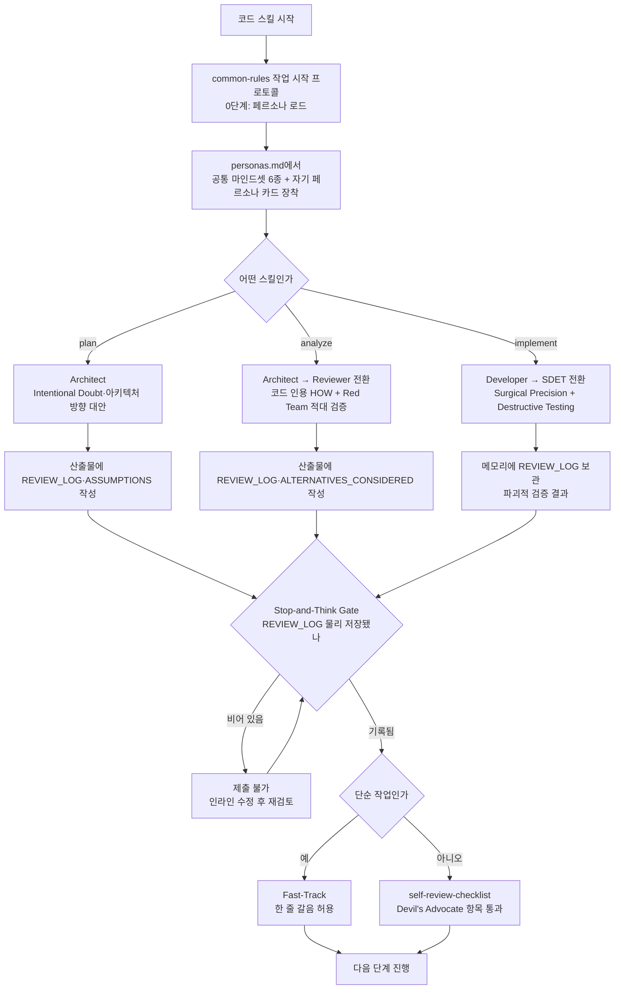

# plan·analyze·implement 3종 스킬 페르소나 시스템 강화

## 개요

PI(harness) 에이전트 전용 시스템 프롬프트에만 주입되고 Claude Code 스킬 실행 시에는 죽어 있던 5개 전문가 페르소나와 6대 마인드셋을 `skills/references/personas.md`로 한국어 single source화하여 신설하고, 이를 `plan`·`analyze`·`implement` 3종 코어 스킬에 바인딩했다. 동시에 Devil's Advocate(악마의 변호인)와 Stop-and-Think Gate(멈춤-사고 게이트)를 각 스킬 산출물의 `[REVIEW_LOG]`·`[ALTERNATIVES_CONSIDERED]` 블록 + self-review 체크리스트에 HARD-GATE로 주입해, 매 실행마다 들쭉날쭉하던 산출물 품질을 "의심 → 대안 → 적대적 자기검증" 루프로 일관되게 강제한다. 단순 작업에는 Fast-Track 예외(harness Rule 8)를 두어 의식의 무게를 지우지 않는다.

## 변경 사항

### 신규 — 페르소나 single source
- `skills/references/personas.md`: harness/PERSONA.md(영문 PI 전용)를 한국어 + Claude Code 스킬 문맥으로 옮긴 single source 신설. 공통 마인드셋 6종(Outcome-Focused Autonomy, Proactive Excellence, Anti-Confirmation Bias, Value-Driven Evaluation, Zero Flattery, Intellectual Humility) + 5개 페르소나 카드(System Architect / Software Developer / Reviewer / Test Engineer·SDET / Frontend·UX/UI) + 스킬↔페르소나 매핑표 + Devil's Advocate·Stop-and-Think Gate·Fast-Track 예외 정의 포함.

### 신규 — 설계 문서
- `docs/superpowers/specs/2026-06-12-suh-core-skills-persona-design.md`: 한 줄 요약·배경·DoD·범위 경계·승인 결정사항·아키텍처·컴포넌트별 상세 설계·변경 요약·위험&완화·검증 방법을 담은 설계 spec 신설.

### 강화 — 3종 스킬 SKILL.md
- `skills/plan/SKILL.md`: "시작 전"에 System Architect 페르소나 로드 지시 추가. Phase 1 질문에 Intentional Doubt(숨은 의도·누락 제약 1개 이상 파고듦) 강제. `## 7. 가정`을 `[ASSUMPTIONS]`로 명시하고, `## 10. [REVIEW_LOG] — Architect 자기검증`(리스크·놓친 시나리오·아키텍처 방향 대안) 신설. 대안은 아키텍처 방향 수준까지만 허용(파일/함수 단위 금지). 흔한 실수 표에 게이트 위반 항목 2개 추가.
- `skills/analyze/SKILL.md`: "시작 전"에 System Architect(주) + Reviewer(부) 이중 페르소나 로드. Phase 1 정찰 체크리스트에 Pre-mortem 항목 추가. `## 4. 위험 & 완화`를 `[RISK]`(Red Team edge case)로 강화. `## 7. [REVIEW_LOG] — Reviewer 적대적 검증`과 `## 8. [ALTERNATIVES_CONSIDERED]`(기각한 HOW 대안 + 기각 이유) 신설. §5 검증 방법에 파괴적 검증 항목 추가. 흔한 실수 표에 게이트 위반 항목 2개 추가.
- `skills/implement/SKILL.md`: "시작 전"에 Software Developer(주) + SDET(부) 이중 페르소나 로드. Phase 2 편집을 Surgical Precision(관련 부분만 외과적 수정) + Pre-mortem으로 강화. Phase 3 검증을 SDET Destructive Testing("성공 증명"이 아니라 "실패의 반증")으로 격상. Phase 5 산출물 메모리에 `[REVIEW_LOG]`(파괴적 검증 결과) 항목 추가. 흔한 실수 표에 게이트 위반 항목 2개 추가.

### 강화 — 공유 references
- `skills/references/self-review-checklist.md`: plan·analyze·implement 3종 체크리스트 각각에 HARD-GATE — Devil's Advocate 항목 1줄씩 추가(plan: `[REVIEW_LOG]`, analyze: `[REVIEW_LOG]` + `[ALTERNATIVES_CONSIDERED]`, implement: SDET 파괴적 검증). `## 7. 가정`을 `[ASSUMPTIONS]`로 표기 정합.
- `skills/references/common-rules.md`: "작업 시작 프로토콜"에 0번 단계로 페르소나 로드(공통 마인드셋 6종 + 본 skill 페르소나 카드) 추가.

### 문서
- `CLAUDE.md`: 템플릿 전용 제외 목록에 `.codex-plugin/`·`.agents/`·`.cursor/`·`package.json`·`harness/` 반영. 레포 루트에 마켓플레이스/템플릿 전용 파일 추가 시 동기화할 3~4곳 가이드 섹션 추가. skills 폴더 구조 설명에 `personas.md`·`self-review-checklist.md` 추가. skill 시작 필독 순서에 페르소나 로드 단계 삽입.

## 주요 구현 내용

핵심 접근은 **페르소나를 장식이 아니라 "행동 강제 레이어"로 다루는 것**이다. 세 가지 메커니즘으로 강제한다.

- **스킬별 단일 페르소나 바인딩**: plan = Architect, analyze = Architect + Reviewer, implement = Developer + SDET. 이중 바인딩 스킬은 한 스킬 안에서 context-switching한다(예: analyze는 Architect로 HOW를 설계한 뒤 Reviewer로 전환해 그 계획을 '신뢰할 수 없는 외부인의 취약한 코드'로 적대적으로 깬다).
- **Devil's Advocate (HARD-GATE)**: 산출물을 단순 "Pass"하지 않고 Reviewer/SDET 시선으로 최소 1개의 결함·edge case·구조 개선점을 `[REVIEW_LOG]` 블록에 물리적으로 기록해야 한다.
- **Stop-and-Think Gate**: 이전 단계의 `[REVIEW_LOG]`가 산출물에 물리적으로 저장됐음을 확인한 후에만 다음 단계로 진행한다. 여러 단계를 한 턴에 몰아치는 "steamrolling"을 차단한다.

PI harness 원본(`harness/PERSONA.md`·`WORKFLOW.md`)은 일절 수정하지 않고 `skills/references/` 공유 자산 + 3종 SKILL.md에만 강화 로직을 반영해 single source를 보존했다.

## 주의사항

- **single source 정합은 수동**: `personas.md`와 harness 원본 간 양방향 자동 동기화는 없다. harness/PERSONA.md를 수정할 일이 생기면 `personas.md`도 함께 검토해야 한다(문서 상단 주석으로 명시).
- **Fast-Track 예외 운용**: 파일 2개 이하·함수 1개 범위·외부 동작/API/스키마 변경 없음·명백한 유사 패턴 존재 시 게이트를 "리스크 없음 — 단순 작업 (Fast-Track)" 한 줄로 갈음할 수 있다. 단순 버그픽스·마이너 조정에 게이트의 무게를 과하게 지우지 않도록 한다.
- **강화 범위는 3종 스킬로 한정**: review/test/design 등은 이번 범위 밖이다. `personas.md` 매핑표에 향후 동일 패턴 바인딩을 위한 매핑만 미리 기록해 두었다.
- **신규 게이트는 추가 레이어**: 기존 HARD-GATE(HOW 침범 금지, No Placeholders)와 충돌하지 않도록 신규 게이트는 기존 규칙 위에 얹는 추가 레이어로 설계됐으며 기존 규칙 문구는 보존됐다.
- 검증은 분석/구현 스킬 특성상 코드 빌드가 아니라 문서 일관성(페르소나 로드 지시·블록·게이트·Fast-Track 예외 존재 여부, harness 원본 미변경) 확인으로 수행한다.
