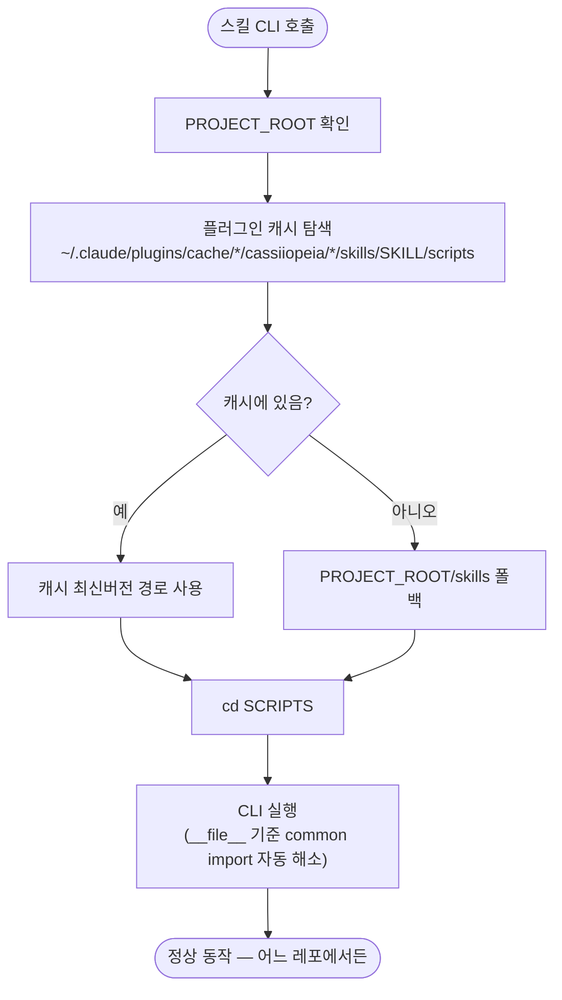

# 스킬 스크립트 경로가 프로젝트 루트 고정이라 타 레포 실행 시 탐색 실패

## 개요

cassiiopeia 플러그인 스킬들이 Python CLI 스크립트를 `cd "$PROJECT_ROOT/skills/<skill>/scripts"` **프로젝트 루트 고정 경로**로 호출하던 것을, **플러그인 캐시(설치 위치) 우선 → 프로젝트 루트 폴백** 탐색으로 변경했다. 이 고정 경로는 SUH-DEVOPS-TEMPLATE 레포 내부에서만 유효했고, 템플릿으로 생성·통합된 사용자 레포에는 `skills/` 폴더가 통합 시 제외되어 존재하지 않으므로, 다른 레포에서 스킬 실행 시 스크립트를 찾지 못하고 헤매던 문제를 해소했다. 윈도우 특정 문제가 아니며 macOS·Linux에서도 동일하게 재현되던 버그다.

## 기능 흐름



## 변경 사항

### 표준 패턴 (single source)
- `skills/references/common-rules.md`: 표준 호출 패턴의 `cd "$PROJECT_ROOT/skills/<skill>/scripts"`를 캐시 우선 탐색 헬퍼로 교체. 스크립트가 플러그인 캐시에 설치된다는 점·`_cli.py`가 `__file__` 기준으로 import한다는 점·config는 user 홈 기준이라 프로젝트 위치와 무관하다는 점을 안내문으로 추가.
- `skills/references/doc-output-path.md`: review 경로 예시 동일 교체.

### 스킬별 SKILL.md
- `skills/suh-github/SKILL.md`: 코드블록 10곳 교체 + "시작 전" 섹션에 캐시 설치 위치 안내 추가 + Windows 주의 주석의 틀린 고정 경로 수정.
- `skills/suh-issue/SKILL.md`: 코드블록 3곳 교체 + Windows 주의 주석 2곳 수정.
- `skills/suh-commit/SKILL.md`: 코드블록 교체.
- `skills/suh-report/SKILL.md`: 코드블록 교체.
- `skills/suh-review/SKILL.md`: 코드블록 교체.
- `skills/suh-troubleshoot/SKILL.md`: 코드블록 교체.
- `skills/suh-changelog-deploy/SKILL.md`: 코드블록 5곳 교체.

## 주요 구현 내용

교체한 탐색 헬퍼 한 줄:

```bash
SCRIPTS=$(ls -d ~/.claude/plugins/cache/*/cassiiopeia/*/skills/<skill>/scripts 2>/dev/null | sort -V | tail -1)
[ -z "$SCRIPTS" ] && SCRIPTS="$PROJECT_ROOT/skills/<skill>/scripts"
cd "$SCRIPTS" || exit 1
```

- **캐시 우선**: `ls -d`로 캐시의 모든 버전 디렉토리를 나열하고 `sort -V | tail -1`로 최신 버전을 선택한다. 마켓플레이스 이름 자리는 `*`로 일반화해 마켓플레이스가 달라도 동작한다.
- **프로젝트 루트 폴백**: 캐시에 없으면(이 템플릿 레포 자체에서 개발 중) 기존 동작대로 프로젝트 루트를 사용한다.
- **코드 무수정**: `config.py`는 `Path.home() / ".suh-template" / "config" / "config.json"`을 정확히 가리키고, `<scope>_cli.py`는 `Path(__file__).resolve().parents[3]` 기준으로 `scripts/common`을 import하므로 cwd와 무관하게 동작한다. 즉 스크립트 파일 위치만 올바르면 import가 자동으로 풀리므로 Python 코드는 손대지 않았다.

## 검증

수정한 7개 스킬 CLI를 "skills 폴더가 없는 다른 레포"로 PROJECT_ROOT를 지정한 환경에서 실제 호출해, 캐시 탐색 → import → CLI 실행이 모두 성공함을 확인했다 (suh-github / suh-issue / suh-commit / suh-report / suh-review / suh-troubleshoot / suh-changelog-deploy).

## 주의사항

- 이미 사용 중인 사용자 레포에서는 **플러그인 캐시의 스킬 버전이 갱신된 이후**부터 이 수정이 반영된다(SKILL.md가 캐시에 설치되므로).
- 상대 경로 표기(`skills/<skill>/scripts/<cli>.py`)는 문서 참조용이라 그대로 두었다. 실제 실행에 쓰이는 `cd` 코드블록만 교체 대상이었다.
