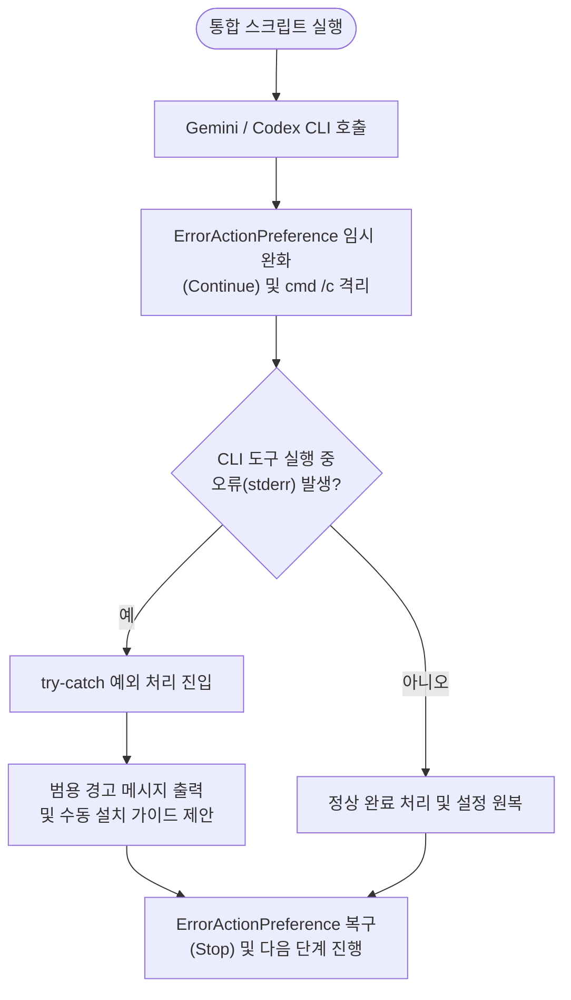

# ❗[버그][Integrator] PowerShell 환경에서 Gemini CLI 업데이트 시 튕김 오류

## 개요
PowerShell 환경에서 `template_integrator.ps1`을 실행할 때, 외부 CLI 도구(Gemini, Codex)의 설치/업데이트 중 환경적 오류(예: 로컬 깨진 확장 등)로 인해 stderr 출력이 발생하면 스크립트가 비정상 강제 종료(튕김)되던 문제를 구조적으로 격리 및 해결했습니다.

## 기능 흐름

## 변경 사항

### [Integrator]
- `template_integrator.ps1`: 외부 명령어 호출 도중 예외가 나도 통합 스크립트가 강제 종료되지 않도록 `cmd /c`와 `try-catch`로 호출 프로세스를 샌드박싱(Sandbox) 처리하였으며, 하드코딩 문구를 걷어내고 정직하며 직관적인 범용 수동 복구 가이드를 제공하도록 개편하였습니다.
- `template_integrator.sh`: `_manage_gemini_extension` 및 `_do_codex_marketplace_register`에서 업데이트 실패 시 특정 도구명을 언급하지 않고, 윈도우 환경과 완전히 일치하는 깔끔한 범용 오류 및 수동 대안 출력 체계로 정돈하였습니다.

## 주요 구현 내용
1. **PowerShell `NativeCommandError` 방어**: PowerShell의 직접 호출 연산자(`&`) 대신 `cmd /c`를 경유해 외부 도구를 호출하여, 외부 프로그램의 stderr 출력이 PowerShell 호출 예외(`RemoteException`)로 폭발하는 구조적 허점을 차단했습니다.
2. **샌드박싱 가드 패턴 도입**: 호출부 직전 `$ErrorActionPreference`를 임시로 `"Continue"`로 하향 조절한 후, `try-catch`로 격리 실행하고 `finally`에서 안전하게 `"Stop"`으로 복원하는 다중 예외 방어 벽을 완비했습니다.
3. **가이드 메시지 본질화**: "핵심 통합에는 영향이 없다"는 식의 혼란스러운 변명을 지우고, 설치 에러 상황을 명확히 알린 뒤 수동으로 실행 가능한 완벽한 복구 명령어를 Cyan 컬러로 직접 제안하도록 사용자 인터페이스를 단순화했습니다.

## 주의사항
- 향후 통합 스크립트 내에서 타 외부 CLI를 새로 도입하는 경우, 본 보고서의 `cmd /c` 샌드박싱 가드 패턴을 일치하게 적용해야 튕김 현상을 영구적으로 예방할 수 있습니다.
