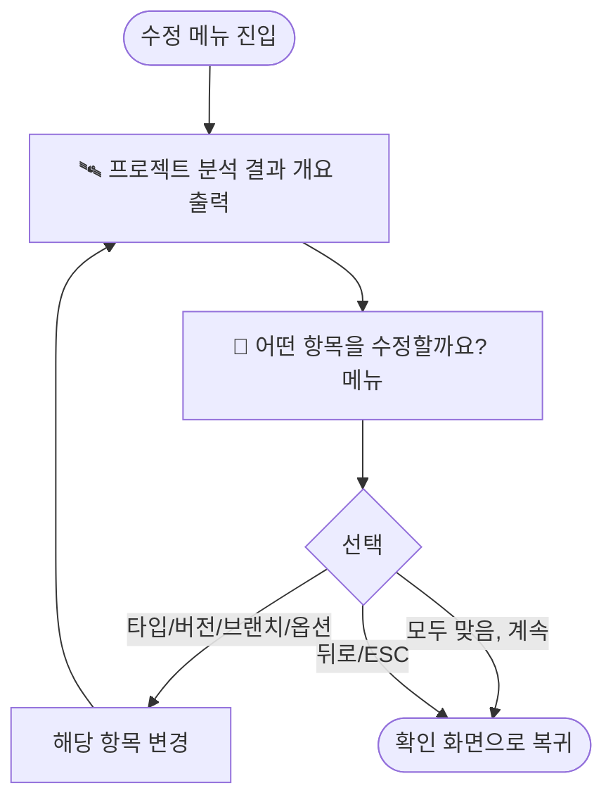

# 수정 메뉴에서 항목 변경 후 분석 결과 개요 재출력

## 개요

`template_integrator.sh` / `template_integrator.ps1`의 "어떤 항목을 수정할까요?" 메뉴는 항목 하나(예: 버전)를 수정하면 변경 직후 곧바로 같은 수정 메뉴를 다시 출력했다. 이 때문에 사용자는 방금 바꾼 값이 전체 개요(`🛰️ 프로젝트 분석 결과`)에 어떻게 반영됐는지 확인하지 못한 채 다음 항목을 골라야 했다. 본 변경은 수정 루프가 매 반복마다 **분석 결과 개요를 먼저 다시 그린 뒤** 수정 메뉴를 보여주도록 개선해, "변경 → 개요 확인 → 다음 선택"의 자연스러운 흐름을 복원한다.

## 기능 흐름

## 변경 사항

### 개요 출력 로직 함수 분리
- `template_integrator.sh`: 기존 `detect_and_confirm_project()` 내부에 인라인돼 있던 분석 결과 개요 출력 블록을 `print_project_analysis()` 함수로 추출.
- `template_integrator.ps1`: 동일하게 `Detect-AndConfirmProject` 내부 개요 출력 블록을 `Print-ProjectAnalysis` 함수로 추출.

### 수정 루프에서 개요 재출력
- `template_integrator.sh` `handle_project_edit_menu()`: 루프 최상단에서 `print_project_analysis` 호출 추가.
- `template_integrator.ps1` `Edit-ProjectInfo`: 루프 최상단에서 `Print-ProjectAnalysis` 호출 추가.

### 확인 화면 호출부 정리
- `detect_and_confirm_project()` / `Detect-AndConfirmProject`: 인라인 개요 블록을 분리된 함수 호출로 교체(동작 동일, 중복 제거).

## 주요 구현 내용

- 개요 출력을 단일 함수로 모아, **확인 화면**과 **수정 루프** 두 진입점이 동일한 출력을 공유한다. 한쪽만 바뀌어도 표시 형식이 어긋나지 않는다.
- 개요 함수는 멀티 타입(csv·`(멀티)`), 통합 모드, Nexus / Secret 백업 포함 여부, 모노레포 경로를 기존과 동일한 조건으로 표시한다 — 출력 형식·항목은 변동 없이 호출 위치만 추가됐다.
- `.sh`와 `.ps1`의 동작·출력 순서를 1:1로 맞췄다.

## 주의사항

- 실행 로직(메뉴 선택, 입력 처리, ESC/뒤로 분기)은 변경하지 않았다. 개요 출력 블록의 추출·호출만 수행했다.
- 검증: `bash -n`(sh 구문), 로컬 PowerShell `Parser::ParseFile`(ps1 구문) 모두 통과. 두 스크립트 모두 수정 루프 진입 시 `🛰️ 프로젝트 분석 결과 → 💫 수정 메뉴` 순으로 출력됨을 실제 실행으로 확인했다.
