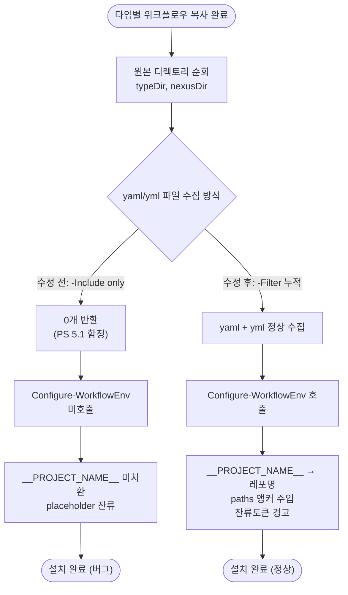

# template_integrator.ps1 Get-ChildItem -Include 함정으로 워크플로우 토큰 치환 전체 스킵

## 개요

PowerShell 마법사(`template_integrator.ps1`)로 템플릿을 설치할 때, 배포 워크플로우의 `@wizard` 토큰 치환(`__PROJECT_NAME__` 등)이 전부 스킵되어 placeholder가 미치환 상태로 남던 버그를 수정했다. 원인은 `Configure-WorkflowEnv` 호출부에서 사용한 `Get-ChildItem -Include`가 Windows PowerShell 5.1에서 경로 끝 `\*` 또는 `-Recurse` 없이는 **에러 없이 0개를 반환**하는 알려진 함정이었다. 이로 인해 치환 엔진이 단 한 번도 호출되지 않았다. 호출부를 `-Filter` 누적 방식으로 교체해 Windows PowerShell 5.1과 macOS PowerShell Core 양쪽에서 동일하게 동작하도록 했다.

## 기능 흐름

## 변경 사항

### 버그 수정
- `template_integrator.ps1` (워크플로우 env 동적 설정 블록): 원본 디렉토리에서 워크플로우 파일을 수집할 때 `Get-ChildItem -Path $srcDir -Include '*.yaml','*.yml' -File`를 사용하던 것을, `-Filter '*.yaml'`와 `-Filter '*.yml'`를 각각 호출해 배열에 누적하는 방식으로 교체했다. 함정의 원인과 해결 의도를 설명하는 주석도 함께 추가했다.

## 주요 구현 내용

PowerShell의 `Get-ChildItem -Include`는 `-Path`가 컨테이너(디렉토리)를 가리킬 때, 경로 끝에 와일드카드(`\*`)가 붙거나 `-Recurse`가 함께 있어야만 필터가 적용된다. 둘 다 없으면 디렉토리 자체를 대상으로 삼아 `-Include`가 매칭에 실패하고 **조용히 빈 결과**를 반환한다. 예외도 경고도 없어 발견이 어렵다.

반면 `-Filter`는 디렉토리 직속 파일에 바로 적용되며, 코드 내 다른 곳에서도 이미 같은 방식으로 워크플로우를 수집하고 있어 검증된 패턴이다. 단, `-Filter`는 한 번에 하나의 패턴만 받으므로 `*.yaml`과 `*.yml`을 각각 호출해 누적했다.

`Configure-WorkflowEnv` 호출부는 스크립트 전체에서 이 한 곳뿐이라, 이 줄이 빈 컬렉션을 돌면 `.ps1`의 토큰 치환 기능 전체(레포명 치환, 모노레포 paths 앵커 주입, 잔류 토큰 경고)가 무력화된다. `.sh`는 glob(`"$_src_dir"/*.{yaml,yml}`)을 사용해 정상 동작했으므로, 이 버그는 `.ps1` 전용이었다.

### 검증 (실측)

| 항목 | 결과 |
|------|------|
| 수정 전 `-Include` only (PS 5.1) | 0개 반환 (버그 재현) |
| 수정 후 `-Filter` 누적 | 2개 정상 수집 |
| 전체 구문 파싱 (`Parser::ParseFile`) | 통과 |
| 함수 단위 실행 — 더미 워크플로우 | `__PROJECT_NAME__` → 레포명 치환 성공, `@wizard ask` → `@wizard set`으로 갱신 |

## 주의사항

- 이 버그는 `@wizard` 마커를 가진 모든 타입의 배포 워크플로우(react/next/spring/python/flutter)에 영향을 주었으므로, `.ps1` 마법사로 이전에 설치한 프로젝트는 워크플로우의 `__PROJECT_NAME__`이 미치환 상태로 남아 있을 수 있다. 마법사를 재실행하거나 해당 값을 직접 채우면 정상화된다.
- `.sh` 마법사로 설치한 프로젝트는 영향을 받지 않는다.

## 처리 결과

- 커밋: `442650f`
- 버전: v3.0.143 자동 증가
- 배포: deploy PR #397 automerge 완료
