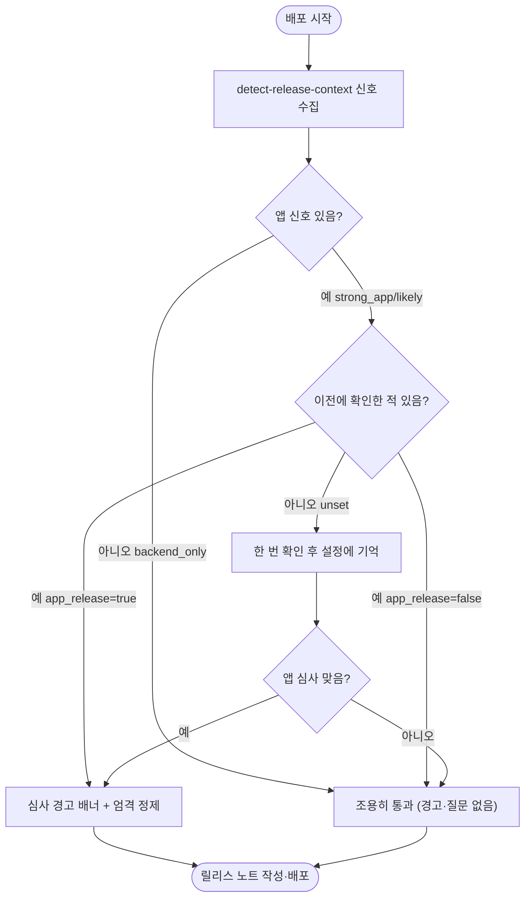

# changelog-deploy 앱 심사 인지(App-Release Awareness) 추가

## 개요

`changelog-deploy` 스킬은 모든 저장소를 동일하게 취급해 릴리스 노트를 작성했다. 그러나 앱스토어/플레이스토어 심사 자동 제출이 켜진 저장소에서는 deploy가 "내부 배포"가 아니라 **사용자 대면 출시**가 되어, 릴리스 노트가 그대로 스토어 출시노트이자 심사 제출물이 된다. 이를 인지하도록 **릴리스 컨텍스트 인지** 단계를 추가했다. 백엔드 저장소(spring/python)는 아무 영향 없이 조용히 통과하고, 앱 심사 저장소는 한 번 확인해 기억한 뒤 릴리스 노트에 심사 경고 배너를 띄우고 정제를 더 엄격히 적용한다. 판단·확인·설정 갱신은 모두 에이전트가 수행하며 사용자는 설정 파일을 직접 만지지 않는다.

## 기능 흐름

## 변경 사항

### 신호 수집기 (Python)
- `skills/changelog-deploy/scripts/changelog_cli.py`: `detect-release-context` 서브커맨드 추가. `version.yml`의 `project_types`와 `.github/workflows`의 스토어 워크플로우(PLAYSTORE/TESTFLIGHT/APPSTORE)를 스캔해 **사실(signals)**과 **약한 hint**(`strong_app`/`app_release_likely`/`backend_only`/`unknown`)만 JSON으로 반환한다. GitHub API를 쓰지 않아 PAT가 불필요하고(로컬 파일만 스캔), 표준 라이브러리만 사용해 폐쇄망에서도 동작한다. 앱 심사 여부의 최종 판단은 하지 않는다.

### 인지·판단 단계 (SKILL.md)
- `skills/changelog-deploy/SKILL.md`: "1.5단계: 릴리스 컨텍스트 인지" 추가. 백엔드는 조용히 통과, 앱 심사 감지 시 한 번 확인 후 결과를 설정에 기억해 다음 배포부터는 묻지 않는다. 5.5단계/fix 4.5단계 승인 게이트에 심사 경고 배너를 결합하고, 5단계 정제 원칙에 "앱 심사 저장소면 기준을 한 단계 더 엄격히" 문구를 보강했다.

### 설정 문서화
- `skills/config.json.example`, `skills/references/config-rules.md`: `changelog_deploy.app_release` 키를 예시·스키마에 추가. 레포별로만 저장하며(글로벌 기본값 없음) 에이전트가 자연어 응답을 받아 갱신한다.

## 주요 구현 내용

- **역할 분담**: 스킬의 기존 철학("입력 해석·판단은 agent, 사실 수집·실행은 py")을 그대로 따른다. py는 신호만 모으고, "앱 심사 레포냐"의 판단·애매할 때 사용자에게 묻기·설정 갱신은 모두 agent가 한다.
- **사용자 경험 우선**: 명확한 백엔드는 조용히 지나가고, 앱 심사로 처음 감지될 때만 한 번 확인한다. 그 결과를 기억해 반복 질문하지 않는다. 사용자에게 설정 키 이름·파일 경로를 노출하지 않고 자연어로만 대화한다.
- **확장성**: 새 스토어/플랫폼(react-native 등)이 생기면 py의 워크플로우 매칭 키워드 목록에 한 줄만 추가하면 된다. SKILL.md 분기 로직은 무수정.

## 검증

5가지 픽스처 케이스 모두 기대값 통과:

| 케이스 | 기대 hint | 결과 |
|--------|-----------|------|
| flutter + PLAYSTORE/TESTFLIGHT 워크플로우 | strong_app | ✅ |
| spring만, 스토어 워크플로우 없음 | backend_only | ✅ |
| 스토어 워크플로우만 + type basic | app_release_likely | ✅ |
| version.yml·workflows 없음 | unknown | ✅ |
| flutter + TEST 워크플로우만 | app_release_likely | ✅ |

- **실전 첫 적용**: 이 저장소(basic 타입, 스토어 워크플로우 없음)에 배포 시 `backend_only`로 정확히 판정되어 경고·질문 없이 조용히 통과함을 확인.
- **배포 결과**: deploy PR #401 automerge 완료.

## 주의사항

- 플러그인 캐시는 마켓플레이스 동기화 전까지 구버전이라, 캐시 경로로는 `detect-release-context`가 보이지 않을 수 있다. main에는 이미 반영됐고 다음 버전 동기화 시 캐시도 갱신된다.
- `app_release` 값은 레포별로만 저장한다 — 앱 심사 여부는 저장소마다 다르므로 글로벌 기본값을 두지 않는다.
