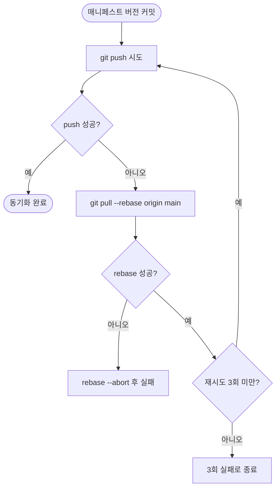

# PLUGIN-VERSION-SYNC push 레이스로 반복 실패 + 사용자 프로젝트 유출

## 개요

`PROJECT-TEMPLATE-PLUGIN-VERSION-SYNC` 워크플로우가 push 전 rebase를 하지 않아, 다른 버전 워크플로우와 동시에 main을 push할 때 `! [rejected] (fetch first)`로 거부되어 2026-06-11부터 반복 실패했다. 이로 인해 플러그인 매니페스트 버전이 `version.yml`보다 뒤처졌다. push step을 **pull-rebase + 3회 재시도**로 교체해 레이스를 자동 복구하도록 고쳤다. 추가로, 이 워크플로우가 마켓플레이스 전용인데도 템플릿 정리 목록에서 빠져 사용자 프로젝트로 유출되던 문제를 함께 바로잡았다 (initializer 삭제 + integrator sh/ps1 복사 제외).

## 기능 흐름

## 변경 사항

### 워크플로우 레이스 수정
- `.github/workflows/PROJECT-TEMPLATE-PLUGIN-VERSION-SYNC.yaml`: "변경사항 커밋" step에서 단순 `git push`를 **pull-rebase + 최대 3회 재시도** 루프로 교체. 원격이 앞서 push가 거부되면 `git pull --rebase origin main` 후 다시 push한다. (이미 운영 중인 `PROJECT-COMMON-VERSION-CONTROL` v2.1과 동일한 검증된 패턴)

### 템플릿 유출 차단 (마켓플레이스 전용 워크플로우 정리)
- `.github/scripts/template_initializer.sh`: `cleanup_template_files()`에 이 워크플로우 삭제 추가 → "Use this template"로 새 프로젝트 생성 시 제거
- `template_integrator.sh`: `plugin_items_to_remove` 배열에 이 워크플로우 경로 추가 → 기존 프로젝트 통합 시 복사 제외
- `template_integrator.ps1`: `pluginItemsToRemove` 배열에 동일 추가 (Windows 대칭)

## 주요 구현 내용

- **레이스 근본 원인**: 한 번의 main push가 VERSION-CONTROL·PLUGIN-VERSION-SYNC 등 여러 버전 워크플로우를 동시에 트리거한다. 각자 main에 커밋·push하므로, 늦게 push하는 쪽이 `fetch first`로 거부된다. 사람이 지키는 "push 전 rebase" 규칙을 워크플로우 스크립트만 지키지 않아 발생한 문제다.
- **해결 패턴 재사용**: 새 로직을 발명하지 않고, 같은 레포에서 이미 success 이력이 있는 VERSION-CONTROL의 pull-rebase + retry 블록을 그대로 가져와 일관성과 신뢰성을 확보했다.
- **유출 차단의 정당성**: 이 워크플로우가 동기화하는 대상(`.claude-plugin/`·`gemini-extension.json`·`package.json` 등)은 전부 마켓플레이스 전용 파일이라 사용자 프로젝트에는 없거나 정리 시 삭제된다. 따라서 워크플로우 자체도 함께 제거하는 것이 옳다. CLAUDE.md의 "루트 마켓플레이스 전용 자산은 initializer·integrator(sh/ps1) 3곳을 함께 수정" 규칙을 그대로 따랐다.

## 검증

- `template_initializer.sh` / `template_integrator.sh`: `bash -n` 문법 통과
- `template_integrator.ps1`: Docker PowerShell `Parser::ParseFile` → `PS1_PARSE_OK`
- 워크플로우 YAML: ruby psych 파싱 통과, `git diff`로 트리거·`uses` 등 실행 로직 무손상 확인 (변경은 `run:` 블록 내 push 로직뿐)

## 주의사항

- 이 수정 후 첫 main push(이 커밋 포함)로 PLUGIN-VERSION-SYNC가 실제 success하는지 Actions 이력으로 확인이 필요하다.
- 기존에 어긋난 매니페스트 버전은 다음 version.yml 변경 시 이 워크플로우가 정상 동작하며 자동으로 따라잡는다.
