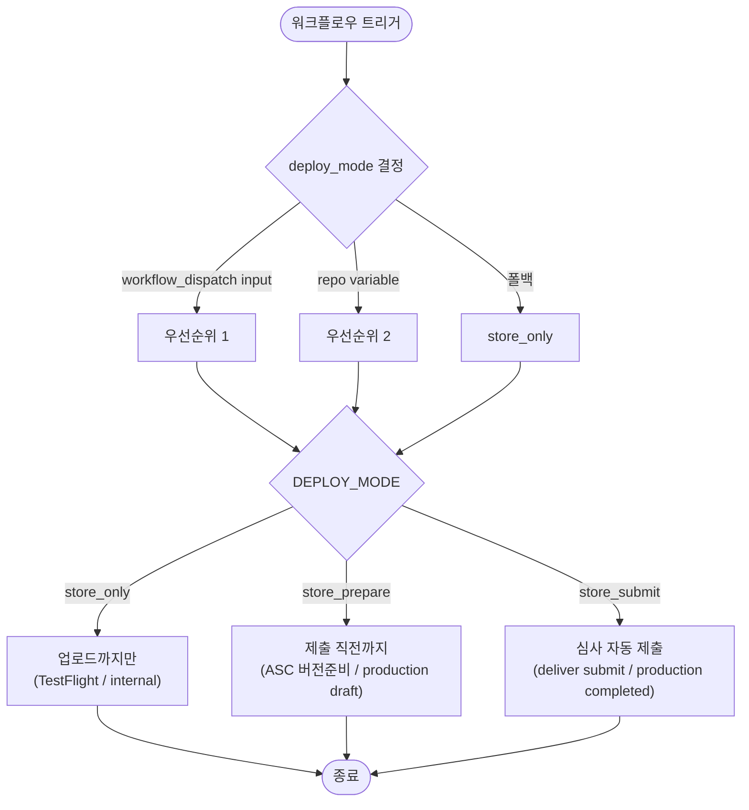
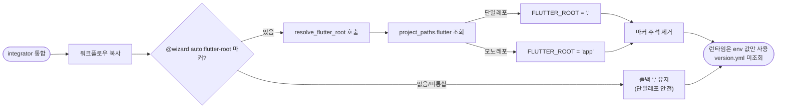

# RomRom 검증 스토어 배포 포팅 + 모노레포 경로 대응

## 개요

RomRom-FE(실측 success 운영본)에서 검증된 Flutter 스토어 배포 로직을 SUH-DEVOPS-TEMPLATE에 포팅하고, Flutter 루트가 서브폴더인 모노레포에서 CICD가 깨지지 않도록 워크플로우 경로를 변수화했다. 두 갈래 작업이다 — **(A) 배포 로직 포팅**: iOS App Store 심사 자동 제출, Android 거짓 성공 제거, 배포 모드 3단계 통일, iOS Fastfile을 Android와 동일한 파일 템플릿 방식으로 통일. **(B) 모노레포 경로 대응**: 워크플로우에 `FLUTTER_ROOT` env를 두고 통합 시점에 `project_paths.flutter` 값으로 1회 치환, 빌드/배포 job에 `working-directory`를 걸고 레포 루트 전용 자산은 절대경로화. 기본값 `.`이면 단일레포 동작이 100% 보존된다.

## 기능 흐름

### 배포 모드 분기 (양 플랫폼 공통)

### 모노레포 경로 주입 (통합 시점 1회 치환)

## 변경 사항

### iOS 배포 로직 (파일 템플릿 통일)

- `testflight-wizard/templates/Fastfile` → `Fastfile.ios.template` 개명 + 전면 교체: `deploy` 통합 lane(pilot 업로드 + deliver 심사 자동 제출 + whatsNew 메타 생성 + 심사 Notes 초기화). RomRom heredoc `deploy_appstore` lane을 ENV 기반으로 이식, Bundle ID 하드코딩 제거.
- `PROJECT-FLUTTER-IOS-TESTFLIGHT.yaml`: heredoc 동적 생성 폐기 → 마법사가 깐 `ios/fastlane/Fastfile` 직접 사용, `deploy_mode` workflow_dispatch input + `DEPLOY_MODE` env, 호출을 `fastlane deploy`로 통일.

### Android 배포 로직 (거짓 성공 제거)

- `playstore-wizard/templates/Fastfile.playstore.template`: `deploy_internal`/`promote_internal_to_production` lane에 `rescue_changes_not_sent_for_review: false`(거짓 성공 차단) + `track_promote_release_status`(completed/draft 분기). `{{APPLICATION_ID}}` 토큰 유지.
- `PROJECT-FLUTTER-ANDROID-PLAYSTORE-CICD.yaml`: `deploy_mode` input + `DEPLOY_MODE` env를 fastlane 호출 step에 전달.

### 모노레포 경로 변수화 (두 워크플로우)

- 두 워크플로우 상단 `env: FLUTTER_ROOT: "."  # @wizard auto:flutter-root` 추가.
- 빌드/배포 job(각 3개)에 `defaults.run.working-directory: ${{ env.FLUTTER_ROOT }}` → `cd ios`/`cd android`/상대경로 `run`이 Flutter 루트 기준으로 해석.
- working-directory가 안 먹는 곳 개별 변수화: artifact `path:`(upload/download), step-level `working-directory`, `$GITHUB_WORKSPACE/.../build` 절대경로.
- **레포 루트 전용 자산 절대경로화**(이번 작업에서 추가 발견·해결): `.github/scripts/*`·`CHANGELOG.json`·`version.yml`·`final_release_notes.txt`를 만지는 step은 `working-directory: ${{ github.workspace }}` 또는 `$GITHUB_WORKSPACE/` 접두로 — working-directory가 `FLUTTER_ROOT`로 바뀌어도 레포 루트 자산을 찾도록 보장.

### integrator resolver

- `template_integrator.sh`: `resolve_flutter_root()` 함수 + `resolve_token` 디스패처에 `flutter-root` 등록.
- `template_integrator.ps1`: `Resolve-FlutterRoot` 함수 + `Resolve-Token` switch에 `flutter-root` 등록(.sh와 동등). `$script:ProjectPaths` 직접 조회.

### 마법사 안내

- iOS 셋업(`testflight-wizard-setup.sh`): 템플릿 참조 경로를 `Fastfile.ios.template`로 변경 + `IOS_DEPLOY_MODE` 안내.
- Android 셋업(`.sh`/`.ps1`): `ANDROID_DEPLOY_MODE` 안내 동기화(동등).
- 두 마법사 HTML 완료단계: 배포 모드 & 출시 로드맵 안내카드(`deploy-mode-card`) 추가.

## 주요 구현 내용

- **배포 모드 3단계 공통 네이밍** `store_only`/`store_prepare`/`store_submit` + iOS 하위호환 별칭(`testflight_only`/`appstore_*`). 양 플랫폼 Fastlane이 둘 다 인식. 우선순위: workflow_dispatch input → repo variable → 폴백(`store_only`).
- **iOS heredoc → 파일 템플릿 통일**: 배포 로직이 `Fastfile.ios.template` 한 곳에만 존재 → 마법사가 깐 파일 = 도는 파일(Android와 대칭). 유지보수 일원화, Ruby 문법 검증 가능.
- **거짓 성공 차단**: fastlane supply 기본값 `rescue_changes_not_sent_for_review: true`가 심사 미전송을 자동 rescue해 "저장만 하고 success 반환"하던 문제를, `false`로 명시해 워크플로우가 정직하게 실패하도록.
- **모노레포 경로는 런타임 version.yml 미조회**: 값을 통합 시점에 env에 1회 박는다. version.yml이 망가져도 배포가 죽지 않고, 워크플로우만 봐도 동작이 보인다.

## 검증

> 정적 검증 + passQL(모노레포 `project_paths.flutter: "app"`) 실측. 실제 GitHub Actions 러너 배포는 RomRom-FE에서 동형 로직으로 검증 완료(iOS Waiting for Review, Android 검토 중).

- **문법**: 두 워크플로우 YAML safe_load OK, `bash -n`(sh×3) OK, PowerShell 파서(ps1×2) OK.
- **resolver 동작**: `.sh`/`.ps1` 모두 단일레포 `.` / 모노레포 `app` / 빈값·키없음 `.` 폴백 — 동등 확인.
- **integrator 마커 치환(passQL 실측)**: `FLUTTER_ROOT: "."  # @wizard auto:flutter-root` → `FLUTTER_ROOT: "app"` 치환 + 마커 주석 제거 확인.
- **마법사 실측(passQL app/ 구조)**: iOS는 `Fastfile.ios.template` → `app/ios/fastlane/Fastfile` 생성(deploy lane 정상), Android는 `{{APPLICATION_ID}}` 완전 치환 + 거짓성공 차단·3단계 lane 확인.
- **RomRom 동형 대조**: Android Fastfile 핵심 옵션 라인 의미상 동일, iOS deploy lane의 deliver/pilot 옵션 동일.
- **RomRom 고유값 미혼입**: `com.alom.romrom`/`ROMROM-`/`alom` 전역 0건.
- **단일레포 회귀**: 두 워크플로우 기본값 `"."`, 미변수화 절대경로/artifact path 잔존 0.

## 주의사항

- **마법사 별개 버그 2건 발견(이번 범위 밖, 후속 정리 권장)**:
  1. iOS 셋업 Bundle ID 치환 `sed` 호출이 GNU/BSD `-i` 문법 차이로 Git Bash에서 실패(`sed: can't read s/...`). GitHub Actions 러너(ubuntu/macOS)에서의 동작은 별도 확인 필요.
  2. Android 셋업 `build.gradle.kts` Python 패치 단계가 실패하면 `set -e`로 전체 중단되어 뒤의 Fastfile 생성까지 못 감.
- **신규 앱 최초 1회는 수동 출시 필요**: iOS는 App Store Connect, Android는 Play Console에서 최초 정식 출시 1회 수동 후 `store_submit` 자동화가 가능.
- **실 러너 최종 검증**: 모노레포 경로는 RomRom(단일레포)에 없던 새 경로라, passQL 통합 후 실제 push로 워크플로우를 돌리는 것이 최종 확인이다.
