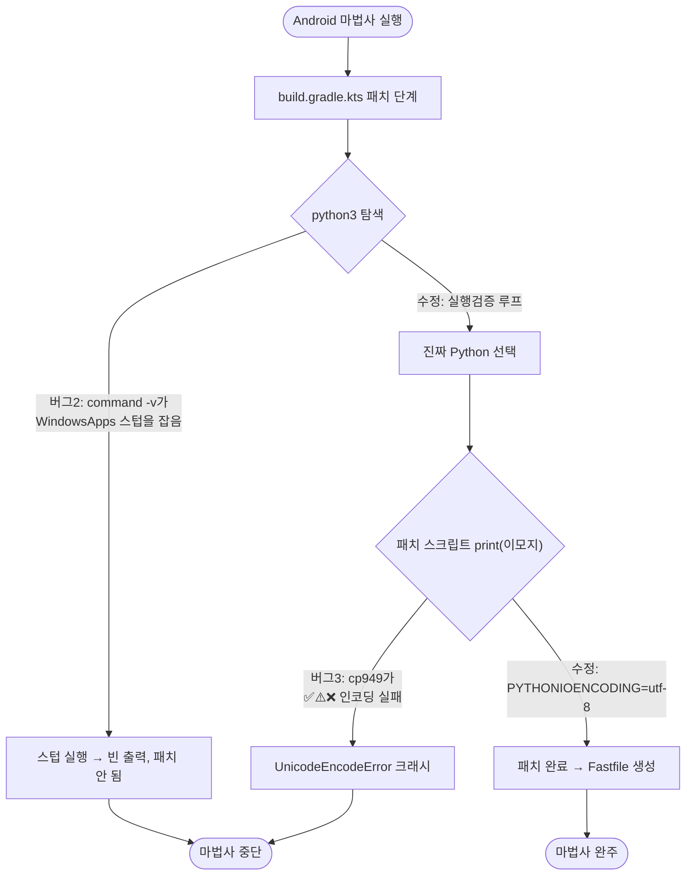
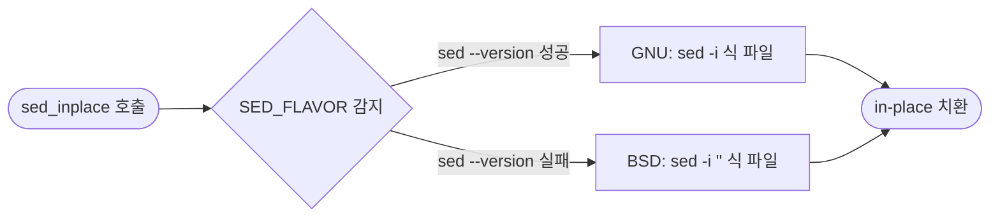

# Flutter 마법사 크로스플랫폼 버그 3건 수정

## 개요

#399 작업 중 두 Flutter 배포 마법사(iOS TestFlight / Android Play Store)를 passQL 모노레포 구조로 실측하다 발견한 **크로스플랫폼 버그 3건**을 근본 원인부터 수정했다. 세 버그는 서로 연쇄되어 있어(앞 버그를 고쳐야 뒤 버그가 드러남), 하나씩 가설-검증으로 잡았다. 모두 **Windows(특히 한국어 Windows) 환경에서만 마법사가 중단**되던 문제로, macOS에서는 정상 동작했기에 그동안 드러나지 않았다. 수정 후 passQL `app/` 구조로 양 마법사가 끝까지 완주함을 실측 확인했다.

## 기능 흐름

### 버그 진단 — 연쇄 구조 (앞을 고쳐야 뒤가 보임)

### OS 분기 in-place sed (버그 1)

## 변경 사항

### iOS 마법사 (sed 크로스플랫폼화)

- `testflight-wizard-setup.sh`: `sed_inplace` 헬퍼 함수 추가. 첫 호출 시 `sed --version` 성공 여부로 GNU/BSD를 1회 감지·캐시하고, GNU면 `sed -i`, BSD면 `sed -i ''`를 쓴다. 기존 `sed -i ''`(BSD 전용) 호출 17곳을 모두 `sed_inplace`로 교체.

### Android 마법사 (Python 탐색 + 인코딩)

- `playstore-wizard-setup.sh` Python 탐색: `command -v python3 || command -v python` 단순 폴백을, `python3`/`python`을 순회하며 `"$_path" -c "import sys; sys.exit(0)"`로 **실제 실행까지 검증**하는 루프로 교체. Windows Store 스텁(실행 시 안내문만 내고 종료)을 걸러 진짜 Python을 고른다.
- `playstore-wizard-setup.sh` 패치 호출: `patch-build-gradle.py` 실행 앞에 `PYTHONIOENCODING=utf-8`을 추가. 패치 스크립트가 출력하는 이모지(✅/⚠️/❌)가 한국어 Windows 콘솔 기본 인코딩(cp949)에서 `UnicodeEncodeError`로 죽던 것을 차단.

## 주요 구현 내용

- **버그 1 — BSD/GNU sed 비호환**: `sed -i ''`는 macOS(BSD sed)에서 빈 백업접미사를 뜻하지만, GNU sed(Linux·Windows Git Bash)에서는 `''`를 편집식으로, 실제 식을 파일명으로 오인해 `sed: can't read s/...`로 실패한다. OS를 감지해 인자 형태를 바꾸는 헬퍼로 양쪽을 모두 지원.
- **버그 2 — Windows python3 스텁**: Windows는 `python3`가 Microsoft Store 설치 유도 스텁을 가리키는 경우가 흔하다. `command -v`는 스텁도 "있음"으로 잡으므로 단순 폴백이 작동하지 않는다. 실제 `-c` 실행이 성공하는 인터프리터만 채택하도록 해 해결.
- **버그 3 — cp949 이모지 인코딩**: 버그 2를 고쳐 진짜 Python이 돌기 시작하자 그 뒤에 가려져 있던 인코딩 크래시가 드러났다. 한국어 Windows의 콘솔 기본 인코딩이 cp949라 이모지를 인코딩하지 못한다. 표준 출력 인코딩을 utf-8로 강제해 해결.

## 검증

> passQL(`project_paths.flutter: "app"`)의 실제 `app/` 구조로 양 마법사를 처음부터 끝까지 실행.

- **iOS 마법사 완주**: Bundle ID `…passqlApp → …passql` 변경 성공(이전 `sed: can't read` 에러 소멸), DEVELOPMENT_TEAM·CODE_SIGN_STYLE·CODE_SIGN_IDENTITY·PROVISIONING_PROFILE·ITSAppUsesNonExemptEncryption 전부 패치, "배포 설정 완료" 출력.
- **Android 마법사 완주**: build.gradle.kts에 signingConfigs/release 서명 설정 추가(이전 중단 지점 통과) → Fastfile.playstore 생성(APPLICATION_ID 치환·거짓성공 차단 옵션 확인), "배포 설정 완료" 출력.
- **문법**: 두 스크립트 `bash -n` 통과.

## 주의사항

- 세 버그 모두 **macOS에서는 원래 정상 동작**했다. 이번 수정은 Windows(특히 한국어 Windows) 사용자도 마법사를 쓸 수 있게 하는 크로스플랫폼 강화이며, macOS 동작은 그대로 보존된다(BSD 분기·python3 우선 탐색 유지).
- `sed_inplace`는 GNU에서 빈 백업접미사를 쓰므로 불필요한 `.bak`을 만들지 않는다(실측 확인).
- 이 수정은 마법사(로컬 셋업 도구) 버그 fix로, 스토어 배포 워크플로우 로직과는 무관하다.
