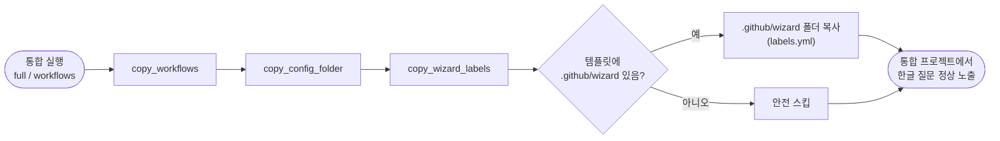

# 통합 시 labels.yml 미복사로 통합 프로젝트 마법사 한글 질문 누락 수정

## 개요

`template_integrator`로 기존 프로젝트에 템플릿을 통합할 때, 워크플로우 파일은 복사하면서 `.github/wizard/labels.yml`은 복사하지 않던 누락 버그를 수정했다. 마커 재설계(#406)에서 워크플로우의 한글 질문 문구를 `@wizard` 마커 본문에서 분리해 `labels.yml`로 옮겼는데, 통합 흐름(`full`·`workflows` 모드)에 이 파일을 복사하는 단계가 빠져 있었다. 그 결과 통합된 프로젝트에는 `@wizard ask:` 마커를 쓰는 워크플로우 16개만 들어가고 질문 문구 원본은 누락되어, '하나씩 입력' 모드에서 한글 질문이 뜨지 않았다. 복사 흐름에 전용 함수를 추가해 해결했다.

## 기능 흐름

## 변경 사항

### 복사 함수 추가 (.sh)
- `template_integrator.sh`: `copy_wizard_labels()` 함수 추가. `$TEMP_DIR/.github/wizard`를 `.github/wizard`로 복사. 템플릿에 폴더가 없으면 `return`으로 안전 스킵. `full`·`workflows` 모드 case 두 곳에 호출 추가.

### 복사 함수 추가 (.ps1, .sh와 동등)
- `template_integrator.ps1`: `Copy-WizardLabels` 함수 추가. `Test-Path`로 소스 존재 확인 후 `Copy-Item`. `full`·`workflows` 모드 두 곳에 호출 추가.

## 주요 구현 내용

- **인접 복사 단계와 동형 구현**: 기존 `copy_config_folder` / `Copy-ConfigFolder`와 같은 패턴(소스 존재 확인 → mkdir → 복사 → 성공 메시지)으로 작성해 흐름의 일관성을 유지했다.
- **안전 스킵**: 구버전 템플릿 등 `.github/wizard` 폴더가 없는 경우에도 오류 없이 건너뛴다.
- **제외목록 무오염**: `labels.yml`은 사용자 프로젝트로 **가야 할** 공통 자산이므로, 템플릿 전용 파일 제외목록(`plugin_items_to_remove` / `cleanup_template_files`)에 넣지 않았다. 이를 검증으로 확인했다.

## 구현 커밋

| 커밋 | 내용 |
|------|------|
| `10048e7` | `full`·`workflows` 모드 복사 흐름에 `.github/wizard/labels.yml` 복사 추가(.sh/.ps1 동등, 원본 없으면 안전 스킵) |

## 검증

- `bash -n template_integrator.sh` → 통과
- ps1 파서(`[Parser]::ParseFile`) → `PS1_PARSE_OK`
- 정의 1개 + 호출 2개(`.sh`/`.ps1` 각각) 위치 확인
- 제외목록(`plugin_items_to_remove` / `cleanup_template_files`) 오염 없음 확인
- 복사 소스 실존 확인: `labels.yml` 존재 + `@wizard ask:` 마커 사용 워크플로우 16개

## 주의사항

- 이 버그는 #406(마커 재설계)에서 질문 문구를 `labels.yml`로 분리하면서 통합 복사 흐름을 함께 갱신하지 않아 발생한 후속 작업이다.
