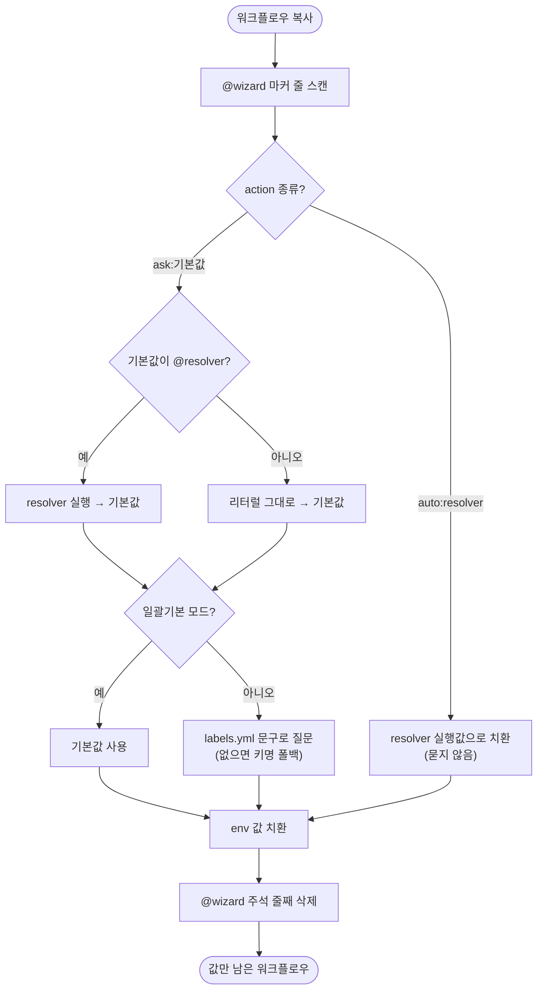

# @wizard 마커 시스템 ask/auto 문법 + labels.yml + resolver 레지스트리로 전면 재설계

## 개요

`template_integrator`(`.sh`/`.ps1`)가 워크플로우의 env 값을 자동으로 채울 때 쓰던 `@wizard` 마커 시스템을 전면 재설계했다. 기존에는 주석 한 줄에 action·한글 설명·기본값을 한꺼번에 욱여넣어 YAML 값 따옴표와 충돌하기 쉽고, 마커 종류마다 동작이 1:1 하드코딩되어 있으며, 기본값이 3곳에 분산되고 `.sh`/`.ps1`에 로직이 두 벌로 갈려 한쪽만 고치면 어긋나는 구조였다. 이를 **① 마커는 `ask:<기본값>` / `auto:<resolver>` 단일 문법만 ② 한글 질문 문구만 `labels.yml`로 분리 ③ 타입별·동적 기본값은 resolver 함수로 흡수**하는 구조로 교체했다. 하위호환은 고려하지 않고 기존 마커를 전량 마이그레이션했다.

## 기능 흐름

## 변경 사항

### 마커 문법 마이그레이션
- `.github/workflows/project-types/**/*.yaml`: 워크플로우 17개의 `@wizard` 마커를 새 문법으로 교체. `# @wizard ask: 설명 [기본: X]` → `# @wizard ask:X`(리터럴) 또는 `ask:@repo`(resolver), `auto-find:` → `auto:spring-app-yml-dir` / `auto:spring-app-yml-path`. 한글 설명·`[기본:]` 제거.

### 질문 문구 분리
- `.github/wizard/labels.yml`: 신규 생성. `KEY: "한글 문구"` 맵. ask 마커의 질문 문구만 담는다. 키가 없거나 파일이 없으면 env 키명으로 폴백(가벼운 선택적 의존).

### 마커 엔진 재작성 (.sh)
- `template_integrator.sh`: `default_for_type_key` 하드코딩 표 제거. `resolve_token`(repo / spring-app-yml-dir / spring-app-yml-path) resolver 디스패처 도입. `configure_workflow_env`를 새 문법 파서(`@wizard (ask|auto):(.*)`) + labels.yml 질문 + 치환 후 마커 삭제로 재작성.

### 마커 엔진 재작성 (.ps1, .sh와 1:1 동등)
- `template_integrator.ps1`: `Get-DefaultForTypeKey` 제거, `Resolve-Token` / `Get-WfLabel` 도입. `Configure-WorkflowEnv`를 `.sh`와 동일하게 재작성.

## 주요 구현 내용

- **resolver 레지스트리**: 타입별로 값이 달라지는 기본값(레포명, Spring application.yml 경로)을 워크플로우 마커에서 빼내 resolver 함수로 흡수했다. `auto:<name>`과 `ask:@<name>`이 같은 레지스트리를 공유한다. `.sh`의 `resolve_*`와 `.ps1`의 `Resolve-*`가 같은 이름·같은 반환을 갖는다.
- **마커에서 한글·따옴표 제거**: 마커 주석에 한글·따옴표를 넣지 않아 YAML 값 따옴표와의 sed 충돌(기존 버그의 근원)을 제거했다.
- **치환 후 마커 삭제**: env 값을 치환한 뒤 `# @wizard ...` 주석 줄을 통째로 삭제해 결과 워크플로우에 값만 남긴다.
- **버그 수정**: `configure_workflow_env` 루프에서 `auto` resolver가 빈값을 반환할 때 이전 이터레이션의 `_val`이 다음 키에 잘못 치환되던 오염 버그를, 매 이터레이션 `_val` 초기화로 해결했다(`f76db6a`). `.ps1`에서는 resolver가 존재하지 않는 `Get-PathForType`를 호출하던 문제를 `script:ProjectPaths` 해시 직접 조회로 수정했다(`ba0d672`).

## 구현 커밋

| 커밋 | 내용 |
|------|------|
| `fcadf95` | 마커를 새 문법으로 마이그레이션 + `labels.yml` 생성 |
| `7c31608` | `.sh` 마커 엔진을 resolver 디스패처 + 새 문법 파서로 교체 |
| `f76db6a` | `_val` 미초기화 오염 버그 수정 |
| `ba05997` | `.ps1` 마커 엔진을 `.sh`와 동등하게 교체 |
| `ba0d672` | `.ps1` resolver 미정의 함수 호출 수정 |

## 검증

- `bash -n template_integrator.sh` → 통과
- ps1 파서(`[Parser]::ParseFile`) → `PS1_PARSE_OK`
- `.sh`/`.ps1` 마커 파싱·resolver 반환·최종 치환 동등성 확인

## 주의사항

- `paths-anchor` 마커(`on.push.paths` 주입)는 env 채움과 별개 기능이라 손대지 않았다(동작 불변).
- `flutter-root` resolver의 실제 적용은 후행 Flutter 포팅 스펙(#399)에서 이 레지스트리 위에 `auto:flutter-root`로 올린다.
- 통합 시 `labels.yml`이 사용자 프로젝트로 복사되지 않던 후속 버그는 #405에서 처리했다.
