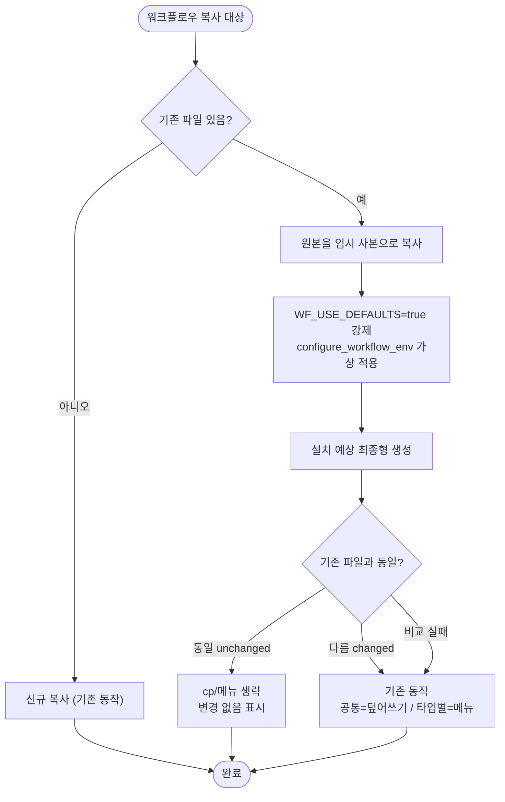

# 워크플로우 통합 시 내용 동일하면 덮어쓰기·메뉴 건너뛰기

## 개요

`template_integrator`(`.sh`/`.ps1`)가 기존 프로젝트에 워크플로우를 통합할 때 **파일명만** 비교해, 내용이 한 글자도 안 바뀐 워크플로우도 공통(common)은 무조건 덮어쓰고 타입별(spring 등)은 3지선 메뉴(`.template`/건너뛰기/`.bak` 덮어쓰기)를 띄워 혼란을 줬다. 이번 변경으로 **복사 직전에 "이 템플릿을 지금 설정대로 깔면 나올 최종형"을 만들어 기존 파일과 비교**하고, 동일하면 조용히 건너뛰도록 했다. 실제로 바뀐 워크플로우만 메뉴/업데이트 대상이 된다.

## 기능 흐름

## 변경 사항

### 공통 비교 헬퍼 (신규)
- `template_integrator.sh`: `_wf_is_unchanged()` 추가 — 원본을 `mktemp` 사본으로 떠서 서브셸 `( WF_USE_DEFAULTS=true; configure_workflow_env ... )`로 가상 치환 후 `cmp -s`로 기존 파일과 바이트 비교. 동일이면 0, 다름·실패면 1 반환.
- `template_integrator.ps1`: `Test-WorkflowUnchanged()` 추가 — 동일 로직. `WfUseDefaults`/`WfDeploy` 상태를 저장·복원해 부수효과를 격리하고, CRLF/LF 정규화 후 문자열 비교. 비교 실패 시 `$false`(=changed) 반환.

### 공통(common) 워크플로우 다운로드 루프
- `.sh`/`.ps1`: 기존 파일이 있고 `_wf_is_unchanged`/`Test-WorkflowUnchanged`가 동일로 판정하면 `cp` 생략하고 `✓ ... (변경 없음)` 출력 후 `continue`. 다르면 기존대로 덮어쓰기(`✓ ... 업데이트`).

### 타입별(spring 등) 워크플로우 처리
- `.sh` `_copy_workflows_for_type` / `.ps1` `Copy-Workflows-ForType`: 기존 파일을 `unchanged`/`changed` 두 그룹으로 분리.
  - `unchanged`: 조용히 `⏭ ... (변경 없음)` 출력하고 skip. **메뉴 미출현.**
  - `changed`가 1개라도 있을 때만 기존 3지선 메뉴 표시(대상도 `changed`만).
  - 전부 동일하면 `... N개가 현재 설정과 동일해 건너뜁니다` 한 줄만 안내.
- 복사 후 env 설정 단계(`configure_workflow_env`)에서 `unchanged` 파일은 재설정 대상에서 제외.

### Nexus(opt-in) 워크플로우
- `.sh`/`.ps1`: 동일하면 `⏭ ... (Nexus, 변경 없음)` 출력하고 `.bak` 생성·복사 생략. 다르면 기존대로 `.bak` 후 덮어쓰기.

### 문서
- `docs/superpowers/specs/2026-06-23-workflow-content-equality-skip-design.md`: 설계 스펙.
- `docs/suh-template/issue/20260623_409_...md`: 이슈 본문.

## 주요 구현 내용

**왜 단순 비교가 안 되나** — 워크플로우는 복사 직후 `configure_workflow_env`로 env 토큰이 치환된다. 템플릿 원본은 `KEY: "__PROJECT_NAME__"  # @wizard ask` 같은 마커가 남은 상태이고, 기존 설치본은 그 자리에 값이 채워진 상태라 그냥 비교하면 항상 다르게 나온다.

**해결 — "설치 예상 최종형"과 비교**: 비교 직전에 원본을 임시 사본으로 떠서 실제 치환 로직을 한 번 적용한 결과(= 지금 설정대로 깔면 나올 파일)를 만들어 기존 파일과 비교한다. 정규식 마스킹 같은 휴리스틱보다 "결과가 같아지는가"를 직접 보므로 오판이 거의 없다.

**질문 차단 + 부수효과 격리**: 가상 치환은 `WF_USE_DEFAULTS=true`(기본값 모드)를 강제해 사용자에게 다시 묻지 않는다. `.sh`는 서브셸 `( ... )`로, `.ps1`은 `WfUseDefaults`/`WfDeploy` 상태 저장·복원으로 `WF_DEPLOY_CSV`·version.yml deploy 기록 같은 부수효과가 실제 설치 흐름으로 새지 않게 막는다.

**안전 우선 fallback**: 임시 파일 생성 실패 등 비교가 깨지면 항상 `changed`로 떨어뜨려 기존 동작(덮어쓰기/메뉴)을 유지한다. 즉 회귀 위험이 "업데이트를 놓치는" 한쪽으로는 절대 생기지 않는다. `set -e` 환경에서도 호출 위치가 전부 `if` 조건문이라 비-0 반환에 죽지 않는다.

## 검증

- `.sh` `_wf_is_unchanged` 4 케이스: 동일→unchanged(0) / 한 줄 변경→changed(1) / 부수효과 격리(부모 `WF_DEPLOY_CSV`·`WF_USE_DEFAULTS` 불변) / 없는 파일→changed fallback — **전부 PASS**.
- `.sh` 통합 흐름: 전부 동일 시 메뉴 미출현·skip / 한 줄 변경 시 메뉴 출현 — **전부 PASS** (검증 후 레포 오염 없음 확인).
- `.ps1` `Test-WorkflowUnchanged` 5 케이스: 동일→true / 상이→false / 없는 파일→false / 상태 격리 / CRLF·LF 차이만→true(정규화) — **전부 PASS**.
- 구문: `bash -n template_integrator.sh` + PowerShell `Parser::ParseFile` 모두 통과.

## 주의사항

- 코드 변경(`.sh`/`.ps1`)은 다른 작업과 함께 커밋 `2ffa40a`(#410 메시지)에 섞여 `origin/main`에 이미 푸시됐다. 기능상 문제는 없으나 이력상 #409와 #410이 한 커밋에 뭉쳐 있다. 설계·이슈 문서는 커밋 `f129a8b`로 별도 푸시됐다.
- 정규화 비교는 "실치환 후 비교"라 오판 가능성이 낮지만, 만약 사용자가 실제 설치 때 기본값과 다른 값을 입력하면 가상 최종형(기본값)과 달라져 `changed`로 분류된다 — 보수적·안전(놓치느니 한 번 더 묻는다).
