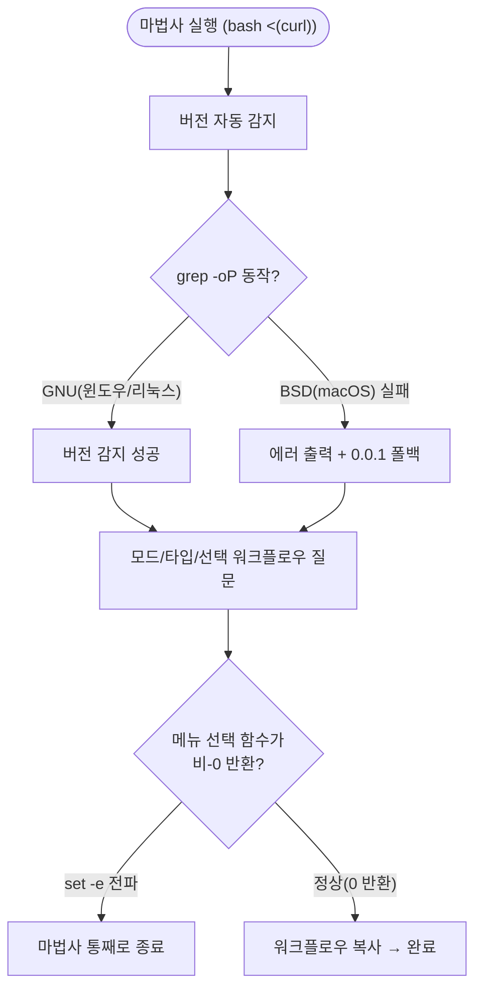

# template_integrator.sh macOS 환경 버그 다수 수정

## 개요

`template_integrator.sh`(기존 프로젝트에 템플릿을 통합하는 마법사)가 **macOS 기본 환경**에서 실행 도중 조용히 종료되거나 버전을 감지하지 못하는 문제를 일괄 수정했다. 모두 macOS 기본 도구(BSD grep)와 `set -e`(에러 시 즉시 종료) 환경 특성에서만 발현되는 버그로, 윈도우(`template_integrator.ps1`)는 PowerShell 특성상 영향이 없었다. 윈도우에서만 검증해 왔던 탓에 그동안 드러나지 않았다.

## 기능 흐름

위 흐름에서 `C`(grep 호환성)와 `G`(메뉴/함수의 종료코드 전파) 두 지점이 macOS에서 마법사를 깨뜨리던 핵심 분기다.

## 변경 사항

### 1. BSD grep 호환 — 버전 감지

- `template_integrator.sh` `detect_version()`: GNU 전용 `grep -oP`(PCRE)와 `\K`를 사용하던 3곳(build.gradle / pubspec.yaml / pyproject.toml)을 `grep -E` + `sed -E` 조합으로 교체. macOS 기본 `/usr/bin/grep`(BSD)은 `-P`를 지원하지 않아 `grep: invalid option -- P` 에러가 나고 버전을 0.0.1로 잘못 폴백하던 문제 해결.

### 2. 파일 선두 BOM 제거 — 셰뱅 깨짐

- `template_integrator.sh` 1행: 파일 맨 앞 UTF-8 BOM(`EF BB BF`)을 제거. `bash <(curl ...)` 프로세스 치환 실행 시 BOM이 셰뱅 줄에 섞여 `#!/bin/bash: No such file or directory` 에러가 나던 문제 해결.

### 3. set -e 조기종료 — 마법사가 중간에 조용히 종료

`set -e` 환경에서 **함수의 마지막 명령이 비-0 종료코드를 반환하면**, 그 함수가 호출부의 마지막 명령일 때 스크립트 전체가 즉시 종료된다. 이 패턴이 여러 지점에 흩어져 있었다.

- `ask_optional_workflow()`: 모든 early `return`을 `return 0`으로 명시. Nexus/Secret 선택 워크플로우 폴더가 없을 때 `[ -d ] || return`이 비-0을 전파하던 것과, "아니오" 선택 시 함수가 비-0으로 끝나던 것을 차단.
- `interactive_mode()` 마지막 줄: `[ "$_need_paths" = true ] && resolve_project_paths`를 `{ ...; } || true`로 감쌈. 경로 재질문이 불필요한 흔한 경우 함수가 비-0으로 끝나 `execute_integration`(실제 통합)이 실행되지 않고 종료되던 문제 해결.
- `_remove_codex_section()`: codex CLI 미설치 시 `command -v codex && ...`가 비-0을 반환해 IDE 스킬 제거 흐름이 중단되던 것을 `|| true` + `return 0`으로 차단.
- 플러그인 업데이트 시 config 마이그레이션(대화형/FORCE 두 경로): 매칭 json이 없어 `cp`가 실패하면 비-0이 전파되던 것을 `|| true`로 흡수.
- 기존 워크플로우 처리 메뉴(`choose_menu` 단독 호출): ESC 취소 시 비-0이 전파되던 라인에 `|| _wf_label=""` 가드 추가.

### 4. @wizard ask 마커 없는 파일 — grep 매치 0건

- 워크플로우 env 토큰 치환(`wf_collect_asks`): 파일에 `@wizard`는 있으나 `@wizard ask:` 마커가 없는 워크플로우에서 `grep`이 매치 0건으로 `exit 1`을 반환해 `set -e`가 통합을 중단시키던 것을 `|| true` 가드로 해결.

## 주요 구현 내용

- **근본 원인 일원화**: 3·4번은 모두 "`set -e` + 비-0 종료코드 전파"라는 동일 뿌리였다. 메뉴 호출(`var=$(choose_menu)`)·early return·`조건 && 명령` 형태의 함수 끝 라인을 전수 점검해 가드(`|| true`, `return 0`, `; rc=$?`)가 빠진 곳을 색출·보강했다.
- **회귀 검증**: macOS 기본 `/bin/bash`로 `--force --mode full --type spring,flutter,react,python` 전체 통합을 실행해 종료코드 0(완주)을 확인했고, 대화형 경로(Nexus/Secret "아니오" → 확인 → 워크플로우 복사 → 완료)도 실제 도달을 확인했다.

## 주의사항

- 이 버그군은 macOS 기본 bash/grep 환경에서만 발현된다. 향후 `.sh` 변경 시 GNU 전용 문법(`grep -P`, `\K`, `sed -i` 인자 차이 등)과 `set -e` 하의 함수 끝 종료코드를 반드시 macOS 기본 도구로 검증해야 한다.
- 윈도우(`.ps1`)는 PowerShell 객체 모델·예외 기반이라 동일 문제가 구조적으로 발생하지 않는다.
