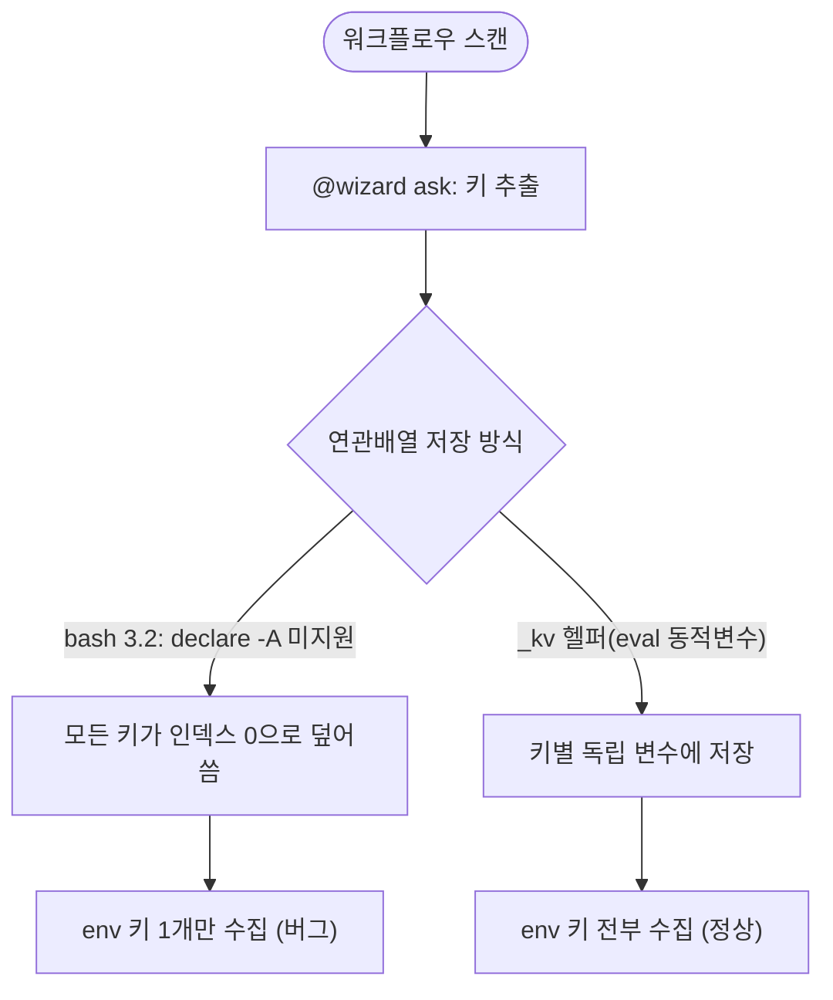

# macOS bash 3.2 연관배열 미지원으로 @wizard env 키가 1개만 수집되던 문제 수정

## 개요

`template_integrator.sh`를 **macOS 기본 bash(3.2)**에서 실행하면, 배포 워크플로우의 `@wizard ask:` 환경설정 키가 여러 개인데도 "배포 워크플로우 환경설정" 단계에서 **1개(`PROJECT_NAME`)만** 표시되던 문제를 수정했다. macOS 기본 `/bin/bash`는 라이선스 문제로 3.2.57(2007년 버전)에 고정돼 있고, bash 3.2는 **연관배열(`declare -A`)을 지원하지 않아** 모든 문자열 키가 인덱스 0 하나로 뭉개진 것이 원인이다. 윈도우(`.ps1`)는 PowerShell 해시테이블, 윈도우 Git Bash는 bash 4+라 정상 동작했으므로 macOS에서만 발현된 포팅 버그다.

## 기능 흐름

## 변경 사항

### 연관배열 → bash 3.2/4 호환 _kv 헬퍼 전환

- `template_integrator.sh`: 다음 연관배열들을 `_kv_set`/`_kv_get`/`_kv_has`/`_kv_clear` 헬퍼 기반 저장으로 전환.
  - `WF_ASK_DEFAULT` (KEY → 기본값)
  - `WF_ASK_SCOPE` (KEY → 사용처 문자열)
  - `WF_ASK_TYPE_DEFAULT` (`type|KEY` → 타입별 기본값)
  - `WF_ASK_FILES` (KEY → 등장 파일 누적)
  - `WF_WFNAME_VAL` (워크플로우명 매핑)
- `declare -A`(연관배열)·`declare -g`(전역 선언)를 코드에서 전부 제거. 순서 보존이 필요한 `WF_ASK_KEYS`는 일반 배열로 유지.

## 주요 구현 내용

- **_kv 헬퍼 동작**: 연관배열 `MAP[KEY]=VALUE`를 `eval`로 동적 변수(`__KV_<MAP>__<인코딩된키>`)에 저장한다. 키는 `_kv_enc`로 16진 인코딩(영숫자·언더스코어 외 모든 문자를 `_<hex>`로 변환)해, 경로(`/volume1/...`)·파이프(`spring|JAVA_VERSION`)·한글·공백이 섞인 키도 안전하게 변수명으로 쓸 수 있다. bash 3.2·4 양쪽에서 동일하게 동작한다.
- **기존 관용구 재사용**: 이 헬퍼는 코드베이스에 이미 존재하던 패턴(`wf_deploy_get`/`set`의 CSV 방식과 같은 철학)으로, 일부만 마이그레이션돼 있던 것을 `WF_ASK_*`까지 통일했다.
- **실측 검증**: macOS 기본 `/bin/bash`(3.2)로 Spring 워크플로우 1개를 대상으로 수집 키 수를 측정. 수정 전 1개(`PROJECT_NAME`) → 수정 후 6개(`PROJECT_NAME`, `JAVA_VERSION`, `DEPLOY_PORT`, `VOLUME_HOST_PATH`, `VOLUME_CONTAINER_PATH`, `SSH_AUTH_METHOD`)로 확인했다. 멀티타입(spring/flutter/react/python) `--force` 전체 통합도 종료코드 0으로 완주함을 확인했다.

## 주의사항

- macOS 기본 bash는 3.2다. 향후 `.sh`에 연관배열(`declare -A`)·`declare -g`·`mapfile`·`${var,,}` 등 bash 4+ 전용 문법을 도입하면 macOS에서 조용히 오작동한다. 동적 키-값 저장이 필요하면 기존 `_kv_*` 헬퍼를 사용해야 한다.
- 윈도우(`.ps1`)는 PowerShell 해시테이블이라 이 문제가 없으며, 별도 수정이 필요하지 않다.
