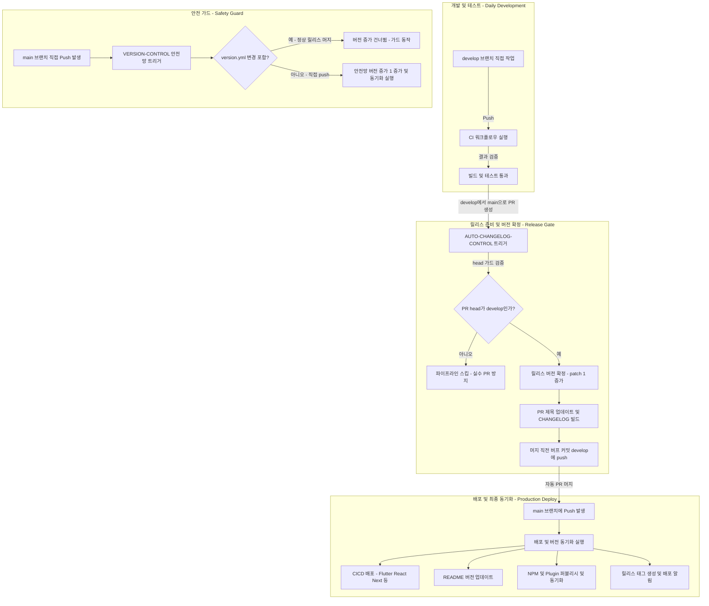

# [Projectops] deploy 브랜치 폐기 및 develop/main 표준 브랜치 전략 전환

## 개요
Projectops 템플릿/라이브러리의 기존 `main`(개발) ➔ `deploy`(배포) 브랜치 전략을 업계 표준인 `develop`(개발) ➔ `main`(배포/릴리스, default) 브랜치 구조로 전면 전환하였습니다. 릴리스는 `develop`에서 `main` 브랜치로 향하는 PR(릴리스 PR)을 통해 제어되며, `AUTO-CHANGELOG-CONTROL` 워크플로우가 릴리스 내에서 버전 확정(patch +1) 및 CHANGELOG 업데이트, 자동 PR 머지(automerge) 및 릴리스 태그 생성을 일괄적으로 관리합니다. 또한, 일상적인 `develop` 푸시 시 불필요한 버전 증가를 방지하고, 프로덕션(`main`)에 대한 직접 푸시가 감지될 경우 수동 버전 동기화 안전망(`VERSION-CONTROL` 가드)이 동작하도록 인프라 파이프라인 및 문서 체계를 개편하였습니다.

## 기능 흐름

## 변경 사항

### 워크플로우 핵심 파이프라인 개편 (Task 1, 2)
- `.github/workflows/PROJECT-COMMON-AUTO-CHANGELOG-CONTROL.yaml` & `project-types/common/PROJECT-COMMON-AUTO-CHANGELOG-CONTROL.yaml`:
  - 트리거 브랜치를 `deploy`에서 `main`으로 변경하고, `develop` 브랜치로부터의 PR만 처리하는 `head 가드` 추가.
  - 체크아웃 대상을 `main`에서 `pull_request.head.ref`(`develop`)로 정합화하여 머지 전에 릴리스 버전 확정(patch +1) 및 CHANGELOG를 작성하도록 구현.
  - 버전 확정 시 PR 제목을 🚀 Deploy {날짜}-v{버전} 형식으로 자동 갱신 및 릴리스 성공 시 태그 생성을 파이프라인에 이식.
- `.github/workflows/PROJECT-COMMON-VERSION-CONTROL.yaml` & `project-types/common/PROJECT-COMMON-VERSION-CONTROL.yaml`:
  - `main` 직접 push 발생 시에만 동작하는 `릴리스 머지 안전망 가드` 도입. `version.yml` 변경이 동반된 정상 머지 커밋의 경우 버전 bump를 자동 건너뛰도록 개선.

### 배포 및 CI 트리거 재편성 (Task 3, 4)
- `.github/workflows/` 내 배포/동기화 워크플로우 13종 (`README-UPDATE`, `PLUGIN-SYNC`, `NPM-PUBLISH`, `PLAYSTORE`, `FIREBASE`, `SELFHOSTED`, `IOS-TESTFLIGHT`, `NEXT-CICD`, `REACT-CICD`, `PYTHON-CICD`, `SPRING-CICD`, `SPRING-PACKAGES-PUBLISH`, `SPRING-NEXUS-PUBLISH`):
  - 배포 조건인 `deploy` 브랜치 푸시를 `main` 브랜치 푸시로 전면 교체.
  - 더 이상 작동하지 않고 충돌 위험이 있는 죽은 `workflow_run` 트리거 구조 일괄 제거.
- `.github/workflows/` 내 CI 및 개발자산 워크플로우 8종 (`FLUTTER-CI`, `REACT-CI`, `NEXT-CI`, `PYTHON-CI`, `NEXUS-CI`, `SECRET-FILE-UPLOAD`, `UTIL-VERSION-SYNC`):
  - 일상 개발 및 빌드 검증을 진행하는 CI 대상 트리거를 `main`에서 `develop` 브랜치로 격하/전환.

### 템플릿 제어 및 CLI 스킬 개정 (Task 5, 6)
- `.github/workflows/PROJECT-TEMPLATE-INITIALIZER.yaml` & `.github/scripts/template_initializer.sh`:
  - 신규 프로젝트 템플릿 생성 시 자동으로 일상 개발 통합 공간인 `develop` 브랜치를 원격에 자동 구성하는 스텝 추가 및 주석 보정.
- `skills/changelog-deploy/scripts/changelog_cli.py` & `skills/changelog-deploy/SKILL.md`:
  - 배포 도구 및 릴리스 생성 CLI 명령이 기본적으로 `develop` ➔ `main` 구도를 향하도록 `--base` 파라미터 기본값 및 사용 가이드라인 전면 개편.

### 문서 및 참조 정합화 (Task 7, 8, 9, 10, 11)
- `CLAUDE.md`, `common-rules.md`, `skills/github/SKILL.md`:
  - 에이전트 및 사용자가 준수해야 할 작업 브랜치 규칙(기본 작업 브랜치: `develop`, 프로덕션: `main`) 및 경고 기준 재확정. 워크플로우 상태 표 업데이트.
- `.github/config/breaking-changes.json`:
  - 브랜치 전면 개편에 대한 수동 마이그레이션 가이드라인을 포함한 `critical` 변경 사항을 `3.0.186` 버전 키 기준으로 등록.
- `README.md`, `CONTRIBUTING.md`, `docs/SSH-DOCKER-DEPLOYMENT-GUIDE.md` 등 전체 문서:
  - 잔여 `deploy` 브랜치 및 `main` 직접 개발에 관한 기술적 오류/서술 스윕 및 워크플로우 상단/인라인 설명 주석 20여 곳 정제 완료.
- **인프라 반영 (Task 11):**
  - 표준 개발을 위한 원격 `develop` 브랜치 정상 신설 완료 (사용자 승인 및 방향에 맞게 기존 `deploy`는 하위 호환성을 위해 안전하게 보존).

## 주요 구현 내용

- **머지 전 버전 확정 및 빌드(Pre-Merge Bump):** 릴리스 머지 이전에 버전과 CHANGELOG 파일을 먼저 `develop`에 커밋/푸시하여, `main` 머지 커밋 자체에 완전한 릴리스 형상이 포팅되도록 파이프라인 견고화.
- **안전망 가드(Release Guard):** 직접 푸시와 릴리스 머지 push를 감지하는 기법으로 `git diff --name-only $RANGE | grep -qx "version.yml"` 가드를 설계하여, `main` 직접 push 상황에서도 유연하게 패치 버전을 보호하는 메커니즘 수립.

## 주의사항
- **일상 개발 작업 위치:** 모든 신규 작업과 에이전트의 수정 작업은 반드시 `develop` 브랜치에서 시작해야 합니다. 프로덕션 직접 배포를 제외한 `main` 브랜치로의 직접 푸시는 철저히 지양해야 합니다.
- **수동 전환 절차:** 기존 이 마이그레이션 이전에 구성된 프로젝트들은 로컬/원격에 `develop` 브랜치를 직접 생성하고 템플릿을 재통합(업데이트 모드)해야 정합성이 일치합니다.
