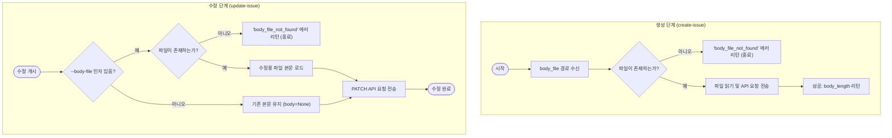

# [버그][Skills] issue_cli body_file 실패 시 빈 본문 silent 등록 및 body 수정 미지원

## 개요
이슈 생성 시 지정한 본문 템플릿 파일(`body_file`)이 한글 경로 이스케이프 깨짐 등의 환경적 요인으로 로드에 실패할 경우, 에러 발생 대신 빈 본문(`""`)으로 이슈가 성공적으로 등록되는 심각한 Silent Fallback 문제를 완벽하게 방어했습니다. 또한, 본문 누락 발생 시 원클릭으로 사후 복구할 수 있도록 `issue_cli.py` 및 `github_cli.py` 의 `update-issue` 명령어에 `--body-file` 아규먼트를 추가해 정밀 수정 파이프라인을 구축했습니다.

## 기능 흐름

## 변경 사항

### CLI 제어 도구 강화
*   `skills/issue/scripts/issue_cli.py`:
    *   `cmd_create_issue` 핸들러 내에서 `args.body_file` 존재 여부의 3-way 검증을 강화하여, 부재 시 `"code": "body_file_not_found"` JSON 및 실패 코드(1)를 반환하도록 수정했습니다.
    *   이슈 생성 성공 응답 메타데이터에 `"body_length": len(body)` 를 보완해 AI가 업로드 성공 크기를 비교 검증할 수 있도록 지원합니다.
    *   `update-issue` 명령어 파서에 `--body-file` 옵션을 신설하고, 파일 내용을 정밀 읽기하여 `update_issue(..., body=body)` API에 올바르게 연동했습니다.

*   `skills/github/scripts/github_cli.py`:
    *   `issue_cli`와 정합성을 완벽하게 대조하여 `update-issue` 명령어에 `--body-file` 옵션을 동일하게 추가하고, 사후에 독자적으로 본문을 안전하게 갱신 및 복구할 수 있도록 기능을 강화했습니다.

### TDD 검증 및 단위 테스트 구현
*   `scripts/tests/test_cli_body_file.py`:
    *   `create-issue` 및 `update-issue` 명령에서 파일 부재 예외 발생 시 기계가 인지하기 쉬운 `"code": "body_file_not_found"` 가 일관되게 출력되는지 점검하는 예외 테스트 3종 구현.
    *   `monkeypatch` 모킹 기술을 적용하여 실제 GitHub API 호출을 격리하되, 응답 JSON 구조에 `"body_length"` 및 수정된 `"body"` 가 올바르게 탑재되는지 체크하는 성공 경로 테스트 3종 구현 (총 6개 테스트 100% GREEN 통과 완료).

## 주요 구현 내용
AI 에이전트 및 자동화 봇이 비동기 실행 오류 발생 시 빠르고 영리하게 대응할 수 있도록 에러 핸들링 구조를 표준화하였습니다. 

1.  **일관된 예외 코드 구조**:
    파일 부재 시 단순히 CLI 가 크래시되거나 조용히 실패하는 것이 아니라, `{"ok": false, "code": "body_file_not_found", "error": "수정용 본문 파일이 존재하지 않습니다..."}` 포맷을 강제하여 AI 에이전트가 예외 발생 시 `"code"` 필드를 스캔해 즉각 임시 대체 파일 경로를 생성하고 사후 복구할 수 있는 조치 루프를 유도했습니다.
2.  **Surgical Precision**:
    공통 라이브러리(`common.gh_client`)의 핵심 API 구조를 헤치지 않고, CLI 최상위의 Argument Parser 및 핸들러 검증 블록에서 가공 작업을 완결 지어 아키텍처적 깔끔함을 유지했습니다.

## 주의사항
*   **파일 인코딩 보장**:
    이슈 본문 템플릿에 한글이 다수 포함되어 Windows 등 환경에서 이스케이프가 깨질 수 있으므로, 파일을 읽을 때 항상 명시적으로 `read_text(encoding="utf-8")` 파라미터를 사용하여 크로스플랫폼 호환성을 철저하게 보장하도록 구현했습니다.
