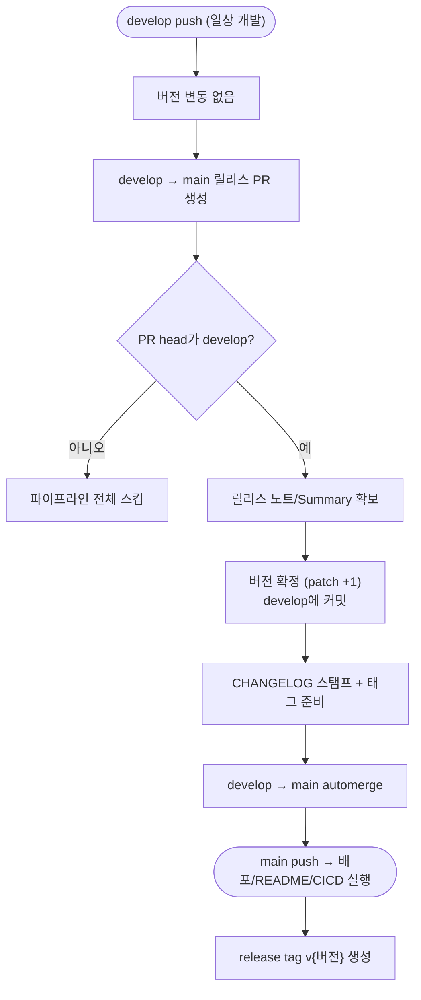

# deploy 브랜치 폐기 및 develop/main 표준 브랜치 전략 전환 — 마무리 및 실전 검증

## 개요

deploy(배포)/main(개발) 비표준 구조를 **develop(개발 통합) / main(default=프로덕션)** 표준 구조로 전환하는 작업의 마무리 단계다. 트리거 전환은 선행 작업으로 반영돼 있었으나, 그 과정에서 **트리거만 바뀌고 워크플로우 내부에 하드코딩된 `deploy` 참조는 남아 있어** deploy 브랜치 삭제 시 앱 배포가 중단되는 치명적 누락이 있었다. 이를 포함한 잔여 결함 전량을 정리하고, 실제 릴리스 PR을 생성해 새 파이프라인이 정상 동작함을 실측 검증한 뒤 deploy 브랜치를 무손실 삭제해 전환을 완료했다.

## 기능 흐름

전환 후 릴리스 파이프라인의 실제 동작 (PR #431로 검증됨):

main 직접 push(핫픽스·비정상 경로)는 VERSION-CONTROL 안전망이 별도로 처리한다: push에 `version.yml` 변경이 포함되면(=릴리스 머지) skip, 없으면(=직접 push) patch +1.

## 변경 사항

### Critical — 배포 중단 방지 (워크플로우 실행 로직)

트리거는 `main`으로 바뀌었으나 job 내부 체크아웃이 여전히 `deploy`를 가리켜, deploy 브랜치 삭제 시 "reference not found"로 배포가 즉시 실패하던 결함을 수정했다.

- `PROJECT-FLUTTER-ANDROID-PLAYSTORE-CICD.yaml`, `PROJECT-FLUTTER-ANDROID-FIREBASE-CICD.yaml`, `PROJECT-FLUTTER-IOS-TESTFLIGHT.yaml`: `ref: deploy` → `ref: main`, `git pull origin deploy` → `git pull origin main` (각 파일 다중 job)
- `PROJECT-FLUTTER-ANDROID-SELFHOSTED-CICD.yaml`: `if: github.ref == 'refs/heads/deploy'` → `'refs/heads/main'`
- `PROJECT-REACT-CICD.yaml`, `PROJECT-NEXT-CICD.yaml`: 트리거가 main뿐이라 도달 불가한 `[ "$BRANCH" == "deploy" ]` 분기 제거

### 통합 마법사 안내 정정

- `template_integrator.sh`, `template_integrator.ps1`: 통합 완료 후 "deploy 브랜치 생성 → git checkout -b deploy" 안내를 "develop 브랜치 생성 → git checkout -b develop"으로 정정. 이 안내를 따르던 사용자가 새 구조에서 아무 워크플로우도 트리거하지 못하던 문제를 해소.

### 문서 정합화

- `README.md`: mermaid 파이프라인·버전 자동화 표를 "develop push → 릴리스 PR → PR 내 버전 확정 → automerge → main push 배포" 흐름으로 갱신
- `CONTRIBUTING.md`: 브랜치 구조를 main/deploy → develop(통합)/main(프로덕션)으로
- `SUH-DEVOPS-TEMPLATE-SETUP-GUIDE.md`: deploy 브랜치 생성 안내 → develop 구조로
- `docs/VERSION-CONTROL.md`: VERSION-CONTROL을 "deploy PR 생성"이 아닌 main 직접 push 안전망(patch 증가) 동작으로 정정
- `docs/SKILLS.md`: changelog-deploy 스킬 흐름을 develop→main으로

## 주요 구현 내용

**핵심 판단 — "트리거 이동"과 "내부 로직 이동"의 분리:** 브랜치 전환에서 `on: push: branches`만 바꾸면 워크플로우가 새 브랜치에서 트리거되지만, job 내부의 `actions/checkout` `ref:`나 `git pull origin <branch>` 같은 하드코딩은 별개다. 이 둘이 어긋나면 "트리거는 되는데 체크아웃에서 죽는" 형태로 배포가 조용히 중단된다. 정답 패턴은 `PROJECT-FLUTTER-ANDROID-SELFHOSTED-CICD`처럼 애초에 ref를 하드코딩하지 않거나, 프로덕션 코드를 빌드해야 하는 배포 워크플로우는 `ref: main`으로 명시하는 것이다(수동 dispatch가 임의 브랜치에서 실행돼도 프로덕션 코드를 빌드).

**버전 불변식 유지:** 버전은 main에 닿기 전에 확정된다. 릴리스 PR 안에서 `version_manager.sh increment`가 `version.yml`을 수정해 develop에 커밋하고, 그 커밋이 머지를 통해 main에 실려 온다. main push를 받은 VERSION-CONTROL 안전망은 그 push 범위에 `version.yml` 변경이 있음을 감지해 skip → 이중 증가가 원천 차단된다.

## 실측 검증 (PR #431)

새 파이프라인의 첫 실전 릴리스로 전 항목을 검증했다.

| 검증 항목 | 결과 |
|---|---|
| develop→main 릴리스 PR 정상 생성 (head=develop, base=main) | 통과 (#431) |
| head=develop 가드 통과 → 파이프라인 진입 | 통과 |
| 릴리스 PR 안에서 버전 확정 (patch +1) | 3.0.188 → 3.0.189 |
| 버전 이중 증가 없음 (안전망 가드) | 정확히 +1 (190 아님) |
| CHANGELOG 스탬프 + [skip ci] 커밋 | 반영 |
| develop→main automerge | 완료 (60초 내) |
| 릴리스 태그 v{버전} 생성 | v3.0.189 |

검증 완료 후, deploy 브랜치가 main 대비 고유 커밋·고유 파일 0건임을 확인하고(순수 배포 머지 이력만 존재) 원격에서 무손실 삭제했다. 최종 상태: 원격에 `develop`·`main`만 남고 둘 다 v3.0.189로 동기화.

## 주의사항

- 기존 프로젝트(RomRom 등)는 이 업데이트 수용 시 브랜치 재편이 필요하다. `breaking-changes.json`에 critical(3.0.186)로 등록돼 수동 전환 절차(develop 생성 → 재통합 → deploy 삭제)를 안내한다.
- main은 이제 PR 전용 프로덕션 브랜치다. 직접 push는 안전망이 버전 정합만 보전할 뿐 지원 경로가 아니며, 직접 push로 시작된 CICD는 bump 전 버전으로 빌드된다.
- Flutter 배포 워크플로우 4종의 실제 GitHub Actions 성공 이력은 다음 앱 릴리스 시 최종 확인 대상이다(diff상 트리거·체크아웃 정합은 확정).
