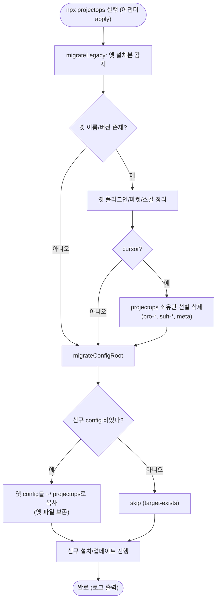

# IDE 어댑터 옛 이름 설치본 자동 마이그레이션

## 개요

레포/플러그인 이름이 `SUH-DEVOPS-TEMPLATE`/`cassiiopeia` → `projectops`로 바뀐 뒤(#459), `npx projectops` 설치 흐름이 옛 이름의 설치본을 인지·정리하지 못해 사용자가 수동으로 `marketplace remove → add → install` 6단계를 밟아야 했다. 이번 작업으로 각 IDE 어댑터의 설치/업데이트 시점에 옛 이름 설치본(플러그인·마켓·심링크·clone·cursor 스킬)과 옛 config 경로를 **자동으로 감지·정리·이관**한다. 조용히 실행하고 로그만 남기며, 다른 출처의 스킬(somansa-tools 등)은 보존한다.

## 기능 흐름

## 변경 사항

### 공용 헬퍼 (신규)
- `src/core/ide/legacy.js`: 어댑터 공용 레거시 유틸 신설
  - `isLegacyVersion(version, maxLegacy)`: 버전 기준점(≤ 4.2.4) 판정. null/빈값은 false(안전)
  - `migrateConfigRoot(io)`: 옛 config 루트(`~/.suh-template/config/config.json` 우선, `~/.cassiiopeia/config.json` 폴백)를 `~/.projectops/config/config.json`으로 이관. 신규가 비었을 때만 복사하고 옛 파일은 삭제하지 않음. idempotent
  - `hasNonEmptyJson(path)`: 파일 존재 + JSON 파싱 + 키 1개 이상 검증

### 어댑터별 레거시 정리 (apply 시작 시 호출)
- `src/core/ide/adapters/claude.js`: 옛 `cassiiopeia@cassiiopeia-marketplace` 플러그인 uninstall + `cassiiopeia-marketplace` 마켓 remove 후 재감지
- `src/core/ide/adapters/codex.js`: 옛 `~/.agents/skills/SUH-DEVOPS-TEMPLATE` native 폴더/심링크 제거 + 옛 marketplace remove
- `src/core/ide/adapters/gemini.js`: 옛 `SUH-DEVOPS-TEMPLATE` extension uninstall
- `src/core/ide/adapters/pi.js` + `pi-common.js`: 신·구 clone 공존 시 옛 `SUH-DEVOPS-TEMPLATE` clone 제거 + settings.json에서 옛 harness loader 경로 제거(`migratePiLegacy`)
- `src/core/ide/adapters/cursor.js`: 옛 이름/버전 meta 감지 시 projectops 소유 항목만 선별 삭제 후 재설치

### 버그 동반 수정
- `src/core/ide/adapters/cursor.js`: 기존 `remove()`가 `~/.cursor/skills` 폴더를 통째로 삭제해 같은 폴더를 쓰는 다른 출처 스킬(somansa-tools 등)까지 지우던 문제 수정. 이제 `ownedEntries`로 projectops 소유(`pro-*`, `suh-*`, meta)만 선별 삭제하고, 폴더에 다른 스킬이 남으면 폴더를 유지

### 문서 · 테스트
- `.github/config/breaking-changes.json`: 4.3.0 항목에 "npx 설치 시 옛 흔적 자동 정리·이주(수동 삭제 불필요, 타 출처 스킬 보존)" 안내 보강
- `test/ide-legacy.test.js`: 신규 단위 테스트 13개(버전 판정, config 이관 5케이스, 어댑터 5개 레거시 정리, cursor 선별삭제/remove 보존)
- `test/ide.test.js`: cursor `remove` 호출부에 소스 컨텍스트 전달로 갱신
- `test/rename-consistency.test.js`: 레거시 감지 코드 3파일(`legacy.js`, `claude.js`, `cursor.js`)을 소문자 `cassiiopeia` 참조 예외로 등록(감지 로직은 구 이름을 리터럴로 참조해야 하므로)

## 주요 구현 내용

- **감지 기준은 이름 OR 버전 하이브리드**: marketplace형(claude/codex)은 옛 이름 존재로, 수동 복사형(cursor)은 meta의 옛 이름 또는 version ≤ 4.2.4로 판정한다.
- **cursor 소유 판정 규칙**: 소스 `skills/` 폴더명(`pro-*`, `references`, `config.json.example`) ∪ `/^suh-/` ∪ `cursor-skills-meta.json`만 projectops 소유로 본다. 접두어 없는 폴더(`analyze`, `gitlab` 등 somansa-tools)는 건드리지 않는다.
- **안전성 원칙**: 모든 정리 명령은 실패 무해(없는 것 제거 = no-op). config는 복사만 하고 삭제하지 않으며, 신규가 이미 있으면 덮어쓰지 않는다. `migrateLegacy`/`migrateConfigRoot`는 반복 실행에 안전(idempotent)하다.

## 검증

실제 개발 환경(3세대 레거시 공존)에서 end-to-end 검증했다.

| 항목 | 검증 전 | 검증 후 |
|------|--------|--------|
| cursor meta name | cassiiopeia | projectops |
| cursor meta version | 4.2.3 | 4.2.5 |
| suh-* 스킬 | 25개 | 0개 |
| pro-* 스킬 | 0개 | 25개 |
| somansa-tools(gitlab/jenkins/redmine/drive/pad/sparrow/server-deploy/postgres) | 존재 | 8종 전부 보존 |
| config 이관 | 신규 존재 시 | `target-exists`로 skip, PAT 보존 |

전체 테스트 200/200 통과(신규 13개 포함), 기존 정합성 테스트 무손상. v4.2.6로 릴리스 완료(PR #465 머지).

## 주의사항

- 이 마이그레이션은 `npx projectops`(어댑터 `apply`) 실행 시점에 동작한다. 릴리스가 마켓플레이스/npm에 반영된 뒤 사용자가 설치/업데이트해야 실제 적용된다.
- cursor 소유 판정은 소스 `skills/` 폴더명 집합에 의존하므로, 향후 스킬 접두어 체계를 다시 바꾸면 `ownedEntries` 규칙(`pro-*`/`suh-*`)도 함께 갱신해야 한다.
- pi는 신·구 clone이 공존할 때만 옛 clone을 제거한다. 옛것만 있으면 설치 흐름이 신규를 만들 때까지 그대로 둔다.
