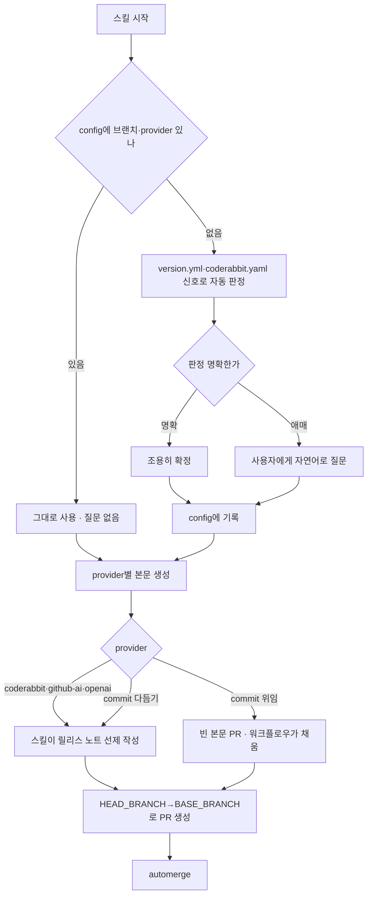

# changelog-deploy 스킬 브랜치·provider config화 및 릴리스 워크플로우 로직 정합

> 이슈 #466 · 2026-07-10

## 요약

pro-changelog-deploy 스킬이 릴리스 워크플로우의 실제 동작을 따라가지 못하던 3가지 결함(브랜치 하드코딩, provider 분기 미실행, config 고정 부재)을 해소했다. 릴리스 브랜치와 릴리스 노트 생성 방식(provider)을 config에서 읽고, config가 비면 최초 1회 자동판정 후 기록해 재질문을 없앴다. 사용자는 config를 직접 손대지 않고, 애매할 때만 스킬이 자연어로 묻는다.

## 문제

| # | 결함 | 증상 |
|---|------|------|
| D1 | 브랜치 하드코딩 | 6단계 PR 생성·3·4·7단계가 `develop`/`main`을 리터럴로 박아둠 → 비표준 브랜치 레포에서 깨짐 |
| D2 | provider 분기 미실행 | coderabbit/commit/github-ai/openai별 본문 생성 방식이 실행 흐름에 없었음 |
| D3 | 최초 판정→config 고정 없음 | 매번 version.yml만 읽고, 확정값을 저장·재사용하지 않음 |

실제로 직전 릴리스에서 automerge가 대기 상태로 멈추는 증상으로 표면화됐다.

## 해결 흐름

## 변경 내용

- **[시작 전 §5] 브랜치·provider 판정 절 신설**: config(레포별→글로벌) 우선 → version.yml 폴백 → 최초 1회 자동판정 후 기록.
- **5단계 provider별 본문 생성 분기표**: 선제 작성 vs 워크플로우 위임을 provider별로 명시. 워크플로우가 `already_found`를 provider 무관하게 존중하므로 선제 작성이 안전함을 근거로 포함.
- **브랜치 하드코딩 전면 제거**: `develop`/`main` → `HEAD_BRANCH`/`BASE_BRANCH` 변수(3·4·6·7단계·fix 모두). deploy-status에 `--base` 명시.
- **config 스키마 확장**: `changelog_deploy`에 `head_branch`/`base_branch`/`provider` 3키 추가·문서화.
- **핵심 원칙 명문화**: 사용자는 config를 직접 수정하지 않고, 스킬이 자연어로 묻고 기록한다.

## 관심사 분리

스크립트(`changelog_cli.py`)는 로컬 파일(version.yml)만 읽어 사실을 반환하고, config 읽기·판단·질문은 agent(SKILL.md)가 맡는다. 스크립트는 이미 브랜치·provider를 지원하므로(`_read_release_branches`·`create-pr`·`detect-release-context`) 코드 변경 없이 SKILL.md 지시만 정합화했다. 빈 본문(commit 위임) 케이스도 기존 `create-pr`·`_resolve_body_file`이 이미 처리함을 실측·테스트로 확인했다.

## 검증

| 항목 | 결과 |
|------|------|
| pytest | 48/48 통과 (`test_release_branches` 6케이스·빈 본문 케이스 포함) |
| npm test | 200/200 통과 |
| SKILL.md 문서 검증 | 14/14 통과 |
| 실행 코드블록 브랜치 하드코딩 | 0 |

## 산출물

- 설계: `docs/superpowers/specs/2026-07-10-changelog-deploy-config-branch-provider-design.md`
- 계획: `docs/superpowers/plans/2026-07-10-changelog-deploy-config-branch-provider.md`
- 커밋 8개 (설계 2 · 계획 1 · 구현 5)
