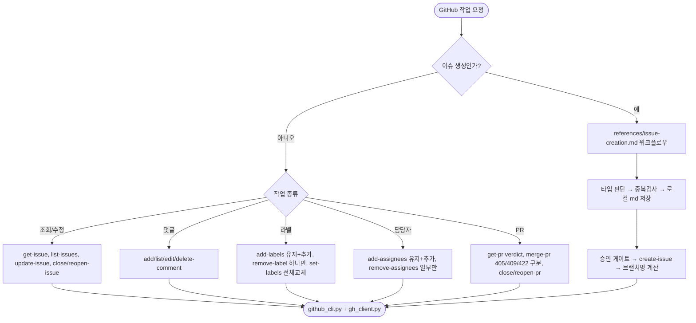

# pro-issue를 pro-github로 통합하고 GitHub 편집 CLI 전면 보강

## 개요

이슈 관련 GitHub 작업에서 `pro-github`와 `pro-issue` 중 무엇을 호출할지 헷갈리던 문제를 해결하기 위해, `pro-issue`를 `pro-github`로 완전히 흡수·삭제하고 GitHub 이슈/PR 편집 기능을 전면 보강했다. 공유 로직(`scripts/common/gh_client.py`)은 이미 두 스킬이 공유하고 있었으므로, 실제 작업은 CLI 서브커맨드 노출 + SKILL 통합 + 폴더 삭제 + 참조 정리였다. 이제 GitHub 작업은 `pro-github` 하나로 통일되고, `github_cli.py`가 32종 서브커맨드로 이슈/PR 편집을 전부 커버한다.

## 기능 흐름

## 변경 사항

### 공유 로직 (신규 API 함수)
- `scripts/common/gh_client.py`: `update_comment`(PATCH), `delete_comment`(DELETE, 204), `remove_issue_label`(DELETE, 라벨명 URL 인코딩), `set_issue_labels`(PUT, 존재하지 않는 라벨 사전 필터), `add_assignees`(POST 201), `remove_assignees`(DELETE + body), `merge_pull_request`(PUT, merge/squash/rebase) 추가

### CLI 서브커맨드 (github_cli.py 32종으로 확장)
- `skills/pro-github/scripts/github_cli.py`: 이슈(create-issue, list-issues, close-issue, reopen-issue), 댓글(list-comments, edit-comment, delete-comment), 라벨(list-labels, add-labels, remove-label, set-labels), 담당자(add-assignees, remove-assignees), PR(get-pr, add-pr-comment, close-pr, reopen-pr, merge-pr), 헬퍼(normalize-title, create-branch-name, get-commit-template) 추가

### SKILL 통합
- `skills/pro-github/SKILL.md`: description에 이슈 생성 트리거 흡수, 신규 서브커맨드 32종 호출예 추가, `/issue` 안내를 자기참조로 수정
- `skills/references/issue-creation.md`: 이슈 생성 워크플로우(템플릿·중복검사·auto_approve·담당자 첫설정·브랜치명)를 신규 분리

### pro-issue 삭제 + 참조 정리
- `skills/pro-issue/` 폴더 통째 삭제 (SKILL.md, issue_cli.py)
- `CLAUDE.md`, `README.md`, `GEMINI.md`, `AGENTS.md`, `docs/SKILLS.md`: routing 표·CLI 표·스킬 목록에서 issue 행을 github으로 병합, 스킬 카운트 25종 → 24종, stale 경로(`skills/issue/` 등)를 `pro-` 접두어로 갱신
- `skills/references/common-rules.md`, `config-rules.md`, `skills/pro-changelog-deploy/SKILL.md`, `skills/pro-plan/SKILL.md`: `/issue` 안내를 github/config-rules로 수정

### 테스트
- `scripts/tests/test_cli_github.py`(신규): github_cli 신규 서브커맨드 verdict·멱등·경고 로직
- `scripts/tests/test_gh_client_edits.py`(신규): gh_client 신규 함수 요청 조립(method/url/body, 한글 quote, DELETE+body)
- `scripts/tests/test_cli_body_file.py`, `test_cli_signatures_doc_sync.py`, `test_skill_docs.py`: issue_cli 참조 제거·github_cli 기반으로 갱신

## 주요 구현 내용

- **라벨/담당자 세분화**: 기존 `update-issue --labels`(전체 교체)만으로는 "기존 것 유지하며 하나만 추가/제거"가 불가능했다. `add-labels`/`remove-label`/`set-labels`, `add-assignees`/`remove-assignees`로 나눠 기존 값이 날아가지 않게 했다.
- **urllib 크로스플랫폼 주의**: 삭제(204)는 JSON 파싱 금지, 한글 라벨(`작업중`)은 `quote(name, safe='')`로 URL 인코딩, `remove_assignees`는 DELETE인데 body 필요, `merge-pr`는 405(머지 불가)/409(sha 불일치)/422(rebase 불허)를 verdict로 구분.
- **config 키 하위 호환**: `issue.auto_approve`, `default_assignee` 등 config 키 이름은 그대로 유지해 기존 사용자 config가 깨지지 않게 했다.
- **doc-sync 테스트 정상화**: `test_cli_signatures_doc_sync.py`의 `CLI_TO_SKILL`이 stale 경로(`github/`)를 봐서 조용히 skip되던 것을 `pro-github/` 경로로 고쳐, github_cli의 전 서브커맨드가 SKILL.md/issue-creation.md에 문서화됐는지 실제로 강제하게 했다.

## 주의사항

- `pro-issue` 폴더 삭제는 스크립트(template_initializer/integrator)·플러그인 매니페스트 수정 불필요 — 이들은 `skills/` 폴더를 통째로 처리하기 때문(개별 스킬 나열 없음).
- 전체 테스트 65종 통과. 실제 GitHub API로 read 계열(list-labels·list-issues·get-pr verdict) 스모크 검증 완료. 파괴적 커맨드(merge-pr·delete-comment 등)는 mock 단위 테스트로만 검증했으며 실제 호출은 사용자 명시 요청 시에만 수행한다.
