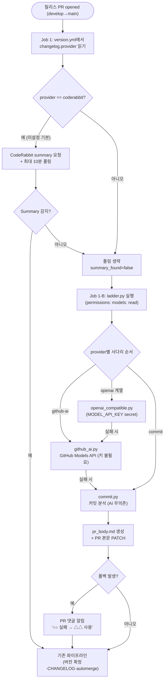

# CodeRabbit 탈의존: changelog provider 아키텍처 (#455)

## 개요

릴리스 노트 생성이 CodeRabbit에 하드 커플링돼 있던 구조를 **provider 사다리 아키텍처**로 전환했다. 마법사(질문·version.yml 스키마)는 선행 작업에서 완료된 상태였고, 이번에 남은 절반 — **provider 실행 계층과 워크플로우 연결** — 을 완성했다. 프로젝트 방침(전 로직 Python 통일)에 따라 초안으로 존재하던 `.sh` provider 3종을 폐기하고 **stdlib 전용 `.py` 5종**으로 재작성했으며, `github-ai` provider를 신규 구현해 "깔면 바로 작동"(API 키 불필요)을 달성했다. v4.2.8로 릴리스됨.

## 기능 흐름

## 변경 사항

### provider 실행 계층 (신규 — 전부 stdlib .py)
- `.github/scripts/changelog_providers/_common.py`: 공통 헬퍼 — 커밋 수집(`[skip ci]` 제외), prefix 분류(feat/fix/refactor/docs), 이슈번호·URL 정제, `Summary by CodeRabbit` 고정 구조 생성
- `.github/scripts/changelog_providers/commit.py`: 커밋 분석 안전망. AI·네트워크 무의존이라 **항상 완주하는 최후 보루** (항상 exit 0)
- `.github/scripts/changelog_providers/github_ai.py`: **신규.** GitHub Models 추론 API(`models.github.ai`) 호출. 워크플로우 job의 `permissions: models: read` + `GITHUB_TOKEN`만으로 동작 — **API 키 등록 없이 AI 릴리스 노트 생성**. 입력 토큰 한도 대응으로 커밋 40개 제한
- `.github/scripts/changelog_providers/openai_compatible.py`: openai/gemini/claude/ollama 프리셋(base_url·기본 모델 스왑). `MODEL_API_KEY` secret 필요, ollama는 `changelog.base_url` 사용
- `.github/scripts/changelog_providers/ladder.py`: 폴백 오케스트레이터. provider 값에 따라 사다리 순서를 구성해 순차 시도하고, 결과를 `provider_result.json`(승자·시도·실패·알림문구)으로 기록
- 구 `commit.sh`·`coderabbit.sh`·`openai_compatible.sh` 삭제 (coderabbit 단계는 워크플로우 Job 1 폴링이 담당하므로 별도 스크립트 불필요)

### 워크플로우 연결
- `.github/workflows/PROJECT-COMMON-RELEASE-CHANGELOG.yaml` (루트 + `project-types/common/` 동일): fallback-summary job의 인라인 커밋 분석 bash를 `ladder.py` 호출로 교체, `permissions: models: read` 추가, `changelog_base_url` output 추가, 폴백 발생 시 PR 댓글 알림 step 추가
- **coderabbit 기본 경로(Job 1)는 무수정** — 미설정 레포는 기존 동작 100% 보존

### 배포 연결
- `src/core/copy/simple.js`: npx 복사 엔진에 provider `.py` 5종 추가 — 사용자 프로젝트에 복사돼야 워크플로우가 동작

### 테스트
- `.github/scripts/test/test_changelog_providers.py`: pytest 13종 신설 — 구 `.sh` 테스트 3종 커버리지 승계 + ladder 폴백 순서·coderabbit 재폴링 금지·changelog_manager 파싱 계약 검증
- `test/copy-simple.test.js`: provider 5종 복사 테스트 추가
- 구 `.sh` 테스트 3종(`test_commit_provider`·`test_openai_provider`·`test_provider_contract`) 삭제
- 부수 수정: provider·테스트 스크립트의 Python 탐지를 실행 검증 포함 표준 패턴으로 교체 (Windows `python3` Store 스텁이 exit 49로 걸러짐)

## 주요 구현 내용

- **provider 무관 계약**: 어떤 provider든 동일한 `Summary by CodeRabbit` 구조의 `pr_body.md`를 산출 → 기존 `changelog_manager.py` 파싱·CHANGELOG·automerge 파이프라인을 무수정 재사용
- **사다리 순서**: 명시 선택 provider가 1순위 → `github-ai`(무료·키 불필요) → `commit`(안전망). `coderabbit` 선택 레포가 폴링 실패로 사다리에 도달한 경우 재폴링하지 않고 github-ai부터 시작 (10분 중복 대기 방지)
- **기본값 정책**: 신규 설치(마법사)는 `github-ai` 기본, **미설정 기존 레포는 `coderabbit` 기본** — 하위 호환 100%

## 주의사항

- openai 계열 사용 시 `MODEL_API_KEY` secret은 사용자가 직접 등록해야 한다 (마법사는 값을 받지 않음)
- GitHub Models rate limit 초과 시 자동으로 commit 안전망으로 폴백되며 PR 댓글로 알린다
- 실제 릴리스 PR에서의 github-ai 동작은 provider를 `github-ai`로 설정한 레포의 다음 릴리스에서 확인 가능 (이 레포는 coderabbit 유지 중)
