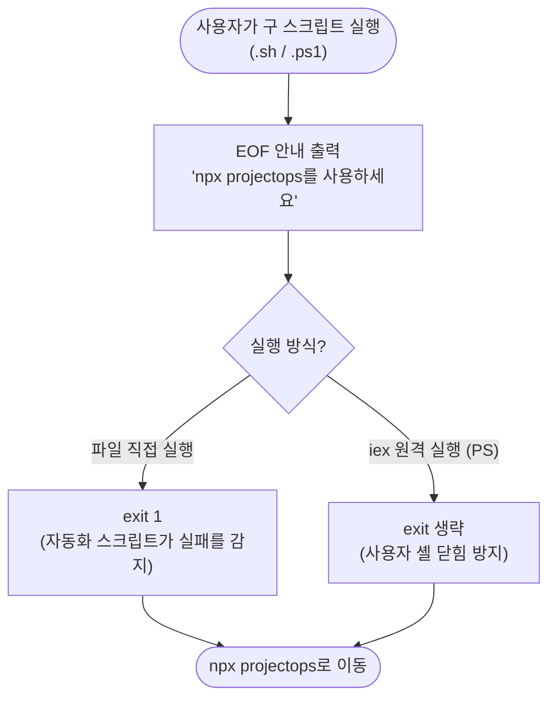
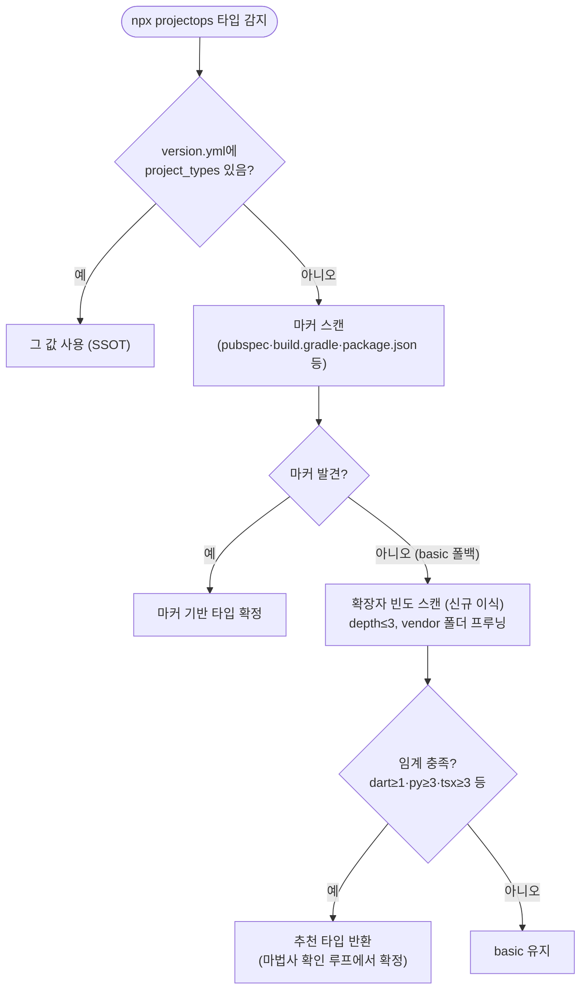

# integrator.sh/.ps1 EOF: npx 단일화 (#458)

## 개요

템플릿 통합 경로가 세 갈래(`npx projectops` / `template_integrator.sh` / `.ps1`)로 나뉘어 같은 로직을 3중 유지보수하던 문제를 해소했다. 선행 의존(#455 changelog 마법사 반영, #457 마법사 질문)이 충족된 것을 확인한 뒤, **안내 shim 1버전 유지** 방식으로 두 스크립트(합계 11,226줄)를 폐기했다. `.sh`에만 있던 확장자 스캔 타입 추천 기능은 npx로 이식해 기능 공백 없이 전환했다. v4.2.8로 릴리스됨.

## 기능 흐름

타입 감지 이식분 (npx 마법사):

## 변경 사항

### 스크립트 폐기 (shim 교체)
- `template_integrator.sh` (5,892줄 → 26줄): `npx projectops` 안내만 출력하는 shim. 직접 실행 시 exit 1 (자동화가 조용히 성공한 척하지 않도록)
- `template_integrator.ps1` (5,334줄 → 24줄): 동일 안내. `iex`(원격 문자열 실행) 사용자의 셸이 닫히지 않도록 `$MyInvocation.MyCommand.Path` 검사 후 파일 실행일 때만 exit 1

### 기능 이식 (공백 방지)
- `src/core/detect.js`: `suggestTypesByExtScan()` 신규 — `.sh`의 `suggest_types_by_scan` 확장자 빈도 폴백 등가 (dart≥1→flutter, java+kt+gradle≥3→spring, tsx+jsx≥3→react, py≥3→python, 단독 ts+js≥3→node)
- `src/core/detect-fs.js`: `listScanFiles()` 워커(depth≤3, node_modules 등 vendor 프루닝) + `detectTypes()`가 마커 0개일 때 스캔 추천으로 2차 시도

### 문서 정리 (npx 기준)
- `README.md` / `PROJECTOPS-SETUP-GUIDE.md` / `docs/SKILLS.md` / `docs/FLUTTER-CICD-OVERVIEW.md` / `docs/SSH-DOCKER-DEPLOYMENT-GUIDE.md`: `bash <(curl ...)` 사용법 전부 `npx projectops`로 교체
- `docs/TEMPLATE-INTEGRATOR.md`: 436줄 상세 가이드 → EOF 안내 + 구 플래그→npx 대응표로 재작성
- `CLAUDE.md`: integrator 전용 macOS 검증 가이드(~85줄) 제거, "템플릿 전용 파일 3곳 동시 수정" 규칙을 새 구조(initializer.py + `src/core/exclusions.js`)로 갱신
- `.github/config/breaking-changes.json`: 4.3.0 항목에 integrator EOF 안내([6]) 추가

### 테스트
- `test/detect.test.js`: 스캔 추천 테스트 7종 추가 (구 `.sh` 테스트 케이스 승계 + vendor 프루닝)
- `.github/scripts/test/test_integrator_suggest.sh` 삭제 (`.sh` 내부 함수 테스트 — 대상 소멸)

## 주요 구현 내용

- **폐기 방식 = 안내 후 삭제**: 구 URL로 실행하는 기존 사용자·문서 링크가 404 대신 명확한 이주 안내를 받는다. 다음 minor에서 파일 자체를 제거할 예정
- **스캔 추천의 배치 위치**: `.sh`에서는 별도 추천 함수였지만, npx에서는 `detectTypes()`의 마커-실패 폴백으로 넣었다 — 마법사의 기존 확인/수정 루프가 그대로 추천 확정 UX 역할을 하므로 UI 변경 없이 등가 동작

## 주의사항

- **다음 minor 릴리스에서 shim 파일 2종을 실제 삭제**해야 한다 (README·breaking-changes에 예고됨)
- 구 스크립트의 `plugin_items_to_remove` 배열이 소멸했으므로, 템플릿 전용 파일 추가 시 복사 제외 지점은 `src/core/exclusions.js` 한 곳이다 (CLAUDE.md 규칙 갱신됨)
- CLAUDE.md의 bash 3.2/BSD 가이드는 남은 `.sh`(initializer shim, flutter util 마법사)를 위해 유지했다
