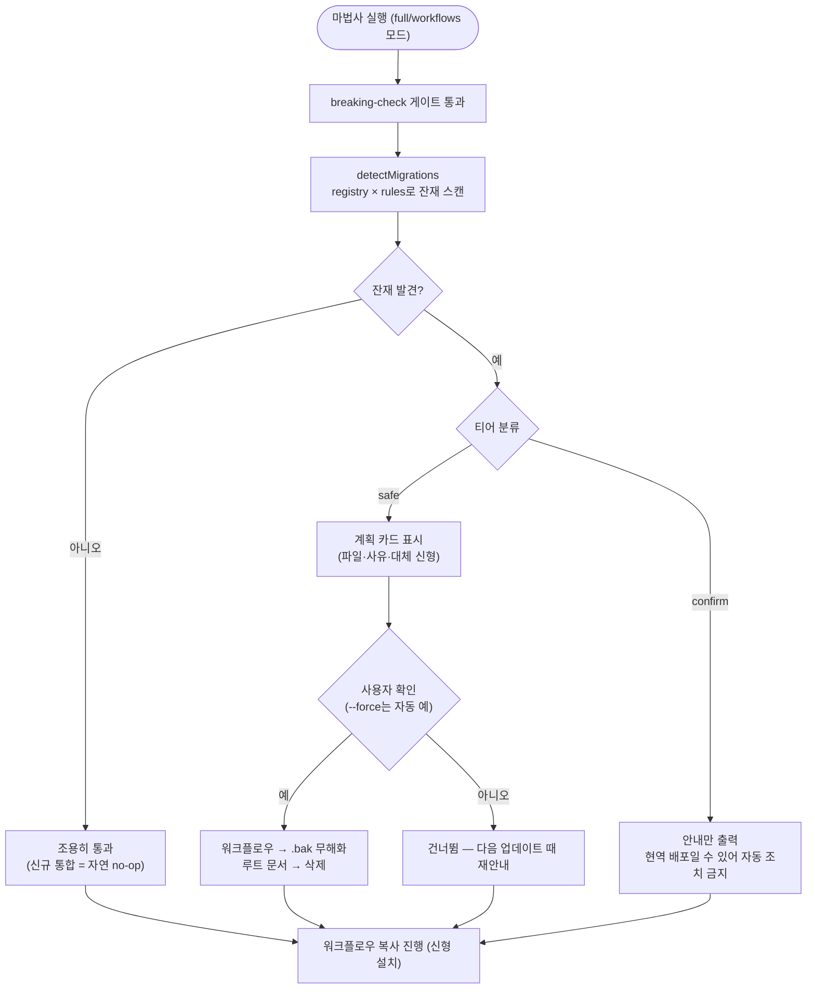

# 레거시 워크플로우 자동 마이그레이션: 신호 기반 단일 레지스트리 (#470)

## 개요

마법사(npx projectops)가 새 워크플로우만 추가하고 구 파일을 치우지 않아, 오래된 통합 레포에서 같은 기능의 워크플로우가 2~3세대 공존(버전 이중 증가·QA 이슈 중복 등)하던 문제를 해결했다. 로컬 통합 레포 14개 전수 스캔으로 실제 잔재 목록을 확정하고, **신호 기반(파일 존재 감지)·멱등·단일 레지스트리** 마이그레이션 시스템을 마법사 업데이트 플로우에 배선했다. 절반의 레포는 version.yml에 template 버전 기록조차 없어(실측) 버전 번호 기반이 아닌 신호 기반이 유일한 선택지였다.

## 기능 흐름

## 변경 사항

### 마이그레이션 시스템 (신규 — 확장 가능한 단일 관리 지점)
- `src/core/migrations/registry.js`: **유일한 관리 지점.** 구 파일명·티어·사유·대체 신형을 데이터로 관리 (workflow 38종 + root-file 2종). 앞으로 워크플로우 리네임/폐기 시 여기 한 줄 추가하면 마이그레이션이 자동으로 따라온다
- `src/core/migrations/rules/obsolete-workflows.js`: workflow 카테고리 — `.bak` 리네임 (GitHub Actions가 실행하지 않아 즉시 무해화 + 복원 가능)
- `src/core/migrations/rules/root-files.js`: root-file 카테고리 — 구 설치 가이드(`SUH-DEVOPS-TEMPLATE-SETUP-GUIDE.md` 등) 삭제. 범용 파일명은 `contentMarker`(내용 마커)로 오탐 방지
- `src/core/migrations/index.js`: 진입점 — 감지 → 계획 카드 → 확인 1회 → 적용 → confirm 티어 안내

### 마법사 배선
- `src/index.js`: 비대화형(`--force`) full/workflows 모드에서 safe 티어 자동 적용 + 로그
- `src/commands/interactive.js`: 대화형은 breaking-check 직후 계획 카드 표시 + `askYesNo` 확인 1회

### 안전 정책 (2-티어)
- **safe** (18종): 순수 리네임/대체 관계 — 공존 시 이중 트리거 실해 (`PROJECT-VERSION-CONTROL`→`PROJECT-COMMON-VERSION-CONTROL` 등) → 확인 후 무해화
- **confirm** (22종): SYNOLOGY 계열·1세대 CICD 등 **그 레포의 유일한 현역 배포일 수 있는 파일** → `--force`에서도 절대 자동 조치하지 않고 안내만
- 정확한 파일명 매칭만(글롭 금지) — 사용자 커스텀(`ROMROM-*`, 리네임된 `SYNOLOGY-MAPSEE-CICD` 등) 자동 보호

### 테스트 / 문서
- `test/migrations.test.js` 9종: **레지스트리·현행 배포 세트 충돌 가드**(살아있는 워크플로우 오살 방지 — 구현 중 `SUH-ISSUE-HELPER-API`가 현행임을 이 검증으로 발견), 티어 분류, contentMarker 오탐 방지, `.bak` 충돌 처리, 멱등성, confirm 불변
- `CLAUDE.md`: "워크플로우 리네임/삭제 시 registry.js에 구 이름 추가" 확장 규칙 명시

## 주요 구현 내용

**실물 검증 (RomRom-FE fresh clone, template v1.8.22):**
- 마법사 1회 실행으로 구세대 4종(`COMQA-ISSUE-CREATION-BOT`, `PROJECT-COMMON-AUTO-CHANGELOG-CONTROL`, `PROJECT-COMMON-ISSUE-COMMENT`, `PROJECT-SYNC-ISSUE-LABELS`) `.bak` 무해화
- 사용자 커스텀 12종(`ROMROM-*`·`chuseok22-*`·`test-*`) 전부 불가침
- 2차 실행 감지 0건 — 멱등 확인

**읽기 전용 감지 교차검증 (세대별 5개 레포):** suh-logger(0세대) safe 5·confirm 2, tripgether-flutter(1세대) safe 6(.yml 구확장자 포함)·confirm 3, PickerPicker(3.0.182) safe 1·confirm 2, MapSy-BE·EarLocAlert 정확 분류 + 커스텀 리네임 파일 보호 확인. 전체 테스트 217/217 통과.

## 주의사항

- confirm 티어는 의도적으로 영원히 자동 조치하지 않는다 — 신형 배포 전환을 확인한 사용자가 직접 삭제하는 것이 계약
- `.bak` 파일은 레포에 남아 커밋될 수 있다 — 복원 가능성을 위한 의도된 동작이며, 확인 후 직접 삭제하면 된다
- 후속 카테고리(레지스트리 구조가 이미 수용): `.claude/commands/` 1.x 잔재, version.yml `metadata.template.source` 구 표기 갱신
