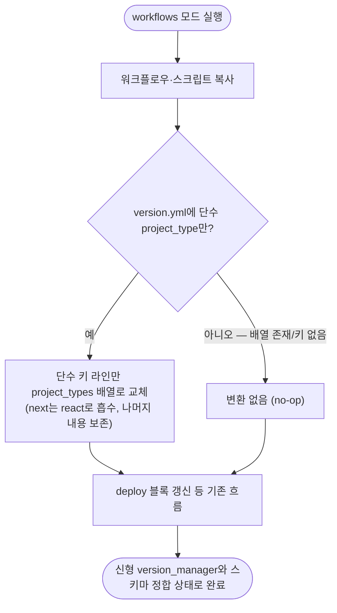

# workflows 모드 구식 version.yml 스키마 미변환으로 버전 워크플로우 전면 실패 수정

## 개요

통합 마법사의 workflows 모드("워크플로우만" 업데이트)가 v4.1.0 이전 형식 version.yml(단수 `project_type` 키)을 가진 레포에서, 단수 키를 명시적으로 거부하는 신형 `version_manager.py`를 복사하면서 정작 스키마 변환은 하지 않아 — 통합 직후 VERSION-CONTROL·RELEASE-CHANGELOG 등 버전 관련 워크플로우가 전부 실패하는 깨진 중간 상태를 만들던 버그를 수정했다. workflows 모드가 구식 스키마를 감지하면 단수 키 라인만 `project_types` 배열로 최소 변환하고 나머지 내용은 손대지 않는다. `suh-project-utility` 실물 레포에서 발견·재현했고, 구식 픽스처로 수정 후 정상 완주를 확인했다.

## 기능 흐름

## 변경 사항

### 스키마 변환 로직
- `src/core/version-yml.js`: `convertLegacySingularType(content)` 신설 — 단수 `project_type` 키만 있으면 해당 라인을 `project_types: ["타입"]` 배열로 교체(주석 라인 오탐 방지, `next`→`react` 흡수), 배열 키와 공존 시 단수 키만 제거(4.1.0 SSOT 잔재 정리), 변환할 것이 없으면 `null` 반환(멱등 no-op)

### workflows 모드 배선
- `src/commands/workflows.js`: 복사 직후 version.yml이 존재하면 변환을 수행 — 신형 `version_manager.py`(단수 키 거부)가 복사되는 모드이므로 스키마 정합을 함께 보장

### 테스트
- `test/version-yml.test.js`: 변환 4종 추가 — 단수→배열(내용 보존), next→react, 배열 공존 시 단수 제거, 재실행 멱등(no-op)

## 주요 구현 내용

- **최소 변환 원칙**: full 모드처럼 version.yml을 재생성하지 않고 문제의 한 라인만 교체 — workflows 모드의 "version.yml 생성 안 함" 계약을 유지하면서 신형 스크립트와의 모순만 해소
- **실측 검증**: 구식 픽스처(단수 키 + build.gradle)에 workflows 모드 실행 → 수정 전 `version_manager.py get`이 "v4.1.0 이전 형식" 오류로 즉시 실패하던 것이 수정 후 정상 완주(버전 조회·동기화 성공)

## 주의사항

- 이 갭은 #470 마이그레이션과 무관하게 v4.1.0 SSOT 전환(구 .sh 시절 포함)부터 존재했다
- v4.2.9 릴리스에 포함되어 npm 배포 완료
