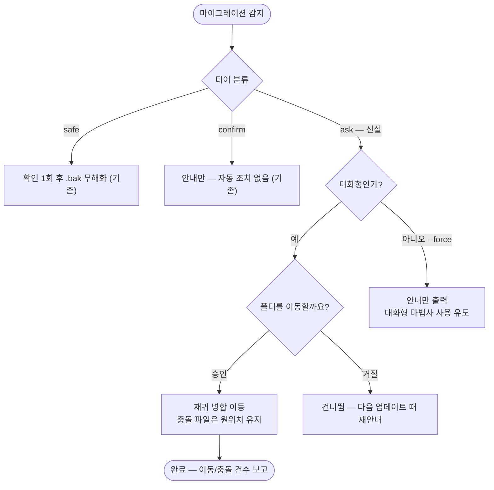

# 레거시 마이그레이션 ask 티어 추가 — 구명칭 산출물 폴더 확인 후 이동

## 개요

리브랜딩으로 스킬 산출물 폴더가 `docs/suh-template/` → `docs/projectops/`로 개명됐지만 레거시 마이그레이션 레지스트리(#470)에 폴더 리네임을 다룰 수단이 없어, 기존 통합 레포의 이슈·보고서 문서가 구 경로에 남는 문제를 해결했다. 이 폴더는 템플릿 소유 파일이 아니라 **사용자가 작성한 문서**이므로 기존 safe(자동 .bak)·confirm(안내만)과 다른 제3 티어 `ask`를 신설 — 대화형에서는 확인 후 손실 없는 이동, 비대화형(--force)에서는 자동 조치 없이 안내만 수행한다.

## 기능 흐름

## 변경 사항

### 레지스트리·티어 정책
- `src/core/migrations/registry.js`: `ask` 티어와 `legacy-dir` 카테고리 스키마 추가, 첫 항목 `dir-docs-suh-template`(`docs/suh-template` → `docs/projectops`, since 4.2.9) 등록

### 이동 규칙
- `src/core/migrations/rules/legacy-dirs.js` (신규): 폴더 존재 감지 + 재귀 병합 이동 — 대상 폴더가 없으면 사실상 통째 rename, 이미 있으면 파일 단위 병합하되 동명 충돌 파일은 원위치에 남기고 건수 보고(사용자 판단 존중), 다 비운 원본 폴더는 제거

### 실행 흐름
- `src/core/migrations/index.js`: `detectMigrations`가 `{safe, confirm, ask}` 3분류 반환, `runMigrations`에 ask 티어 처리 추가 — 대화형은 별도 질문 후 적용, 비대화형은 `askPending`으로 보고하며 안내만

### 테스트
- `test/migrations.test.js`: 5종 추가 — 통째 이동(구조·내용 보존), 충돌 병합(양쪽 보존), 비대화형 무조치, 대화형 거절, 멱등(재감지 0건) + 레지스트리 검증의 tier/category 허용 목록 확장

## 주요 구현 내용

- **사용자 콘텐츠 보호가 설계 축**: 삭제·무해화가 아닌 손실 없는 이동만 수행하고, 충돌 시 덮어쓰지 않으며, 비대화형에서는 아예 건드리지 않는다
- 템플릿에서 산출물 폴더류를 개명할 때 레지스트리에 legacy-dir 한 줄만 추가하면 되는 확장 구조

## 주의사항

- 스킬(플러그인) 쪽 산출 경로가 신 경로(`docs/projectops/`)로 통일된 버전과 함께 쓰여야 산출물 이원화가 완전히 해소된다
- v4.2.12 릴리스에 포함되어 npm 배포 완료
