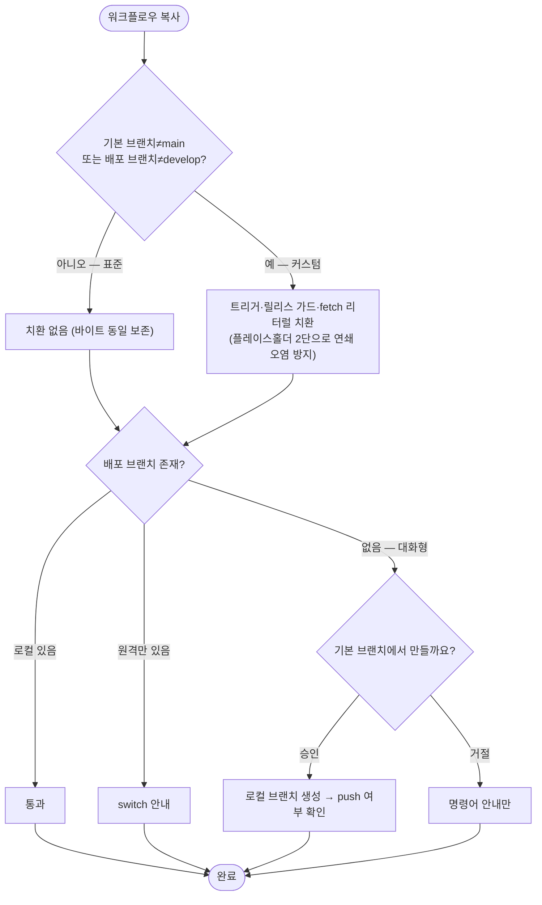

# 마법사 브랜치 전략 실효화 — 워크플로우 브랜치 치환 및 개발 브랜치 생성 제안

## 개요

마법사는 이미 기본 브랜치와 배포 브랜치(`deploy_branch`, 릴리스 PR head)를 질문·저장했지만 워크플로우가 그 값을 쓰지 않아, 기본 브랜치가 main이 아니거나 개발 브랜치명이 develop이 아닌 레포에서 CI/CICD/릴리스가 무반응이거나 자동머지 가드가 조용히 스킵되던 문제를 해결했다. 표준(main/develop)과 다른 브랜치 전략일 때만 복사된 워크플로우의 트리거·릴리스 가드·내부 리터럴을 설정값으로 치환하며(표준 레포는 바이트 변화 없음), 배포 브랜치가 없으면 마법사가 확인 후 생성·push를 제안한다.

## 기능 흐름

## 변경 사항

### 브랜치 치환 모듈
- `src/core/branch-sub.js` (신규): `substituteBranches(content, branches)` — 실측 전수조사된 패턴만 치환(인라인 `branches: [...]`, 멀티라인 `- main`/`- develop`, `== 'develop'` 가드, `git fetch origin main`). 표준값이면 no-op. 플레이스홀더 2단 치환으로 값 충돌(기본 브랜치=develop 등) 시 연쇄 오염 차단

### 복사 엔진 배선 (churn 방지)
- `src/core/copy/workflows.js`: 복사 후 브랜치 치환 post-pass 적용, `listWorkflowConflicts`도 동일 기준 사용
- `src/core/wizard-env.js`: `isUnchanged` 가상 비교에 브랜치 치환 포함 — 치환된 설치본이 "변경됨"으로 오판돼 매 업데이트마다 재복사(.bak churn)되던 것 차단

### 워크플로우 내부 리터럴 동적화
- `PROJECT-COMMON-RELEASE-CHANGELOG.yaml`(루트·project-types 두 복사본 동일): step 내부 `git fetch origin main` 및 안내 문구를 `github.event.pull_request.base.ref` 기반으로 교체 — 트리거 외 리터럴은 치환 불필요하게

### 개발 브랜치 생성 제안
- `src/core/git-branch.js` (신규): `branchStatus`(로컬·원격 존재 감지, 실패 시 안전 폴백)·`createBranch`(fromBranch→origin/fromBranch→HEAD 폴백, checkout 안 함)·`pushBranch`
- `src/core/options-ask.js`: `ensureDeployBranch` — 배포 브랜치 부재 시 대화형 생성·push 제안(실패 시 명령어 안내), 비대화형·비레포·질문 불가 시 조용히 통과
- `src/core/detect-fs.js`: origin 없는 로컬 레포에서 현재 HEAD 브랜치로 폴백 감지

### 완료 요약
- `src/ui/summary.js`: 하드코딩된 "develop 브랜치 생성" 안내를 설정된 배포 브랜치명 기반으로 파라미터화

### 테스트
- `test/branch-strategy.test.js` (신규): 10종 — 치환 no-op/인라인/멀티라인/값충돌/무관어 보존, isUnchanged 가상비교, git 헬퍼, ensureDeployBranch(생성·기존통과·거절·비레포)

## 주요 구현 내용

- **표준 레포 무변화 계약 유지가 핵심**: 치환은 커스텀 브랜치일 때만 발동하고, isUnchanged에도 동일 branches를 주입해 업데이트 시 불필요한 재복사가 없다
- **버전 증가 위치와의 관계**: 버전 확정은 ①develop→main 릴리스 PR에서 RELEASE-CHANGELOG이 머지 직전 +1, ②main 직접 push 시 VERSION-CONTROL 안전망 patch +1 — 두 워크플로우 모두 치환 대상이라 커스텀 브랜치에서도 정상 동작
- 실물 스모크(master/release 레포): `branches: ["master"]`·`== 'release'`·`git fetch origin master` 전부 치환, 재실행 시 재복사 0건 확인

## 주의사항

- 치환은 실측된 정확 패턴만 다루므로, 향후 워크플로우에 새로운 브랜치 참조 형태를 추가하면 `branch-sub.js` 패턴도 함께 갱신해야 한다
- v4.2.12 릴리스에 포함되어 npm 배포 완료
