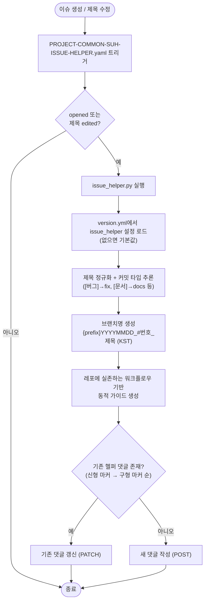
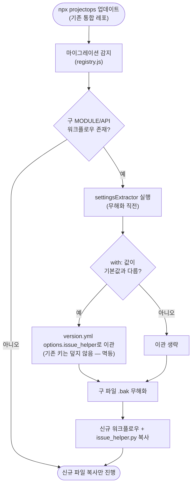

# 🚀[기능개선][Workflow] SUH-ISSUE-HELPER 외부 액션 의존 제거 및 내재화

## 개요

이슈 생성 시 브랜치명/커밋 메시지를 댓글로 제안하던 기능이 외부 GitHub 액션(`Cassiiopeia/github-issue-helper@deploy`)에 의존하던 것을 템플릿 내부 Python 스크립트(`.github/scripts/issue_helper.py`, stdlib 전용)로 완전히 내재화했다. deprecated 상태였던 API 버전 워크플로우를 삭제하고, MODULE 워크플로우는 `PROJECT-COMMON-SUH-ISSUE-HELPER.yaml`로 리네임해 내부 스크립트 실행으로 교체했다. 설정은 `version.yml`의 `metadata.template.options.issue_helper`(SSOT)로 이동했으며, 기존 통합 레포는 마법사 업데이트 시 구 워크플로우가 자동 무해화(.bak)되고 `with:` 블록의 커스텀 설정이 version.yml로 자동 이관된다. 커밋 타입 추론·템플릿 변수 확장·KST 타임존·브랜치 규칙 동적 가이드 등 사용성 개선을 함께 반영했다.

## 기능 흐름

## 변경 사항

### 신규 — 내재화 스크립트
- `.github/scripts/issue_helper.py`: 이슈 이벤트 처리·제목 정규화·브랜치명/커밋 메시지 생성·댓글 upsert 전체 로직 (stdlib 전용, 외부 의존 0)
- `.github/scripts/test/test_issue_helper.py`: pytest 36건 — 구 TS 액션과의 정규화 패리티, 커밋 타입 추론, BUILD-TRIGGER 파서 계약 테스트 포함

### 워크플로우 교체
- `PROJECT-COMMON-SUH-ISSUE-HELPER.yaml` (신규, 루트 + `project-types/common/` 두 곳 동일): checkout 후 `python3 .github/scripts/issue_helper.py` 실행
- `PROJECT-COMMON-SUH-ISSUE-HELPER-MODULE.yml` (삭제, 두 곳): 외부 액션 호출본
- `PROJECT-COMMON-SUH-ISSUE-HELPER-API.yaml` (삭제): deprecated 잔재

### 자동 마이그레이션
- `src/core/migrations/registry.js`: 구 파일 2종 `safe` 티어 등록, 1·2세대 항목의 `replacedBy`를 신규 파일명으로 갱신, `settingsExtractor` 스키마 필드 추가
- `src/core/migrations/rules/settings-extractors.js` (신규): 구 워크플로우 `with:` 커스텀 값을 version.yml로 이관 (기본값 제외·기존 섹션 보존·version.yml 부재 시 skip·멱등)
- `src/core/migrations/rules/obsolete-workflows.js`: `.bak` 무해화 직전 추출기 실행 훅 (실패해도 무해화는 진행)
- `test/migrations.test.js`: 설정 이관 테스트 5종 추가

### 배선
- `src/core/copy/simple.js`: npx 통합/업데이트 시 `issue_helper.py` 복사 목록 추가

### 브랜치 규칙 가이드 표면화 (3층)
- 이슈 댓글: 접이식(`
`) 안내 — **레포에 실존하는 워크플로우 파일 기반 동적 생성**이라 타입 변경 시 자동 추종, 없는 기능은 안내하지 않음
- `PROJECT-FLUTTER-ANDROID-TEST-APK` / `IOS-TEST-TESTFLIGHT` / `PROJECTOPS-APP-BUILD-TRIGGER`: 헤더에 "브랜치 규칙 의존" 표준 주석 블록 추가 (실행 로직 무변경 — diff로 주석 외 0줄 확인)
- `docs/BRANCH-CONVENTION.md` (신규): 브랜치 포맷 정의·소비자 전체 목록·확장 규칙 중앙 문서

### 문서
- `CLAUDE.md`: 워크플로우 표 갱신, settingsExtractor·GUIDE_LINES 확장 규칙(agent 필독) 추가
- `docs/ISSUE-AUTOMATION.md`, `docs/WORKFLOW-COMMENT-GUIDELINES.md`: 신규 파일명·커스터마이징 반영

## 주요 구현 내용

**불변 계약 보존 (하위호환)**
- 브랜치 코어 `YYYYMMDD_#번호_제목` 고정 — 플러터 빌드 3종(`#(\d+)` 추출), 커밋/보고서/리뷰 스킬(worktree `\d{8}_(\d+)_`)이 이 형식을 기계 파싱하므로 prefix·최대길이만 설정 개방
- 댓글의 `Guide by SUH-LAB` 문구 + `### 브랜치` 코드블록 구조 유지 — 사용자 레포에서 계속 실행 중인 구버전 BUILD-TRIGGER 파서와 호환 (실제 파서 정규식으로 계약 테스트 작성)
- 구 액션이 남긴 댓글도 구형 마커로 매칭해 갱신 — 전환 후 중복 댓글 없음

**사용성 개선**
- 커밋 타입 추론: 이슈 제목 태그 → `[버그]`=fix, `[기능추가/개선/요청]`=feat, `[문서]`=docs, `[디자인]`=design, `[시험요청]`=test (설정으로 오버라이드 가능)
- 커밋 템플릿 변수 확장: 기존 5종 + `${commitType}` `${labels}` `${assignees}`
- 날짜 기준을 UTC 러너 시각 → `Asia/Seoul`(설정 가능)로 변경 — 한국 새벽 시간대 브랜치 날짜 하루 오차 해소
- 설정 스키마는 플랫 구조로 유지 — 향후 마법사 "설정 중앙관리" 메뉴가 그대로 편입 가능

**검증**
- node 테스트 247/247, pytest 36/36 통과
- 외부 액션 `uses:` 참조 잔재 0건, 공통 워크플로우 두 위치 동일성 확인

## 주의사항

- 새 워크플로우가 브랜치 규칙에 의존하게 되면 `issue_helper.py`의 `GUIDE_LINES`에 한 줄 추가하고 헤더 주석 블록을 넣어야 한다 (`docs/BRANCH-CONVENTION.md` 확장 규칙 참조)
- 댓글 형식(`Guide by SUH-LAB`, `### 브랜치` 코드블록)은 기계 파싱 대상이므로 변경 금지
- Private 레포에서 이 댓글로 다른 워크플로우 연쇄 트리거가 필요한 경우에만 `_GITHUB_PAT_TOKEN` 시크릿이 필요하다 (일반 댓글 생성은 `GITHUB_TOKEN`으로 충분)
- 실제 GitHub Actions 동작 검증은 push 후 이슈 생성으로 확인 필요
