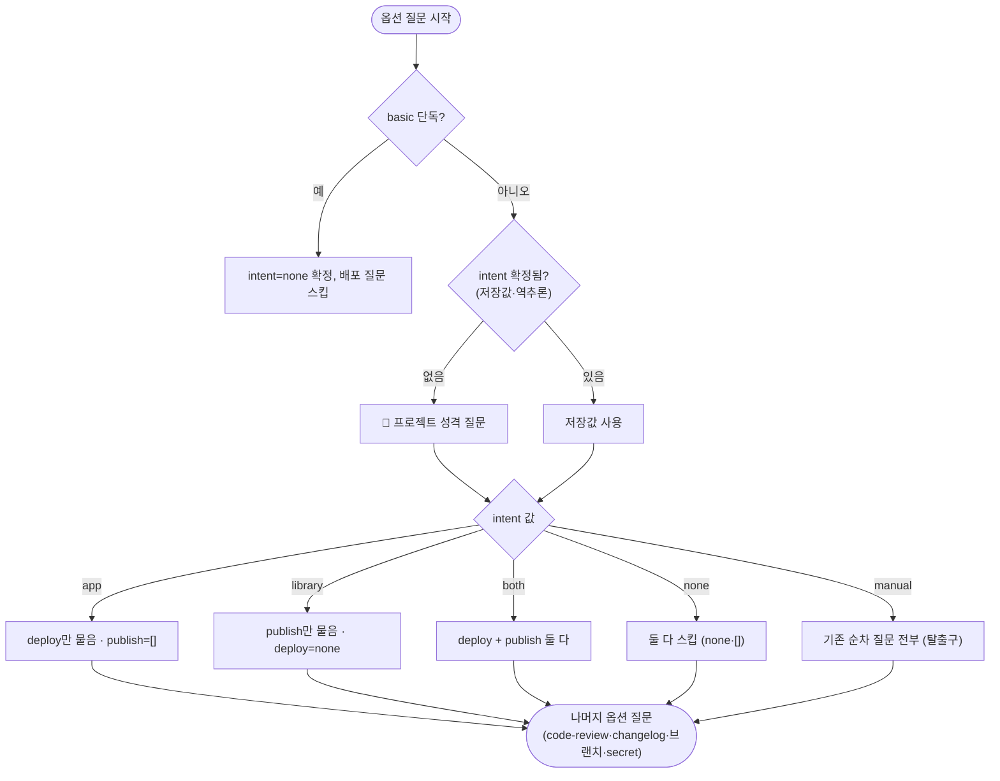

# 의도 우선(intent-first) 진입 구조 재설계

## 개요

마법사가 배포 옵션을 낱개로 순차 질문하던 구조를 근본적으로 바꿨다. 기존에는 deploy·publish를 서로 무관하게 낱개로 물어, 서버 앱 개발자한테 "라이브러리 배포할래?"를 묻는 식의 판단 부담이 있었다(#480~483은 이 증상을 문구로 완화). 이제 통합 시작 시 **프로젝트 성격(intent)을 한 번 묻고, 그 답이 배포 축을 유도**한다. 서버 앱이면 라이브러리 배포 질문을, 라이브러리면 서버 배포 질문을 아예 건너뛴다. 기존 방식을 원하면 `manual`로 그대로 쓸 수 있어 하위호환이 완전하다.

## 기능 흐름

## 변경 사항

### intent 저장·역추론
- `src/core/version-yml.js`: `parseTemplateOptions`에 `intent` 파싱(인라인 주석 대응), `buildVersionYml`에 `options.intent` 기록. `inferIntent(deploy, publish)` 헬퍼 신설 — 구 version.yml(intent 없음)은 deploy/publish 값에서 역추론(app/library/both/none).

### intent 우선 분기 + 축 유도
- `src/core/options-ask.js`: `INTENT_ASKS_DEPLOY`/`INTENT_ASKS_PUBLISH` 유도 규칙. 진입 질문(5지선다) → 유도된 축만 질문, 무관 축은 기본값 확정. 수정 메뉴 단일 축 편집(scope) 시엔 intent 게이트를 무시해 그 축만 편집(#483 격리 존중). `OPTION_AXES`에 intent 추가.

### 배선·CLI
- `src/commands/interactive.js`·`src/index.js`·`src/context.js`·`src/commands/full.js`: intent를 상태·context·version.yml 저장까지 전달. 비대화형은 `--intent` + 미지정 시 deploy/publish 역추론, intent 명시 시 축 유도(library→deploy=none 등).
- `src/cli/args.js`·`src/cli/help.js`: `--intent app|library|both|none|manual` 플래그.
- `src/ui/prompts.js`: 수정 메뉴에 "프로젝트 성격(배포 유형)" 항목.

### 문서·테스트
- `CLAUDE.md`: intent 우선 분기 표·역추론 규칙·비대화형 사용법 추가.
- 테스트 8종: intent별 축 게이팅(app/library/both/none), 역추론, --intent 플래그, forceAsk+scope 조합, manual 두 축 안내.

## 주요 구현 내용

- **manual = 완전한 탈출구**: 기존 순차 질문을 100% 재현하므로 어떤 사용자도 옛 방식으로 진행 가능 — 되돌리기 리스크 최소화.
- **하위호환**: intent 키는 추가만(deploy/publish 병기), 구 파일은 역추론으로 자연 편입. 비대화형 CLI는 무수정 동작.
- 실측: library intent → deploy=none 유도 → server-deploy 워크플로우 제외 → 재통합 시 저장값 재사용으로 멱등 확인. app intent 대화형 스모크에서 publish 질문이 실제로 사라짐 확인.

## 주의사항

- 이 기능은 npx(JS) 경로 전용 — `.sh`/`.ps1`은 #458에서 EOF shim으로 전환돼 해당 없음.
- v4.2.14 릴리스에 포함되어 npm 배포 완료.
