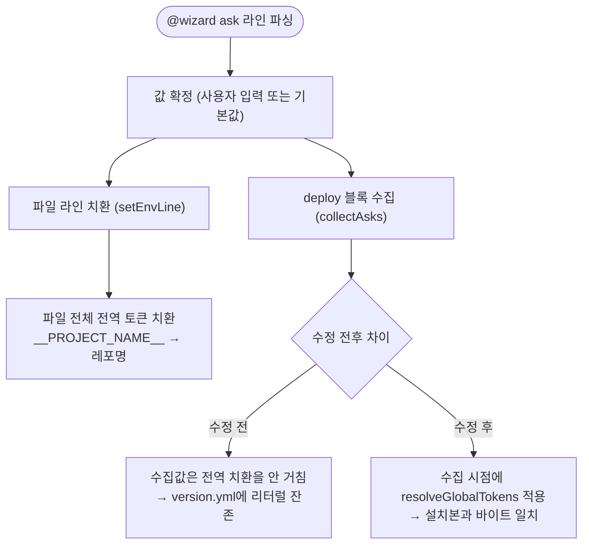

# 마법사 version.yml deploy 블록에 미치환 __PROJECT_NAME__ 리터럴 저장 수정

## 개요

마법사 통합 시 워크플로우 파일에는 `__PROJECT_NAME__` 토큰이 레포명으로 정상 치환되는데, 같은 값을 기억하는 `version.yml`의 `deploy.<type>` 블록에는 치환 전 리터럴이 그대로 저장되어 설치본과 기억값이 영구 불일치하던 버그를 수정했다. 같은 원인으로 env 입력 카드의 기본값도 `/volume1/projects/__PROJECT_NAME__` 리터럴로 노출되던 문제를 함께 해결했다. v4.2.15 실측(스프링 레포 통합)에서 발견·확정된 버그다.

## 기능 흐름

## 변경 사항

### 치환 로직 단일 지점화
- `src/core/wizard-env.js`: 전역 토큰 치환(`__PROJECT_NAME__`/`__APP_ARTIFACT_NAME__` → 레포명)을 `resolveGlobalTokens()` 함수로 분리 export. 파일 본문 치환과 ask 수집값(`collectAsks`)이 같은 함수를 쓰도록 통일 — version.yml deploy 블록에 저장되는 값이 설치본과 항상 일치한다.

### env 카드 표시 수정
- `src/ui/env-plan.js`: `collectAsks()`에 `repoName` 옵션을 추가하고, 카드에 노출되는 타입별 기본값에 `resolveGlobalTokens`를 적용. `promptEnvPlan()`이 이미 받고 있던 `repoName`을 수집 단계까지 전달한다. 사용자는 이제 `/volume1/projects/my-repo`처럼 실제로 설치될 값을 보고 판단한다.

### 테스트
- `test/wizard-env.test.js`: 수집값과 파일 본문의 바이트 일치 검증 1종
- `test/env-plan.test.js`: repoName 주입 시 카드 기본값 해석 검증 1종
- `test/copy-workflows.test.js`: 복사 엔진 경유 end-to-end로 `deployValues`(version.yml 기억값)와 설치 파일 값 일치 검증 1종

## 주요 구현 내용

근본 원인은 치환 순서였다. ask 값 수집(`collectAsks.set`)이 라인 단위 처리 루프 안에서 일어나는 반면, 전역 토큰 치환은 루프가 끝난 뒤 파일 전체 문자열에만 적용됐다. 그래서 파일은 올바르게 치환되고 수집값만 리터럴로 남았다. 수집 시점에 동일한 치환 함수를 적용하는 것이 최소 수정이며, 사용자가 값을 직접 입력한 경우(이미 리터럴이 없음)에는 자연스럽게 no-op이 된다.

`isUnchanged`(업데이트 시 재복사 판정)는 파일 본문 비교만 수행하므로 이 변경의 영향을 받지 않는다 — 기존 설치 레포에서 불필요한 재복사(churn)가 발생하지 않는다.

## 주의사항

- 이미 통합된 레포의 version.yml에 남아 있는 리터럴은 이번 수정으로 자동 교정되지 않는다. 다음 업데이트 통합 실행 시 새 수집값으로 재기록되면서 자연 치유된다.
- `repoName`이 빈 문자열인 극단 케이스(레포명 감지 실패)에는 파일 치환과 동일하게 빈 값으로 치환된다 — 파일과 기억값의 일치라는 계약은 유지된다.
