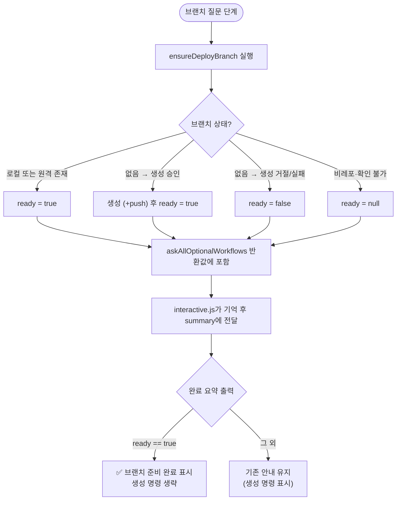

# 완료 요약이 이미 생성한 개발 브랜치를 다시 만들라고 안내하던 문제 수정

## 개요

마법사가 통합 도중 개발(릴리스 소스) 브랜치를 직접 생성하고 origin push까지 완료했는데도, 완료 요약의 "다음 3가지 작업" 안내가 여전히 같은 브랜치를 만들라고 지시하던 모순을 수정했다. 브랜치 확인·생성 결과(`ready` 시그널)를 완료 요약까지 배선해, 준비된 브랜치는 "✅ 준비 완료"로 표시하고 생성 명령 안내를 생략한다.

## 기능 흐름

## 변경 사항

### ready 시그널 추가
- `src/core/options-ask.js`: `ensureDeployBranch()` 반환에 `ready` 필드 추가 — `true`(존재 확인 또는 이번 실행에서 생성), `false`(없는데 거절/실패), `null`(비레포 등 확인 불가). `askAllOptionalWorkflows()`가 이 값을 `deployBranchReady`로 반환 객체에 포함.

### 배선
- `src/commands/interactive.js`: 초기 질문·수정 메뉴 두 경로에서 `deployBranchReady`를 수신(`??` 폴백으로 이전 값 보존)해 완료 요약 호출에 전달.

### 요약 출력
- `src/ui/summary.js`: `deployBranchReady === true`면 2번 항목을 "✅ {브랜치} 브랜치 준비 완료 — 마법사가 확인·생성했습니다"로 대체하고 `git checkout -b ...` 명령 안내를 생략. 그 외(false/null/비대화형)는 기존 안내 유지 — 보수적 기본값.

### 테스트
- `test/branch-strategy.test.js`: ready 4분기(존재/생성/거절/비레포) 검증 1종
- `test/summary.test.js`: ready=true 시 완료 표시·명령 생략, 미확인 시 기존 안내 유지 검증 1종
- `test/options-ask.test.js`: 비대화형 반환 객체에 `deployBranchReady: null` 포함 반영

## 주요 구현 내용

핵심은 "요약이 실행 결과를 모른다"는 구조 문제였다. 브랜치 생성은 옵션 질문 단계(`ensureDeployBranch`)에서 일어나는데, 완료 요약은 정적 텍스트였다. 이미 존재하던 반환값(`{created, pushed}`)만으로는 "원래 있었음"과 "확인 못 함"을 구분할 수 없어 `ready` 3값(true/false/null)을 추가했다. null(확인 불가)일 때 기존 안내를 유지하는 보수적 설계로, 비대화형·force 경로의 동작은 그대로다.

## 주의사항

- 비대화형(CLI 플래그) 경로는 브랜치 확인 자체를 하지 않으므로 항상 기존 안내가 나온다 — 의도된 동작.
- 수정 메뉴에서 브랜치 축을 재질문하지 않은 경우 이전 실행의 ready 값을 보존한다(`??` 폴백).
