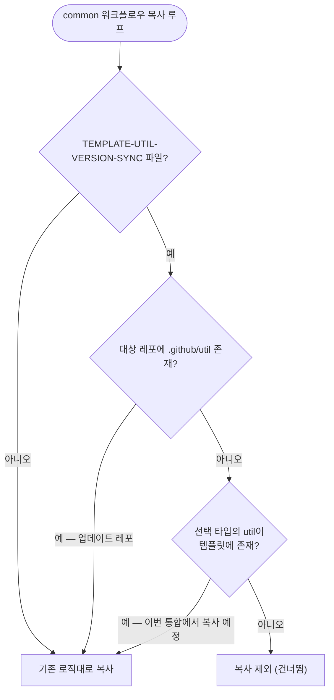

# 템플릿 전용 TEMPLATE-UTIL-VERSION-SYNC가 사용자 레포에 복사되던 문제 수정

## 개요

`.github/util/*/version.json` 변경 시 util HTML 버전을 동기화하는 `PROJECT-COMMON-TEMPLATE-UTIL-VERSION-SYNC.yml`이 `project-types/common/`에 있어 모든 사용자 프로젝트에 무조건 복사되던 문제를 수정했다. util 모듈이 없는 레포(예: spring 단독)에서는 트리거가 영원히 발동하지 않는 no-op 파일이 프로젝트를 오염시켰다. 이제 util 모듈이 있(게 되)는 레포에만 복사된다.

## 기능 흐름

## 변경 사항

### 복사 게이트
- `src/core/copy/workflows.js`: `copyWorkflows()`의 common 복사 루프에 `utilSyncApplies()` 게이트 추가. ① 대상 레포에 `.github/util/`이 이미 있거나(기존 설치·업데이트) ② 선택 타입의 util 폴더가 템플릿에 있어 이번 통합(runFull 6단계)에서 복사될 예정이면 포함, 둘 다 아니면 제외.

### 문서
- `CLAUDE.md`: 공통 워크플로우 표에 "(util 모듈 보유 레포에만 복사)" 명시.

### 테스트
- `test/copy-workflows.test.js`: 3분기 검증 — util 없는 spring 단독 레포 제외 / 템플릿에 타입 util 존재 시 포함 / 대상에 `.github/util` 기보유 시 포함.

## 주요 구현 내용

일괄 제외가 아닌 조건부 복사를 택했다. flutter 타입은 util 모듈(playstore·testflight·firebase 마법사)이 `version.json`+`version-sync.sh`와 함께 실제로 복사되므로, 그런 레포에서는 이 워크플로우가 정상 기능한다. 게이트 판정은 복사 엔진(`copyWorkflows`)이 util 복사(runFull 6단계)보다 먼저 실행되는 순서를 고려해, 대상 폴더 존재 여부와 "곧 복사될 예정"(템플릿 내 타입별 util 존재)을 모두 본다.

템플릿 레포 자신과 "Use this template"로 생성된 레포는 `.github/util/`을 통째로 보유하므로 영향이 없다.

## 주의사항

- 이미 복사된 기존 사용자 레포의 no-op 파일은 이번 수정으로 삭제되지 않는다 (무해하므로 자동 제거 대상 아님). 필요 시 마법사의 레거시 정리 흐름에 제거 후보로 추가하는 것은 후속 과제.
- 새 "템플릿 전용" 워크플로우를 추가할 때는 같은 함정을 피하도록 복사 제외 목록 또는 조건 게이트를 함께 검토해야 한다.
