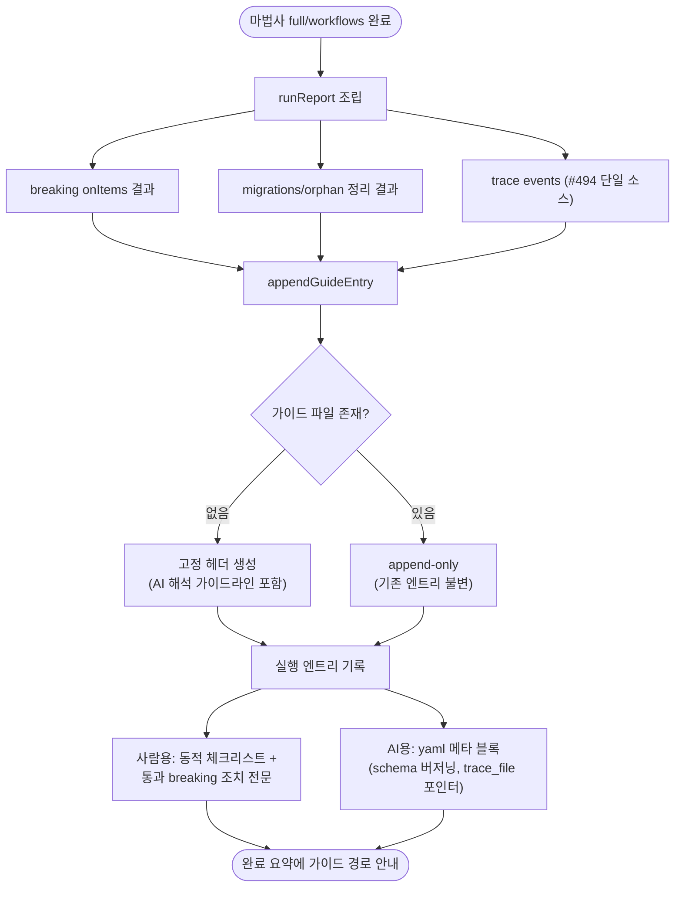

# 마이그레이션 가이드 문서 자동 생성

## 개요

마법사(full/workflows) 실행이 끝나면 대상 레포의 `docs/projectops/migration/PROJECTOPS-MIGRATION-GUIDE.md`에 실행 기록을 자동으로 남긴다. 사람용 동적 체크리스트(구세대 워크플로우 삭제, .bak 정리, Secrets 등록, env 값 검증 등 — 실제 발생분만)와 AI Agent용 yaml 메타데이터를 한 엔트리에 담고, v1~v3 → v4 같은 버전 점프에서 통과한 breaking change의 **조치 방법 전문**을 임베드한다. 터미널에서 "상세 내용 스킵"해도 문서에는 반드시 남아, 마이그레이션 후 사용자가 AI Agent에게 "뭐 확인해야 해?"라고 물으면 이 문서 하나로 근거 있는 답이 나온다.

## 기능 흐름

## 변경 사항

### 신규 모듈
- `src/core/migration-guide.js`: 고정 헤더(문서 목적 + AI Agent 해석 가이드라인 표 — `leftover_old_gen`→전환 제안, `skipped_conflict`→병합 제안, `env_applied`→드리프트 경고, `manual_actions_pending`→상기), 엔트리 렌더러(`renderGuideEntry`), append 엔진(`appendGuideEntry` — 최초 생성 시 헤더, 이후 append-only). trace events에서 워크플로우 목록·env 값을 파생(`deriveWorkflowLists`/`deriveEnvApplied`).

### 배선 (대화형·비대화형 공용)
- `src/commands/interactive.js`: breaking onItems·migrations·orphan 결과 수집 → 실행 후 trace 파일 기록 + 가이드 엔트리 append → 완료 요약에 경로 전달.
- `src/index.js`: 비대화형(--force) 동일 배선 (브랜치 확인은 비대화형에서 안 하므로 해당 필드는 null).
- `src/ui/summary.js`: 완료 요약에 "🧭 마이그레이션 가이드" 포인터 출력.
- `CLAUDE.md`: 3계층 기록 구조·확장 규칙(agent 필독) 문서화.

### 테스트
- `test/migration-guide.test.js` 6종: 이벤트 파생, 동적 체크리스트(발생분만 출력/미발생 미출력), breaking 전문 임베드 + `action_required` 메타, leftover 체크리스트·`manual_actions_pending`, yaml 필수 필드, 최초 생성/append-only 불변성.
- `test/interactive.test.js`: full 실행 end-to-end — 가이드 생성, `trace_file` 포인터가 가리키는 JSONL 실존·파싱 검증.
- `test/summary.test.js`: 가이드 포인터 출력/미출력 분기.

## 주요 구현 내용

체크리스트는 **실행 결과 기반으로만 동적 생성**된다 — 항목이 없으면 할 일이 없다는 뜻이라, 백엔드 레포의 단순 업데이트는 짧은 엔트리로 끝난다. 반대로 v2.7.7→v4.x 같은 점프는 통과한 CRITICAL/WARNING 전건의 조치 방법 전문 + 이 레포에서의 실제 영향(잔존 구세대 파일 등)이 그대로 남는다.

AI 메타 블록은 `schema: 1` 버저닝과 "모르는 필드는 무시" 규칙을 헤더에 명시해 전방 호환을 확보했다. `manual_actions_pending`은 leftover/bak/충돌스킵/Secrets/브랜치 상태에서 자동 도출되는 액션 코드 목록으로, Agent가 남은 수동 작업을 기계적으로 판단하는 기준점이다.

배치 결정: 이슈 초안의 "레포 루트" 대신 `docs/projectops/migration/`으로 확정 — 기존 스킬 산출물 홈(`docs/projectops/issue·report`)과 일관되고 루트 오염이 없다. 완료 요약이 경로를 안내하므로 발견성은 유지된다.

## 주의사항

- 가이드·트레이스는 마법사가 **대상 레포에 생성하는 사용자 자산**이다 — initializer 삭제 목록·integrator 복사 제외 목록에 넣지 않는다.
- 기존 엔트리는 절대 수정되지 않는다(append-only 이력 계약). 새 엔진 동작을 추가하면 trace 이벤트 emit을 함께 추가해야 가이드에 반영된다 (CLAUDE.md 확장 규칙 참조).
- 이미 v4.2.16 이하로 통합된 레포는 다음 마법사 실행부터 가이드가 생성된다 (소급 생성 없음).
