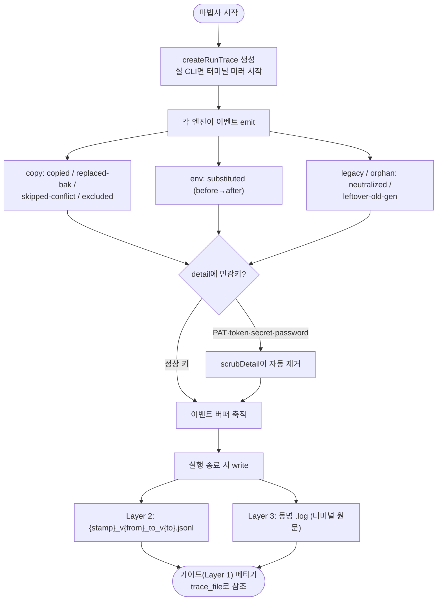

# 마법사 실행 트레이스 3계층 로깅

## 개요

마법사 실행 과정(파일별 복사/스킵/.bak 결정, env 치환 전후값, 레거시 정리, 브랜치 생성)이 터미널 출력으로만 흘러가 휘발되던 문제를 해결했다. 실행의 모든 결정·행동을 JSONL 이벤트(Layer 2)와 터미널 원문 미러(Layer 3)로 대상 레포에 남겨, 사용자가 로그를 수동 복사하지 않아도 사람·AI Agent가 파일명 grep 한 번으로 인과를 추적할 수 있다. v4.2.15 마이그레이션 진단(사용자가 터미널 로그를 복사해 제공)의 자동화다.

## 기능 흐름

## 변경 사항

### 신규 모듈
- `src/core/run-trace.js`: 트레이스 팩토리 — `event()`(ts/phase/action/target/detail 스키마), `mirrorStart/Stop()`(stdout·stderr write 래핑, 원본 참조 복원), `write()`(JSONL 헤더 `schema: 1` + 이벤트, 미러 원문 `.log`). 민감키(`pat|token|secret|password|credential`)는 `scrubDetail`이 어떤 깊이에서도 제거. 이벤트 0건이면 파일을 만들지 않는다(no-op 오염 방지).

### 엔진 이벤트 배선 (전부 null-safe — trace 미주입 경로 무영향)
- `src/core/copy/workflows.js`: common/타입별/server-deploy/publish/secret-backup 복사 루프와 충돌 3지선(`applyDecision`), util-sync 제외(#491), 브랜치 치환 post-pass에 copy/env 이벤트 emit. `configureEnv`가 치환 1건당 `env.substituted`(before/after) 기록.
- `src/core/wizard-env.js`: `substituteEnv`에 `collectSubs` 옵션 — 치환 전후값을 파일 최종형과 동일 규칙(전역 토큰 해석 포함)으로 수집.
- `src/core/breaking-check.js`: `onItems` 콜백 — 통과 구간 breaking 항목을 표시 여부와 무관하게 상위로 전달.
- `src/core/options-ask.js`: `deployBranchCreated` 반환 추가 (가이드가 "생성함 vs 이미 있었음" 구분).

### 테스트
- `test/run-trace.test.js` 6종: 이벤트 스키마, 민감값 스크럽(중첩 포함), 민감키만 있던 detail 생략, 파일명 스탬프 폴백, JSONL 기록/0건 no-op, 미러 수집·복원.
- `test/wizard-env.test.js`·`test/copy-workflows.test.js`: collectSubs 수집, 엔진 이벤트 emit 검증.

## 주요 구현 내용

핵심 설계는 **null-safe 주입**과 **단일 소스**다. 엔진들은 `trace?.event(...)` 한 줄씩만 추가되어 trace 미주입 시 완전 무영향이고(기존 테스트 278종 무수정 통과), 가이드(Layer 1)의 파일 목록·env 값은 이 이벤트 스트림에서 파생되므로 기록 간 불일치가 구조적으로 불가능하다. `env.substituted` 이벤트가 before/after를 담아, v4.2.16에서 수정한 치환 불일치류(#489) 버그는 이제 로그만 봐도 즉시 드러난다.

터미널 미러는 `process.stdout/stderr.write`를 감싸되 원본 함수 참조를 보관·복원한다(테스트 스텁 경로에서는 켜지 않음 — `io === prompts` 실 CLI만).

## 주의사항

- 미러(.log)는 실 CLI 실행에서만 생성된다. 이벤트(.jsonl)는 비대화형(--force)에서도 남는다.
- 민감값 스크럽은 detail의 **키 이름** 기준이다. 새 이벤트를 추가할 때 민감값을 일반 키명(value 등)에 담지 않도록 주의.
