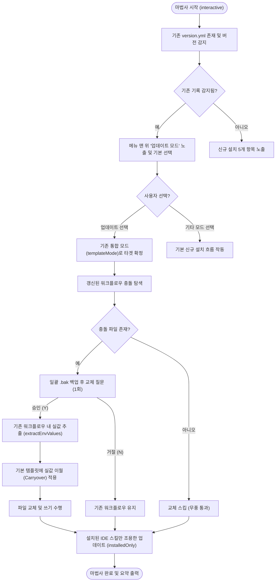

# [기능추가] npx 마법사 업데이트 모드 및 설정값 보존 기능 구현

## 개요
기존 통합 레포지토리에서 `npx projectops@latest` 재수행 시, 이전 설정이 존재함에도 불구하고 매번 신규 설치 옵션(전체 설치 등)을 수동 선택해야 하고, 환경 변수 계획 질문 및 워크플로우 충돌 3지선다를 거치며 기존의 실값이 초기화(건너뛰기 시 템플릿 미반영)되는 사용성의 함정이 있었습니다. 

이를 해결하기 위해 마법사 실행 시 기존 설정 유무를 감지해 맨 위에 **"업데이트 모드"**를 노출하고, 질문 최소화, 충돌 일괄 .bak 백업 및 기존 환경 변수 실값 이월(Carryover), 이미 설치된 IDE 스킬의 조용한 최신화 등을 자동 연동하여 매끄러운 원클릭 마이그레이션 환경을 설계 및 구현했습니다.

## 기능 흐름

## 변경 사항

### 마법사 대화 및 흐름 최적화 (`src/commands/`)
- `src/commands/interactive.js`: 
  - `picked === "update"` 일 때 `updateRun` 플래그를 활성화하고 실질 타겟 모드를 기존 `templateMode` 혹은 `full`로 우회 정의합니다.
  - 감지된 타입 대신 `existing.types` 저장을 최우선으로 복원하여 타입 집합 충돌을 방지합니다.
  - 분석 카드는 즉시 패스하도록 구성하고, `promptEnvPlan` 질문을 바이패스합니다.
  - 워크플로우 충돌 탐색 시 개별 3지선다 대화 루프 대신 `io.askYesNo` 일괄 확인 1회만 처리하고, 결과에 따라 `.bak` 백업 교체를 자동 매핑합니다.
  - 이미 설치된 IDE 스킬만 무확인으로 교체 처리하도록 `skills` 호출 시 `installedOnly: true` 및 `interactive: false` 옵션을 부여합니다.
- `src/commands/full.js`: `buildVersionYml` 호출 시 `mode: "full"` 명세를 안전 기록합니다.
- `src/commands/version.js`: version 모드 하향 단독 실행 시 기존 통합 범위(`mode`)가 `"full"`이었을 경우 강등 소실되지 않도록 `recordMode` 파라미터를 보존 이월합니다.

### 템플릿 데이터 기록 및 파싱 (`src/core/`)
- `src/core/version-yml.js`:
  - `parseExisting` 함수에 `templateMode` 필드 정규식 구문을 추가하여 이전 모드를 정상 로드하고 구식 레포는 `null`로 안전 폴백합니다.
  - `buildVersionYml` 에 `mode` 주입 기능을 내재화하여 `version.yml`의 `template` 블록 내에 `mode: "값"`을 영구 보존할 수 있도록 인코더를 개편했습니다.

### 실값 복원 엔진 개발 (`src/core/`)
- `src/core/wizard-env.js`: 
  - 신규 `extractEnvValues` 헬퍼 함수를 구현했습니다. 템플릿의 주석(`@wizard ask` 등) 유실 여부와 무관하게 디스크에 실재하는 기존 파일에서 활성화된 `KEY: "값"`들을 추출해 Map으로 수집하며, 빈 값은 정제 처리하고 CRLF의 호환성도 확보했습니다.

### UI 레이아웃 및 기타 설정 수정 (`src/ui/`, `src/index.js`)
- `src/ui/prompts.js`: `selectMode` 시그니처에 `update` 옵션을 수락하여 맨 위에 업데이트 추천 카드를 출력하고 기본 커서로 포커싱합니다.
- `src/ui/status-cards.js`: 기존 버전 감지 시 문구를 좀 더 풍부하고 명확하게 안내하도록 수정했습니다.
- `src/index.js`: version 단독 모드 실행 시 상위 `mode` 소실을 제어하는 `recordMode` 안전 변수를 컨텍스트에 바인딩합니다.

---

## 주요 구현 내용

### 1. 무질문 일괄 처리와 안전 장치의 타협
완전 자동화는 편리하지만, 예기치 않은 기존 워크플로우 덮어쓰기 위험이 있습니다. 이를 방지하고자 **"1회의 마스터 일괄 백업 교체 승인 게이트"**를 두었습니다. 단 한 번의 엔터 키 입력만으로 모든 충돌 해결 과정이 안전하게 백업(`.bak`) 조치되므로 강력한 안전망과 최적의 UX를 동시에 잡았습니다.

### 2. 정교한 실값 보존형 Carryover 메커니즘
교체 교정을 선택하면 기존 설치본에서 `extractEnvValues`가 활성 환경 변수들의 주입값만 Map으로 보존해 추출합니다. 그 후 템플릿 파일을 새로 치환할 때 해당 보존 Map을 오버라이딩 치환 소스로 참조시킴으로써, 사용자가 기존에 작성해 두었던 민감 PAT 및 실 값들이 템플릿 업데이트 후에도 고스란히 복원 주입되어 작동성을 영구히 이월 유지합니다.

---

## 주의사항
- **이월 제어 범위**: 마법사를 통하지 않고 수동으로 임의 정의한 복잡한 커스텀 액션 로직 등은 `.bak` 백업 파일로만 남으므로 업데이트 시 `.bak` 파일을 수동으로 대조 참고하여 병합할 필요가 있을 수 있습니다.
