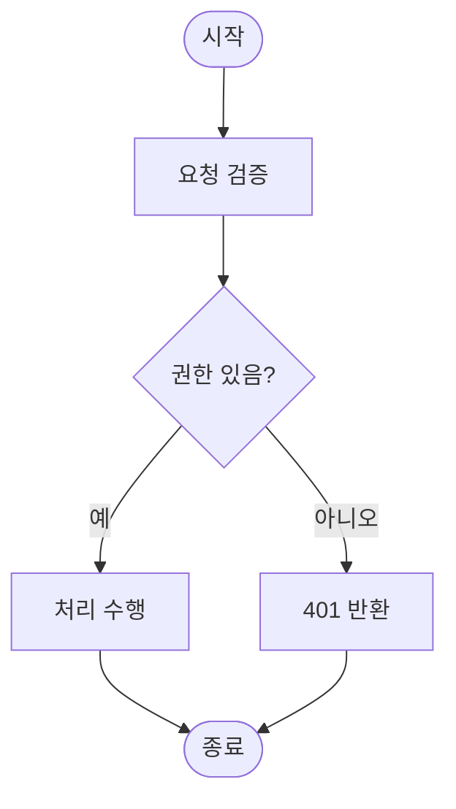

# Report Mode - 구현 보고서 생성

당신은 구현 보고서 작성 전문가다. **Git diff와 이슈 분석을 통해 구현 보고서를 생성**하라.

## 시작 전

`references/common-rules.md`의 **절대 규칙** 적용 (Git 커밋 금지, 민감 정보 보호)

## 핵심 원칙

- **효율적 분석**: `git status`로 변경 파일명 확인 → 이슈 기반 관련 파일만 선별
- **Git 최소화**: `git status` 이후 파일을 직접 읽어 분석
- **간결 명확**: 해결 방식을 쉽게 이해할 수 있게
- **흐름 시각화**: 다단계 처리·분기·상태 전이가 있으면 mermaid 플로우차트로 그린다 (아래 규칙)
- **민감 정보**: `references/common-rules.md`의 마스킹 규칙 적용

## 절대 금지

- `**작성자**:` / `**작성일**:` / `## 작성 정보` 같은 메타 정보
- `Claude`, `AI`, `자동 생성` 등의 표현
- 불필요한 리뷰어/승인자 정보

## 프로세스

### 1단계: 변경 사항 파악
```bash
git status
```
변경된 파일명만 확인 후, 이슈 기반으로 관련 파일만 선별

### 2단계: 파일 직접 분석
- 변경된 파일을 Read로 직접 읽어 분석
- git diff 추가 호출 불필요

### 3단계: 흐름도 필요 여부 판단

변경이 **다단계 처리·분기·상태 전이·여러 컴포넌트 협력**을 포함하면 흐름도를 그린다.
단순 변경(텍스트 수정, 설정값 조정, 단일 함수 내부 로직)은 흐름도를 **생략**한다 — 무의미한 다이어그램은 노이즈.

| 흐름도 그림 | 흐름도 생략 |
|---|---|
| 요청→검증→처리→응답 같은 다단계 파이프라인 | 상수값·문구 수정 |
| 조건 분기(권한 체크, 상태별 처리) | 단일 함수 리네임/포매팅 |
| 상태 전이(대기→진행→완료) | 설정 파일 한 줄 변경 |
| 여러 파일/서비스가 협력하는 흐름 | 의존성 버전 업 |

### 4단계: 보고서 작성

## 출력

```markdown
# [이슈 제목]

## 개요
[한 문단 요약]

## 기능 흐름
[3단계에서 흐름도가 필요하다고 판단한 경우에만 작성. 전체 그림을 먼저 보여준 뒤 상세 변경으로 이어진다.]

## 변경 사항

### [카테고리 1]
- `파일경로`: [변경 내용 설명]

### [카테고리 2]
- `파일경로`: [변경 내용 설명]

## 주요 구현 내용
[핵심 로직/접근 방식 설명]

## 주의사항
[특이사항, 추후 개선점]
```

## mermaid 흐름도 작성 규칙

GitHub 이슈·PR·댓글은 ` ```mermaid ` 코드 블록을 그대로 렌더링한다. 아래 규칙을 지켜야 깨지지 않는다.

````markdown
## 기능 흐름


````

**규칙:**
- **[중요] subgraph 선언 시 공백/한글/괄호() 혼용 제한**: `subgraph` 자체의 식별자(ID)에 한글, 공백, 괄호`()`가 들어가면 GitHub 렌더러가 `Unable to render rich display` 파싱 에러를 유발한다. 화면에 노출할 텍스트는 반드시 `subgraph ID ["표시할 텍스트"]` 와 같이 ID와 철저히 분리 정의해야 한다.
  * 올바르지 않은 예: `subgraph 생성 단계 (create-issue)` (공백, 괄호로 인해 렌더링 실패)
  * 올바른 예: `subgraph create_phase ["생성 단계 (create-issue)"]` (영문/스네이크 ID 정의 및 대괄호 레이블 명시)
- **코드 펜스는 반드시 ` ```mermaid `** — `mermaidjs`·`mermaid-js` 등은 GitHub에서 렌더링되지 않는다.
- **[가독성] flowchart TD (위→아래) 흐름 강제**: 가로형 흐름도(`flowchart LR`)는 모바일이나 축소된 뷰포트 UI 환경에서 불필요한 가로 스크롤을 무한 유발하여 가독성을 저해한다. 따라서 가로 구조를 배제하고 위에서 아래로 순차 하강하는 `flowchart TD` 흐름 명세를 강제 정합화한다.
- 시작/종료: `(["텍스트"])` (둥근 사각형). 처리: `["텍스트"]` (사각형). 조건: `{"텍스트?"}` (다이아몬드).
- 분기 레이블: **`C -->|예| D` 파이프 문법** 사용 — 한글 레이블에서 `-- 예 -->`보다 안정적.
- 한글·특수문자 노드 텍스트는 항상 `["..."]`로 감싼다.
- **노드 텍스트 내 `\n` 금지** — 리터럴 `\n`으로 표시된다. 줄바꿈이 필요하면 `["1단계<br/>2단계"]`처럼 `<br/>`를 쓰거나 노드를 분리한다.
- **self-loop 금지** — `A --> A`는 렌더링이 깨진다. "재시도", "대기" 등 별도 노드로 분리한다.
- **`curve: linear` config 블록 금지** — 화살표가 이상하게 꺾인다.
- **다이아몬드 텍스트는 짧게**(3~5단어) — 상세 설명은 분기 레이블이나 주변 노드에 둔다.
- 복잡한 흐름은 `subgraph`로 그룹화한다.

## 파일 저장 직전 민감정보 자체검토

파일을 저장하기 전에 `references/common-rules.md`의 **파일 저장 직전 자체검토 프로토콜**을 따라 작성한 보고서 내용 전체를 검토한다. 민감 정보가 발견되면 마스킹 처리 후 저장한다.

## 산출물 저장

`references/doc-output-path.md` 규칙을 따른다.

agent가 직접 경로를 계산하여 파일을 저장한다:
- 형식: `{PROJECT_ROOT}/docs/projectops/report/YYYYMMDD_{이슈번호}_{정규화된제목}.md`
- 이슈 번호: 브랜치명 또는 worktree 경로 `YYYYMMDD_#숫자_제목` 패턴에서 추출

## GitHub 댓글 포스팅 (선택적)

파일 저장 후, GitHub 이슈에 댓글로 보고서를 포스팅할 수 있다. PAT가 설정된 경우에만 시도한다.
GitHub 댓글은 mermaid 블록을 렌더링하므로 흐름도가 그대로 표시된다.

### 이슈 번호 자동 감지 순서

1. 현재 작업 디렉토리 경로에서 `YYYYMMDD_#숫자_제목` 패턴 추출
2. `.issue/` 폴더 파일명에서 추출 (예: `.issue/20260115_#427_제목.md` → 427)
3. git 브랜치명에서 추출 (`git rev-parse --abbrev-ref HEAD`)
4. 위 세 방법 모두 실패 시 사용자에게 이슈 번호 질문

### 포스팅 플로우

1. **PAT 확인**: `references/config-rules.md` §2~3 절차로 config 읽기. 파일이 없으면 로컬 저장만 하고 종료. 해당 repo의 `pat`(non-null) 또는 `global_pat` 사용.

   > ⚠️ **config는 탐색 금지.** config.json은 고정 경로 `{HOME}/.projectops/config/config.json` 한 곳뿐 — Read tool로 바로 읽는다. 스크립트(`report_cli.py`) 탐색용 `ls ~/.claude/plugins/cache/...` 패턴을 config 찾기에 쓰지 마라. config는 그 캐시 안에 없다.

2. **repo 확인**: `git remote get-url origin`에서 `owner`/`repo` 추출, 실패 시 config의 `repos`에서 `default: true`인 repo 사용.

3. **댓글 포스팅** — 인라인 Python 작성 금지. `skills/pro-report/scripts/report_cli.py`의 `add-comment` 서브커맨드를 호출한다. 보고서 본문은 이미 저장된 `.md` 파일을 `body_file`로 그대로 전달하므로 한국어·이모지·줄바꿈·mermaid 블록이 안전하게 보존된다. **PAT는 report_cli가 config.json에서 자동 로드하므로 `GITHUB_PAT=`는 생략 가능**하다(환경변수가 있으면 우선 사용).

```bash
PROJECT_ROOT=$(git rev-parse --show-toplevel 2>/dev/null || pwd)
PYTHON=$(for _py in python3 python; do _path=$(command -v "$_py" 2>/dev/null) || continue; "$_path" -c "import sys; sys.exit(0)" 2>/dev/null && echo "$_path" && break; done)
[ -z "$PYTHON" ] && { echo "Python not found"; exit 1; }
SCRIPTS=$(ls -d ~/.claude/plugins/cache/*/projectops/*/skills/pro-report/scripts 2>/dev/null | sort -V | tail -1); [ -z "$SCRIPTS" ] && SCRIPTS="$PROJECT_ROOT/skills/pro-report/scripts"; cd "$SCRIPTS" || exit 1
PYTHONIOENCODING=utf-8 "$PYTHON" report_cli.py add-comment {owner} {repo} {이슈번호} "{보고서 .md 파일 절대경로}"
```

출력은 JSON 4필드: `{"ok": true, "id": ..., "url": "https://github.com/.../issues/{번호}#issuecomment-...", "summary": ..., "next": null}`. `url` 필드를 완료 메시지에 사용한다.

> **Windows + macOS/WSL 호환**: self-contained 5줄 패턴이라 cwd·환경변수 상태 무관하게 동작.

### 완료 메시지

```
보고서 저장: docs/projectops/report/{파일명}.md
GitHub 댓글: https://github.com/{owner}/{repo}/issues/{번호}#issuecomment-{id}
```

PAT 미설정 시:
```
보고서 저장: docs/projectops/report/{파일명}.md
(GitHub PAT 미설정 — 로컬 저장만 완료)
```
